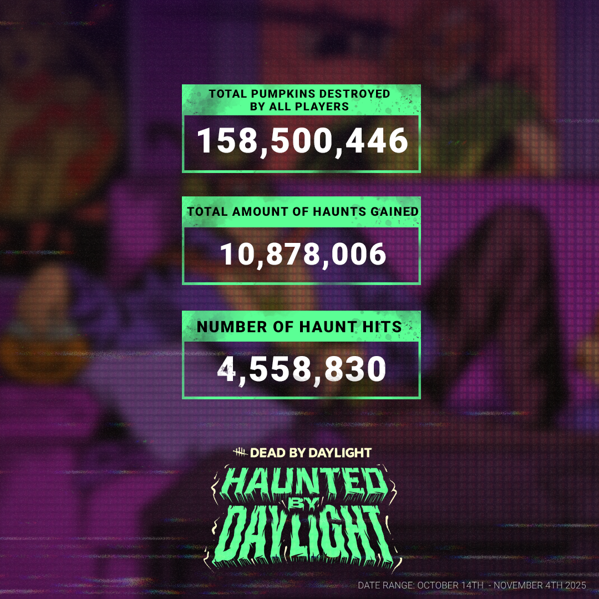
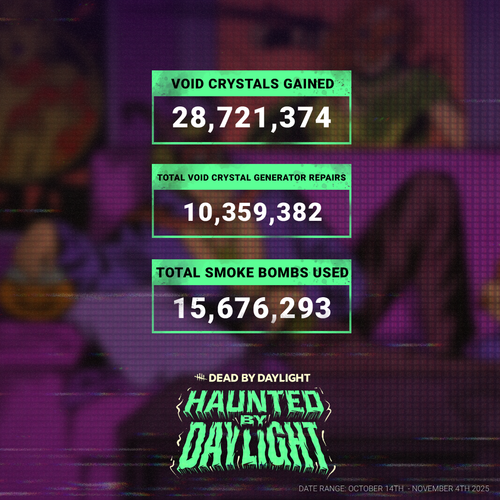

<!-- summary -->
## AI TL;DR

Haunted by Daylight revealed that Survivors and Killers together destroyed over 150 million pumpkins, with Killers freeing a massive number of Void haunts and even flinging them at Survivors. Survivors favored using Void Crystals as distractions rather than for generator repairs, sending countless skill checks into the Void. The event data is now tracked on the stats tracker, covering past and future Limited Time Events.
<!-- /summary -->

<!-- nav -->
&larr; [Developer Update | August 2025](521-developer-update-august-2025.md) · [Developer Updates](../index.md#developer-updates) · [Stats | 2025 Year in Review](532-stats-2025-year-in-review.md) &rarr;
<!-- /nav -->

# Stats | Haunted by Daylight

Welcome back from the Void Realm! Whether you chose to celebrate in style with a costume or tuned in for some good ol’ fashioned pumpkin stomping, that’s another Haunted by Daylight in the books!

Now that we’ve had a chance to take some readings of the Void, let’s see how your Halloween shenanigans went…

Speaking of gutting gourds (or smashing squashes), Survivors and Killers both woke up and chose violence this event with over 150 million pumpkins destroyed. The real question: who’s carving all those?

The Void’s haunt population also owes Killers a big thanks for freeing them (depending how you look at it) in such high volumes, even if that meant turning around and flinging them at Survivors.

On the Survivor side of things, it’s clear there was a preference for tricks over treats. Flush with Void Crystals, Survivors were more likely to use them as a distraction tactic than to employ their services to repair generators. Still, that’s a lot of skill checks that were sent into the Void to never be seen again.

While that’s all from us on Haunted by Daylight today, head over to the [Dead by Daylight Stats Tracker](https://stats.deadbydaylight.com/) for even more stats goodness, especially now that it tracks data from past (and future) Limited Time Events!

Until next time…

The Dead by Daylight Team

<!-- nav -->
&larr; [Developer Update | August 2025](521-developer-update-august-2025.md) · [Developer Updates](../index.md#developer-updates) · [Stats | 2025 Year in Review](532-stats-2025-year-in-review.md) &rarr;
<!-- /nav -->
