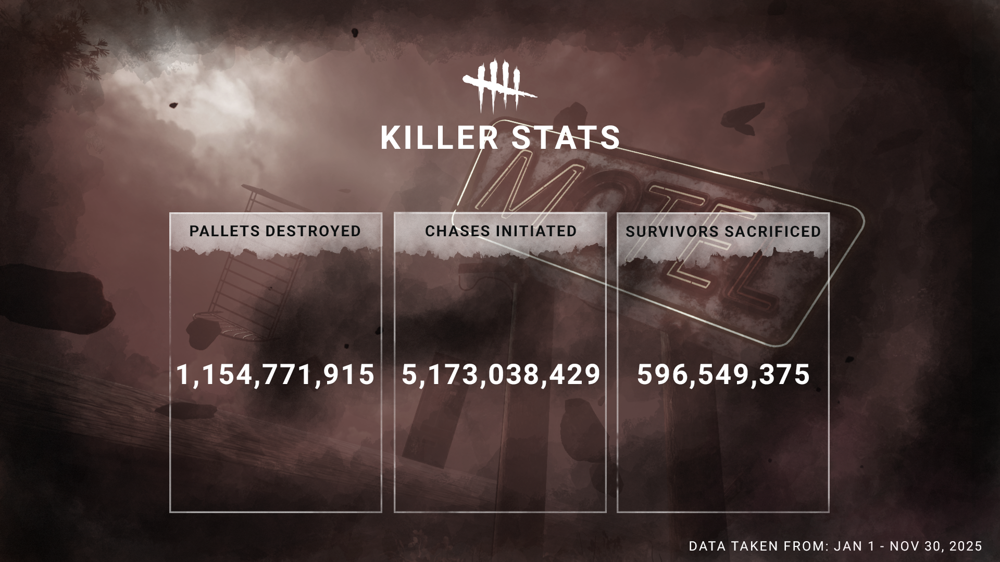
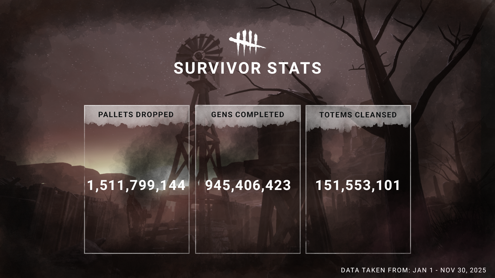
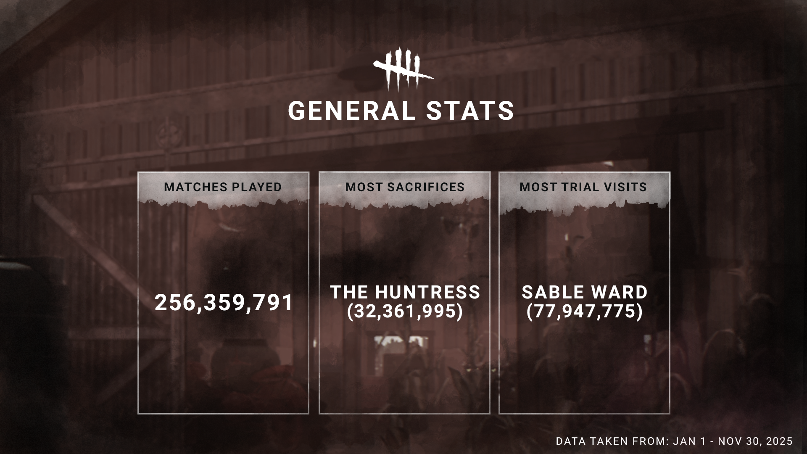

<!-- summary -->
## AI TL;DR

The 2025 Year in Review highlighted the Stats system, summarizing player activity across the past twelve months. It celebrated killers’ high-damage play, noting how pallets dreaded their approach, while survivors were praised for relentless repair efforts and chaotic interactions with the Entity. The update mainly served as a community thank-you, showcasing overall kill-and-survival trends rather than introducing new content, and pointed players toward the official stats tracker for personal breakdowns.
<!-- /summary -->

<!-- nav -->
&larr; [Stats | Haunted by Daylight](528-stats-haunted-by-daylight.md) · [Developer Updates](../index.md#developer-updates) · [Stats | First Look at Stats in 2026](540-stats-first-look-at-stats-in-2026.md) &rarr;
<!-- /nav -->

# Stats | 2025 Year in Review

With one year coming to a close and another approaching, we wanted to look back at the last year and marvel at some of your accomplishments in The Fog. From brutality to boldness, Killer and Survivor, thanks for making this a year to remember!

Starting with Killers, your passion for destruction this past year was unmatched. Pallets *hated* to see you coming! And Survivors? They could run, but they sure couldn’t hide if those chase totals are anything to go off.

On the other hand, all of you Survivors sure did keep busy! Whether you were zeroing in on repair duty or creating an unholy mess for The Entity to pick up after, you definitely made your mark on your Trials.

All this said, we’ve had a blast watching you react and adapt to every new twist and turn this year. Thanks for joining us on this journey and here’s to another stellar year of Dead by Daylight!

Looking for a more detailed look at your own personal stats from The Fog? Head on over to the [Dead by Daylight Stats Tracker,](https://stats.deadbydaylight.com/) and if you share them on socials, don’t hesitate to tag us!

Until next time…

The Dead by Daylight Team

<!-- nav -->
&larr; [Stats | Haunted by Daylight](528-stats-haunted-by-daylight.md) · [Developer Updates](../index.md#developer-updates) · [Stats | First Look at Stats in 2026](540-stats-first-look-at-stats-in-2026.md) &rarr;
<!-- /nav -->
