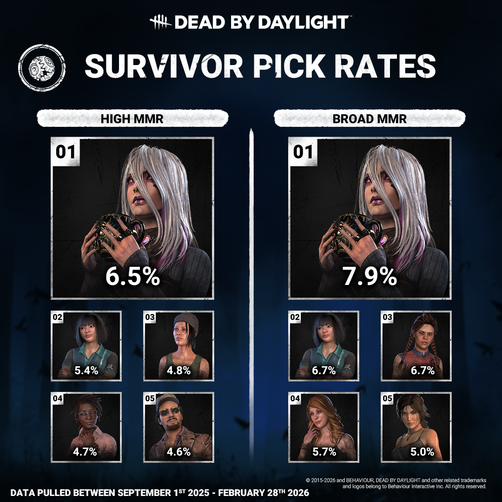
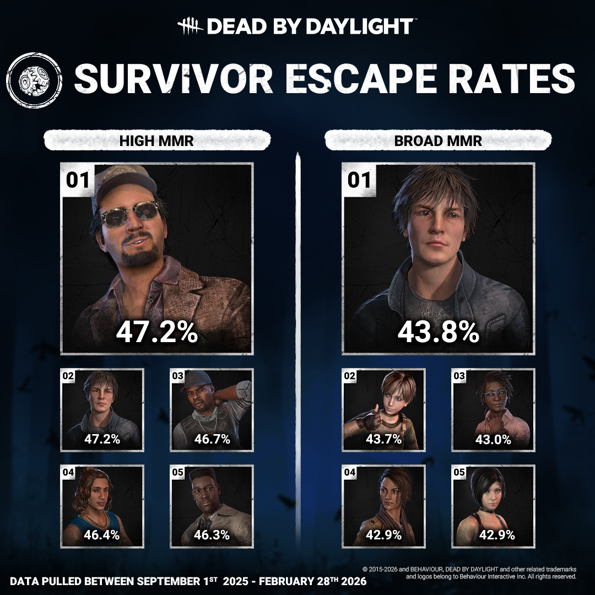
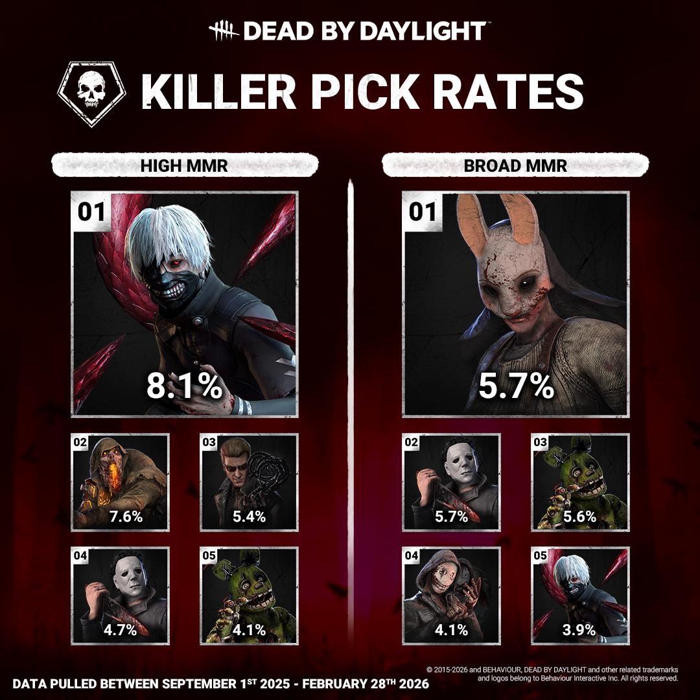
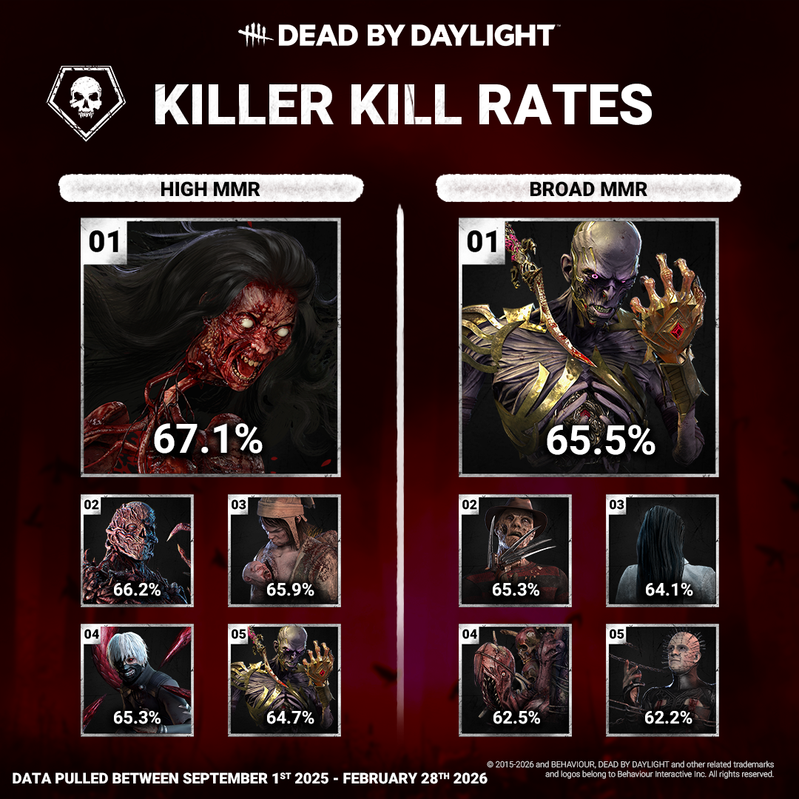

<!-- summary -->
## AI TL;DR

Survivor Sable leads the overall popularity rankings, with Feng second, while high-MMR players also favor Sable. Among killers, Ghoul tops the high-MMR list and Huntress remains the most used across all tiers; Krasue leads high-MMR carnage and The Lich dominates the broad-MMR rankings. The developer update presents a six-month statistical snapshot, noting that “high MMR” refers to players with 1800+ rating (about 18 % of the base). It also hints at future periodic releases for stats-hungry players.
<!-- /summary -->

<!-- nav -->
&larr; [Stats | 2025 Year in Review](532-stats-2025-year-in-review.md) · [Developer Updates](../index.md#developer-updates) · [Stats | The Trickster](543-stats-the-trickster.md) &rarr;
<!-- /nav -->

# Stats | First Look at Stats in 2026

How time flies, it's already almost April. Let’s take a moment to celebrate the changing of seasons with a look at some stats from the past 6 months! Please note that “High MMR” in these stats refers to those with an MMR rating of 1800 or higher, which counts for approximately 18% of the playerbase at the time of pulling these numbers.

Starting with Survivor, these are the Survivors that resonated the most with all of you! To nobody’s surprise, our gothic queen Sable has planted her heels into the first spot across all MMR ranges, with the ever stylish Feng close behind.

And seeing how our survivors fared, it seems that Ace and Quentin players had some tricks up their sleeves (Or some Aces in... you know what, nevermind).

Moving on to killers, we can see the killers you all loved to go on murdering sprees with the most, with Ghoul taking the spot for high MMR and Huntress remaining an oldie but a goldie amongst broad MMR.

And last but very much not least, leading the carnage in high MMR is the terrifying Krasue, while broad MMR is being tormented by The Lich.

We look forward to sharing more stats with you throughout the year so make sure to keep your eyes peeled if you’re numbers fiends like we are.

And as always, you can check out your own personal stats at any time using our Dead by Daylight Stats Tracker.

Until next time…

The Dead by Daylight Team

<!-- nav -->
&larr; [Stats | 2025 Year in Review](532-stats-2025-year-in-review.md) · [Developer Updates](../index.md#developer-updates) · [Stats | The Trickster](543-stats-the-trickster.md) &rarr;
<!-- /nav -->
