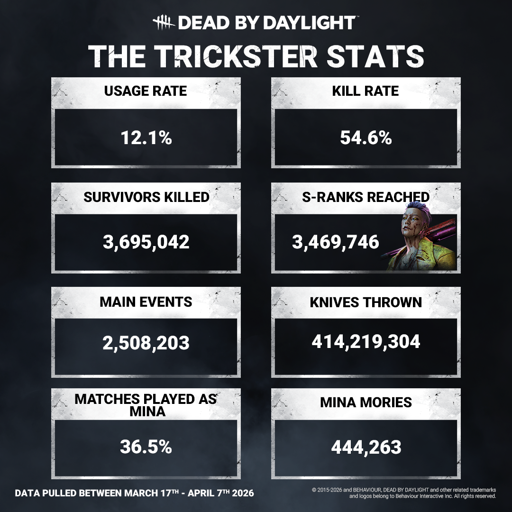

# Stats | The Trickster

Greetings, Fog Dwellers, and welcome to another round of stats! This time, our stats focus on our recently updated knife-throwing K-Pop star, The Trickster! Without further ado, let’s take a look.

Trickster has been vibing with his brand new self, and it appears as though you have as well, as his usage rate has gone up since his update (Up from 1.6% between January 1st to March 16th 2026!). We know a lot of new folks have been giving him a spin and we’re always excited to see our players stepping out of their comfort zones to try new things. We will be monitoring his kill rate as players get more used to this new design. With the amount of knives being thrown, we’re surprised the Survivors aren’t all walking around looking like swiss cheese.

You’ve also all given MiNA a warm welcome to the fog, with 36.5% of Trickster matches bringing the iconic diva to the stage. (Or, uh, to murderous rampages, I guess.) She’d be thrilled to hear that, but we’re afraid it would get to her head.

We hope you’ve enjoyed this round of stats, and we look forward to seeing you at the next one.

Until next time…

The Dead by Daylight Team
