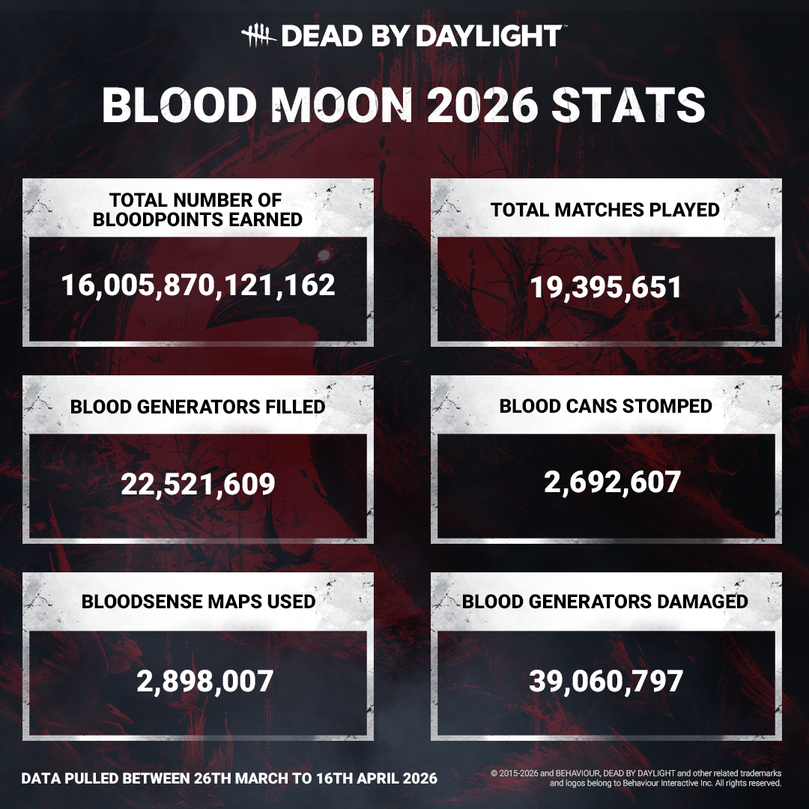

<!-- summary -->
## AI TL;DR

Blood Moon 2026 event stats revealed over 19 million trials and a massive accumulation of Bloodpoints. Survivors heavily engaged with Blood Generators and Bloodsense Maps, while Killers focused on cannibalizing cans and stomping generators. The update serves purely as a performance recap and invites player feedback for future stat tracking. No gameplay changes or fixes accompany this release.
<!-- /summary -->

<!-- nav -->
&larr; [Stats | The Trickster](543-stats-the-trickster.md) · [Developer Updates](../index.md#developer-updates) · [PTB To Live Changes: The Slasher](549-ptb-to-live-changes-the-slasher.md) &rarr;
<!-- /nav -->

# Stats | Blood Moon 2026

Warm greetings, Fog Dwellers. The time has come once more for stats, with a spotlight this time on our 2026 Blood Moon Event! Let’s dive right in.

The Blood Moon rose, and you all rose to the occasion with it, entering more than a whopping 19 million trials and earning a… Well, a substantial amount of Bloodpoints.

Survivors hustled to fill Blood Generators and used their Bloodsense Maps to navigate the Entity’s realms, while Killers exercised their leg muscles by stomping on cans and kicking said Blood Gens.

And what about you, dear reader? How did you fare during this event? What numbers would you like to see?

You can let us know in [Feedback & Suggestions](https://forums.bhvr.com/dead-by-daylight/categories/suggestions) while you wait for the next round of stats.

Until next time…

The Dead by Daylight Team

<!-- nav -->
&larr; [Stats | The Trickster](543-stats-the-trickster.md) · [Developer Updates](../index.md#developer-updates) · [PTB To Live Changes: The Slasher](549-ptb-to-live-changes-the-slasher.md) &rarr;
<!-- /nav -->
