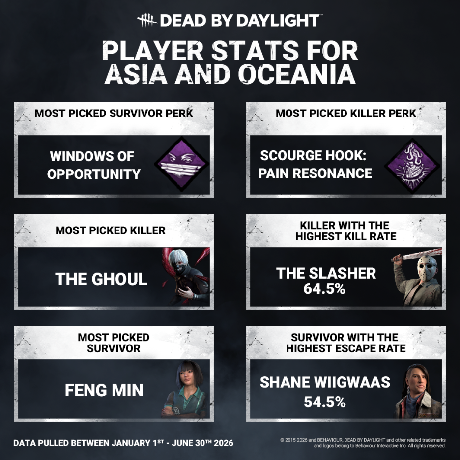
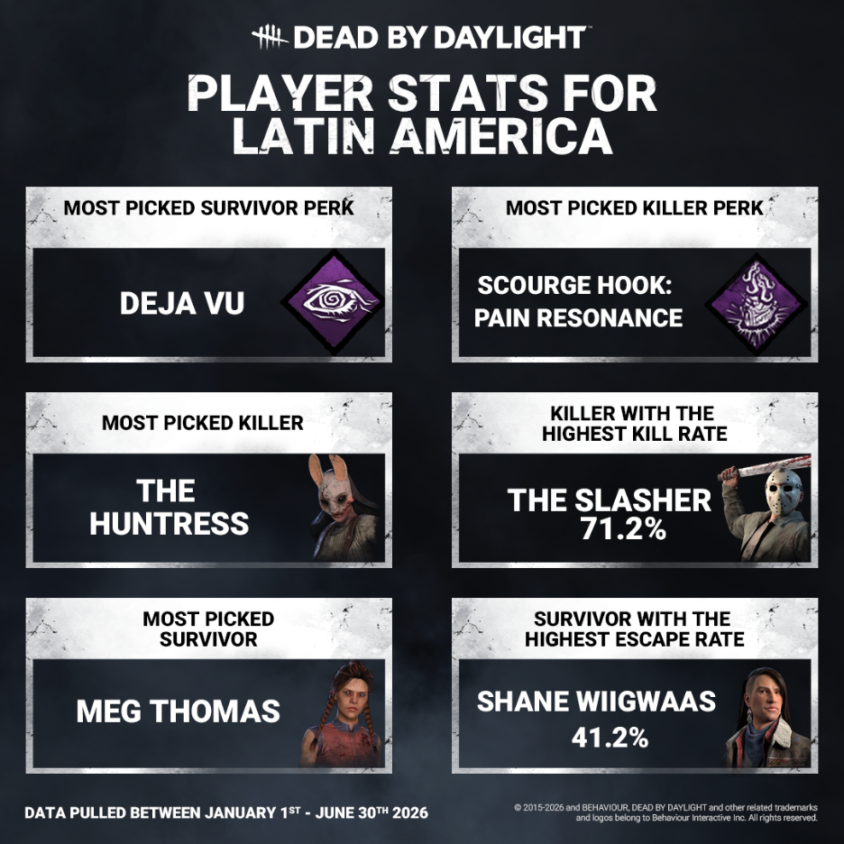
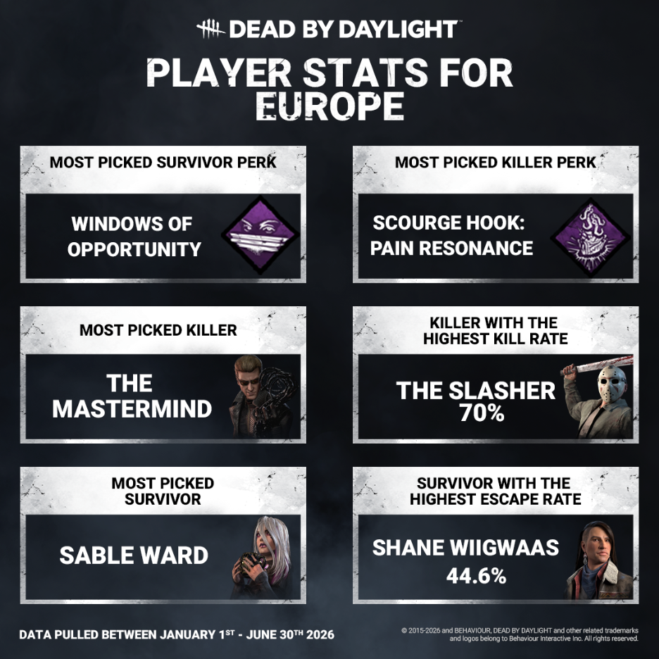
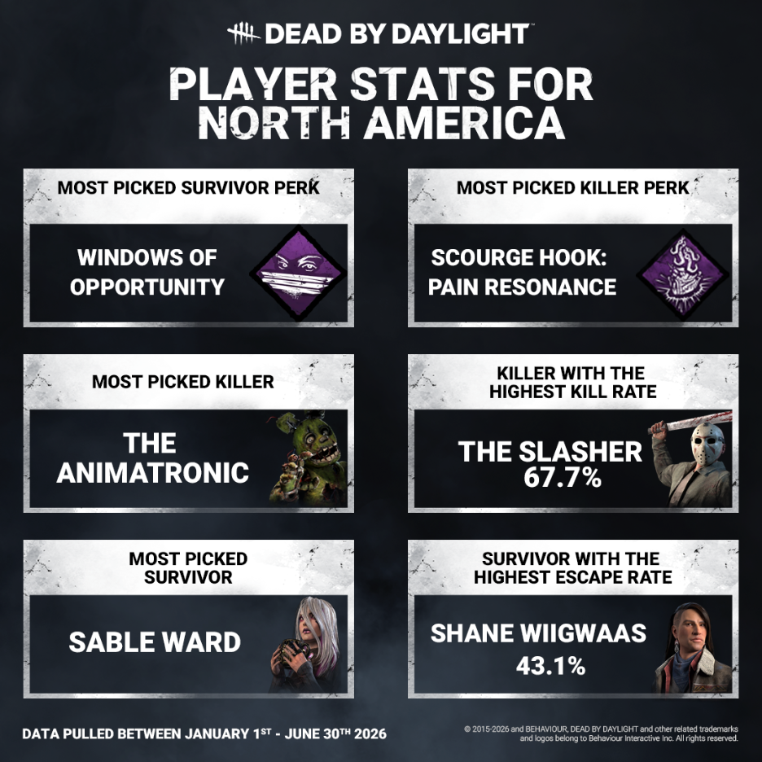

<!-- summary -->
## AI TL;DR

The Dead by Daylight team posted a developer-update presenting fresh global stats broken down by region—Asia/Oceania, Latin America, Europe and North America. It highlights regional favorites such as the Ghoul as top killer and Feng Min as most-picked survivor in Asia/Oceania, the Huntress and Meg in Latin America, The Mastermind and Sable in Europe, and heavy Animatronic usage and shared Sable preference in North America, all observed during the first two weeks of The Slasher’s release and the first five days of Shane. The post covers early-game patterns and promises continued monitoring of kill rates as more data arrives.
<!-- /summary -->

<!-- nav -->
&larr; [PTB To Live Changes: The Slasher](549-ptb-to-live-changes-the-slasher.md) · [Developer Updates](../index.md#developer-updates) · _newest_ &rarr;
<!-- /nav -->

# Stats | Global Stats

Welcome again, Fog Dwellers, to another round of stats. This time, we’ve got some stats from different parts of the globe. No matter how far apart you are or what language you speak, we are all connected by one thing: The love of DbD. Let’s take a look!

First up we’ve got our players from Asia and Oceania. They’ll be paving the way for what you will notice is a pattern with a few of our categories. What you will notice IS different will be the Ghoul coming in for top pick of Killer, with Feng Min holding a very long and strong victory over most picked Survivor. Their Shanes have also done the heaviest escape work!

Next up we’ve got Latin America, who leaned ever slightly more towards Déjà Vu than Windows of Opportunity. Their go-to gals were The Huntress and Meg, proving that sometimes you really can’t beat the classics. They also boast the most lethal Slasher!

Third to fall under our gaze is Europe, who bring us back to the Windows of Opportunity trend. Our European players show a preference for The Mastermind when it comes to killing, and lean towards the iconic Sable for surviving.

And last but definitely not least, we’ve got North America, who have spent way more than five nights playing The Animatronic. They also share a love for Sable with their friends across the ocean, which we think is just beautiful.

We want to emphasize that these stats only take into account the first two weeks of The Slasher being available, while players were still figuring out counterplay, and the first 5 days of Shane being available, which is why they appear consistently throughout this post. We will continue to monitor the kill rate of The Slasher as time goes on.

We hope you found these stats interesting, and we look forward to seeing you again for our next round!

Until next time…

The Dead by Daylight Team

<!-- nav -->
&larr; [PTB To Live Changes: The Slasher](549-ptb-to-live-changes-the-slasher.md) · [Developer Updates](../index.md#developer-updates) · _newest_ &rarr;
<!-- /nav -->
