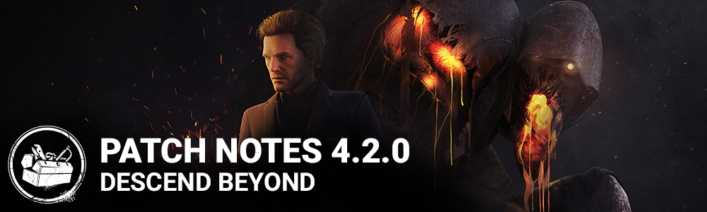

<!-- summary -->
## AI TL;DR

The Blight joins the Killer roster and Felix Richter becomes a new Survivor, accompanied by new offerings such as Sacrificial Ward and several blueprint types. The update also gives visual overhauls to generators, pallets, lockers and chests, plus map tweaks on Springwood and Yamaoka Estate, and refines flashlight aiming. The remainder focuses on a broad sweep of bug fixes across killers, survivors, perks and stability.
<!-- /summary -->

<!-- nav -->
&larr; [4.1.2 | Bug fix patch ](224-4-1-2-bug-fix-patch.md) · [Archive: Nintendo Switch](../../index.md#archive-nintendo-switch) · [4.2.1 | Bugfix Patch](237-4-2-1-bugfix-patch.md) &rarr;
<!-- /nav -->

# 4.2.0 | Descend Beyond

## New Chapter

Unleash The Blight, an alchemist consumed by his research. Ambition brought him to the Entity's realm but his hunger for power destroyed him. Mutated and mad, his power, Blighted Corruption, provides him with unnatural abilities to quickly pursue and ambush Survivors.

Plan your escape with Felix Richter, a successful architect who was torn away from his lavish lifestyle. Resourceful and bold, he has clever methods to stand against the oncoming evil and plan out the one thing that matters to him most—returning home.

- Added a new Killer - **The Blight.**
- Added a new Survivor - **Felix Richter.**
- Added a new Rare Offering for Killers and Survivors - **Sacrificial Ward** - cancels other offerings that would send you to a specific realm.
- Added a new Common Offering for Killers and Survivors - **Bloodied Blueprint** - reveals the aura of basement hooks to you for 20 seconds at the start of the trial. If the map has a Killer Shack, this offering increases the chance that the basement will spawn below it.
- Added a new Common Offering for Killers and Survivors - **Torn Blueprint** - reveals the aura of basement hooks to you for 20 seconds at the start of the trial. If the map has a main building, this offering increases the chance that the basement will spawn below it.
- Added a new Common Offering for Killers and Survivors - **Annotated Blueprint** - If the map has a Killer Shack, this offering increases the chance that the Hatch will spawn within it.
- Added a new Common Offering for Killers and Survivors - **Vigo’s Blueprint** - If the map has a main building, this offering increases the chance that the Hatch will spawn within it.

## Features & Content

Many in-game objects in Dead By Daylight haven't been changed significantly since the game's launch. As part of our ongoing effort to enhance the game's visuals, many of these objects got visual updates in this patch to bring them closer to our long-term vision for the appearance of the game. Some realms also got visual updates, with more coming later in future patches.

- Visual updates of several common in-game objects:
  - Visual update of the **Generators,** including changes to models, animations and VFX. The Survivor repairing animations and VFX were also updated.
  - Visual update of the **Pallets**, including models and VFX.
  - Visual update of the **Lockers.**
  - Visual update of the **Chests**, including the model and changes to the Survivor's interaction. This Survivor interaction has been updated
- Visual updates to some maps, including additions of breakable walls:
  - **Springwood** - Updated Badham Preschool Maps I - V
  - **Yamaoka Estate** - Updated Family Residence and Sanctum of Wrath
- Update aiming when using the flashlight. Up to 4.1.0, the flashlight would aim up and to the right of the center of the screen. In 4.1.0, the aiming animation was updated, which caused the flashlight to aim more towards right of center. Now, the aim should be squarely in the center.

## Bug Fixes

### Killer

- Fixed an issue that caused survivors not to be stunned when shot by the Deathslinger.
- Fixed an issue that caused the Hillbilly's carry and lunge speed to be reduced when equipped with the Tuned Carburetor add on.
- Fixed an issue that caused all Legion characters to use Julie's animation when the 'Empty Stare' mask was equipped.
- Fixed an issue that may cause the Oni to lose the ability to enter Blood Fury.
- Fixed an issue that caused the Oni's blood orbs to sometimes flicker in and out of visibility.
- Fixed an issue that caused the Plague's Vile Purge to arc higher than previously.
- Fixed an issue that cause the Shape not to change stances while in Tier 3 Evil Within.
- Fixed an issue that caused the Trapper's bear trap aura not to appear during the tutorial.

### Survivor

- Fixed an issue that caused survivors to be stuck at the bottom of the Hill on various maps.
- Fixed several issues that may cause survivors to be misaligned during Moris.

### Perk

- Fixed an issue that caused a regressing generator not to turn red once reaching 0 progress when using the Surveillance perk.
- Fixed an issue that caused the "Pull Down" prompt to be replaced for Survivors standing next to a pallet while injured and with the Self-Care perk equipped.
- Fixed an issue that caused survivors to see the auras of breakable walls when equipped with the Windows of Opportunity perk and suffering from the Blind effect.

### Other

- Fixed a crash that would sometimes happen when selecting the Low or Medium Graphics Quality from Medium and above.
- Reduced rank update errors.
- HTML markup in player names during social notifications (toast invites) are now handled properly.

<!-- nav -->
&larr; [4.1.2 | Bug fix patch ](224-4-1-2-bug-fix-patch.md) · [Archive: Nintendo Switch](../../index.md#archive-nintendo-switch) · [4.2.1 | Bugfix Patch](237-4-2-1-bugfix-patch.md) &rarr;
<!-- /nav -->
