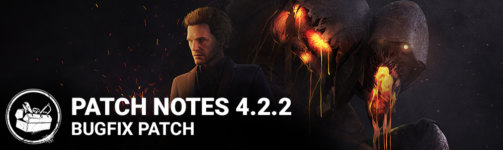

<!-- summary -->
## AI TL;DR

The Blight now breaks pallets and breakable walls by attacking during a Lethal Dash, and its Compound 21 add-on reveal range was halved to 8 m and duration cut to three seconds. The patch also adds a Japanese promo-code expiration notice and fixes the police-car blue light on Switch, while gameplay tweaks resolve input drop-outs when hooking, breaking pallets or damaging generators, reduce network-latency movement stutter, standardise killer stun times, lock camera pitch during the Blight’s injection, stop Iron Maiden from accelerating locker grabs, and prevent survivors from becoming permanently stuck on hooks.
<!-- /summary -->

<!-- nav -->
&larr; [4.2.1 | Bugfix Patch](237-4-2-1-bugfix-patch.md) · [Archive: Nintendo Switch](../../index.md#archive-nintendo-switch) · [4.3.0 | Mid-Chapter](250-4-3-0-mid-chapter.md) &rarr;
<!-- /nav -->

# 4.2.2 | Bugfix Patch

## Features & Content

**The Blight**

- The Blight can now break pallets and breakable walls by attacking during a Lethal Dash
- The Blight add-on "Compound 21" has been adjusted, changing the reveal range from 16 meters to 8 meters and the duration of the effect is reduced from 6 seconds to 3 seconds

## Bug Fixes

**System**

- Add an Auric Cell expiration message for Japanese promo code users
- Switch only: Fixed an issue with the blue light on top of the police car in Haddonfield

**Gameplay**

- Fixed an issue that may cause hooking survivors, breaking pallets and damaging generators to stop shortly after pressing the input
- Fixed an issue that may cause movement stutters due to network latency
- Fixed an issue that caused stun durations to be inconsistent across killers
- Fixed an issue where some instances of the Blight's injection sequence would allow players to control the pitch of the camera
- Fixed an issue that caused grabbing survivors out of lockers to be accelerated when using the perk **Iron Maiden**
- Fixed an issue that may cause a survivor to be stuck on the hook without being able to do anything

<!-- nav -->
&larr; [4.2.1 | Bugfix Patch](237-4-2-1-bugfix-patch.md) · [Archive: Nintendo Switch](../../index.md#archive-nintendo-switch) · [4.3.0 | Mid-Chapter](250-4-3-0-mid-chapter.md) &rarr;
<!-- /nav -->
