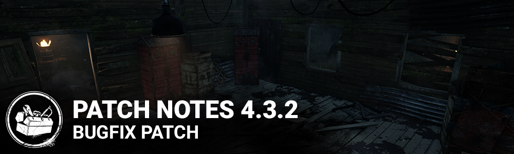

<!-- summary -->
## AI TL;DR

Discordance received a range boost to 64/96/128 meters and its aura after leaving a generator was cut from eight to four seconds, while Blood Favor’s description was clarified to note it only applies to basic attacks. The patch also resolved a variety of issues across the Switch version, including placement bugs for traps and snares on Macmillan Estate maps, improper Spirit breathing sounds, persistent Totems on Rotten Fields and Coal Tower, unrealistic fog visuals, missing Halloween generators in Midwich Elementary, several cosmetic glitches such as Jake’s missing beard and gaps in Yui’s Miss Speedway outfit, and an erroneous token-recharge bonus from the Blight’s Alchemist Ring add-on.
<!-- /summary -->

<!-- nav -->
&larr; [4.3.1 | Bugfix Patch](258-4-3-1-bugfix-patch.md) · [Archive: Nintendo Switch](../../index.md#archive-nintendo-switch) · _newest_ &rarr;
<!-- /nav -->

# 4.3.2 | Bugfix Patch

## Content

**Perk Updates:**

- Discordance: Updated range from **32/64/96** meters to **64/96/128** meters and decreased the aura duration after survivors have left the generator from **8** seconds to **4** seconds.
- Updated Blood Favor's text to indicate that it only works with basic attacks; note that the function of the perk remains unchanged.

## Bug Fixes

- Fixed an issue that caused Traps, Phantasm and Snares not to be placed properly in specific places (exit gates, Shelter Woods' Unique Tree etc.) in Macmillan Estate's maps
- Fixed an issue that caused The Spirit's breathing to be heard while she was phasing
- Fixed an issue that caused two uncleansable Totems on Rotten Fields and Coal Tower
- Fixed an issue that caused the visual effect of the fog on Switch™ to appear unrealistic
- Fixed an issue that caused Halloween Event generators not to spawn in the Midwich Elementary School map
- Fixed Jake's beard not appearing in the Orbital Captain head cosmetic
- Fixed gaps in Yui's Miss Speedway outfit when mixing with other outfit's cosmetic pieces
- Fixed an issue that caused The Blight's "Alchemist Ring" add-on to grant a bonus to rush token recharge time

<!-- nav -->
&larr; [4.3.1 | Bugfix Patch](258-4-3-1-bugfix-patch.md) · [Archive: Nintendo Switch](../../index.md#archive-nintendo-switch) · _newest_ &rarr;
<!-- /nav -->
