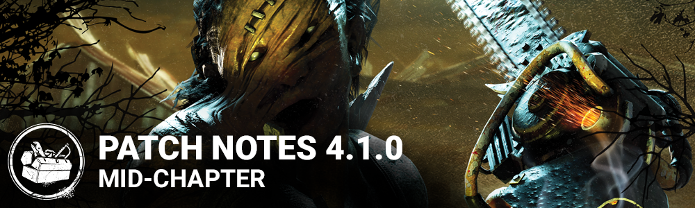

<!-- summary -->
## AI TL;DR

Aura System was refactored, changing its visual look, a Promo Code store was added and killers can no longer swap characters while queuing, enabling skill-based matchmaking. The Cannibal now has Chainsaw Sweep charges, faster sweep speed and revised add-ons; the Hillbilly gains an overheat meter that limits chainsaw use and updated add-ons. Perk balance affects Franklin’s Demise, Knock Out, Lightborn and Tinkerer.

The rest of the update is a wide bug-fix sweep: killer audio and animation glitches, survivor sound and movement bugs, many map collision and texture issues, perk token and aura outline errors, and UI scaling fixes for sub-4K screens. PTB changes also turn off blood-stain VFX and pause tantrum and overheat meters when the power button is released.
<!-- /summary -->

<!-- nav -->
&larr; [4.0.2 | Hotfix](203-4-0-2-hotfix.md) · [Archive: PS4](../../index.md#archive-ps4) · [4.1.1 | Bugfix Patch](216-4-1-1-bugfix-patch.md) &rarr;
<!-- /nav -->

# 4.1.0 | Mid-Chapter

## FEATURES

- Aura Rework - Refactored the Aura System on a technical level to make sure the system is easier to maintain and less prone to bugs in the future. Visuals for the Refactor were changed to support the new refactor. Functionally the system has not been significantly changed, however the appearance of auras is noticeably different.
- Added a Promo Code System to the Store - Keep your eyes on our forums / social media for promotional codes that you can use in-game in the future.
- Killer Selection - Killers can no longer change characters while searching for a match / in a lobby (excluding custom matches). This will soon be used by the new matchmaking system to provide better match balance based on your skill with each killer individually, instead of a global killer rating.

## BALANCE

### THE CANNIBAL

The Cannibal was one of our less-popular Killers, so we are pushing to lessen some of the character's weaknesses while chasing Survivors. Cannibal players will see a higher skill ceiling and new ways to master the power. His add-ons were changed to match our rarity composition requirements, remove overlap with the Hillbilly's add-ons, and open up more builds.

**Power Changes**

Added Chainsaw Sweep charges. Using the Chainsaw will consume a charge and trigger a Chainsaw Sweep. During this time, The Cannibal can extend the Chainsaw Sweep by pressing the power button before the power bar fully depletes. The more charges are used, the longer the miss cooldown / tantrum (if colliding with obstacles).

The numbers:

- The Cannibal starts with **3** charges
- Triggering the chainsaw will start a Chainsaw Sweep that lasts **2** seconds
- During the Sweep, each charge used after that will reset the Chainsaw Sweep timer back to **2** seconds
- Each additional charge used increases the missed chainsaw attack cooldown / tantrum duration by **1** second
- Charges refill at a rate of **1** charge every **4** seconds when the chainsaw is not being used
- The Cannibal’s maximum speed during a Chainsaw Sweep has increased to **5.29 m/s** from **5.06 m/s**

Furthermore, if The Cannibal revs the chainsaw for too long, a tantrum is automatically triggered for the base duration of **5** seconds.

When a tantrum is triggered, all remaining charges are consumed.

The tantrum meter will pause as soon as the power button is released and will start going down when the chainsaw is put away.

**Add-ons:** Updated most of his add-ons.

Spoiler

**Common add-ons:**

*Chainsaw File:*

Old effect: Slightly reduces the noise made by the chainsaw

New effect: Slightly reduces the tantrum duration

*Long Guide Bar:*

Old effect: Slightly increase the reach of the chainsaw attack

New effect: Moderately increase the rate at which charges replenish

*Spark Plug:*

Old effect: Slightly decreases the chainsaw charge time

New effect: Slightly increases movement speed during the tantrum

*Vegetable Oil:*

Same effect: Slightly decreases the chainsaw cooldown

**Uncommon add-ons:**

*Chili:*

Old effect: Moderately increases acceleration when using the chainsaw

New effect: Slightly increase dash duration when a token is consumed. Slightly increase the additional chainsaw swing window.

*Homemade Muffler:*

Old effect: Moderately reduces the noise made by the chainsaw

New effect: Moderately decreases the tantrum duration

*Knife Scratches:*

Same effect: Slightly increase chainsaw movement speed. Slightly increase charge time

*Primer Bulb:*

Old effect: Moderately decreases the chainsaw charge time

New effect: Moderately increases movement speed during the tantrum

*Speed Limiter:*

Same effect: Chainsaw does not automatically trigger the dying state. Get 50% more bloodpoints for chainsaw hit score events.

**Rare add-ons:**

*Begrimed Chains (Carburetor Tuning Guide):*

Old effect: Moderately decreases the chainsaw charge time. Slightly decreases the chainsaw cooldown. Slightly reduces the time penalty when bumping in objects. Slightly reduces the noise made by the chainsaw.

New effect: Chainsaw hits cause survivors to drop their items.

*Grisly Chains:*

Old effect: Moderately decreases the repair speed of survivors injured by the chainsaw for 90 seconds.

New effect: Hit target suffers from the mangled status effect for 90 seconds.

*Shop Lubricant:*

Old effect: Moderately decreases the chainsaw cooldown

New effect: Downing a survivor with a chainsaw hit while no other survivors are in your terror radius will hide the survivor's aura for 20 seconds.

*The Beast's Marks:*

Same effect: Moderately increases chainsaw movement speed. Slightly increases charge time.

*The Grease:*

Old effect: Considerably decreases the chainsaw cooldown. Slightly decreases the chainsaw charge time.

New effect: Moderately increase movement speed during the tantrum. Slightly increase the duration of the tantrum.

**Very Rare add-ons:**

*Award-Winning Chili:*

Old effect: Tremendously increases acceleration when using the chainsaw. Considerably increases the time penalty when bumping in objects.

New effect: Moderately increase dash duration when a token is consumed. Moderately increase the additional chainsaw swing window.

*Depth Gauge Rake:*

Old effect: Moderately reduces the time penalty when bumping in objects.

New effect: Increases the amount of charges available. Slightly increase charge time. Slightly decrease the chainsaw sweep's maximum speed.

*Light Chassis:*

Old effect: Slightly reduces the reach of the chainsaw attack. Considerably reduces the time penalty when bumping in objects.

New effect: While revving, see the auras of survivors within 8 meters. Slightly reduces movement speed while revving.

*Rusted Chains:*

Old effect: Targets hit with a chainsaw attack suffer considerably from the mangled status effect for 120 seconds.

New effect: Targets hit with a chainsaw attack suffer from the Broken status effect for 90 seconds.

**Ultra Rare add-ons:**

*Carburetor Tuning Guide (Begrimed Chains):*

Old effect: Moderately decreases the repair speed of survivors injured by the chainsaw for 120 seconds. Hit target suffers considerably from the Mangled status effect for 120 seconds.

New effect: Automatically consume all charges when triggering a chainsaw dash. Slightly increase the chainsaw dash duration. Slightly decrease the chainsaw sweep's maximum speed. Slightly decrease the tokens' recharge rate.

*Iridescent Flesh:*

New effect: Hitting a Survivor with the Chainsaw replenishes its charges.

### THE HILLBILLY

The Hillbilly has a versatile kit with traversal and double-damage effects as a part of his base power, leading this character to overperform compared to other Killers. These changes introduce a resource management aspect to place some limitations on access to his tools.

**Power Changes**

Added the overheat mechanic. Using the chainsaw will now build up heat. When reaching the maximum amount of heat, the chainsaw overheats and cannot be used until it has cooled off.

The numbers:

- The chainsaw heat meter starts at **0**.
- Starting a rev adds **5** charges.
- Actively revving adds **8** charges per second
- Actively sprinting adds **2** charges per second
- When not using the chainsaw, the heat meter dissipates at a rate of **-5** charges per second
- When the chainsaw overheats, the heat meter dissipates at a rate of **-6.6** charges per second

If the heat meter reaches **100** charges, the chainsaw overheats.

If the chainsaw overheats during a chainsaw sprint:

- The sprint is not interrupted
- The chainsaw goes through the cooldown phase after the sprint has ended

The heat meter will pause as soon as the power button is released and will start going down when the chainsaw is put away. Furthermore, the heat meter does not progress during The Hillbilly's various cooldown phases. This includes a chainsaw miss, a chainsaw hit and colliding with an obstacle.

**Add-ons:** Updated most of his add-ons.

Spoiler

**Common add-ons:**

*Dad’s boots (Spiked Boots):*

Same effect: Moderately increases steering while using the chainsaw.

*Heavy Clutch (Long Guide Bar):*

Old effect: Slightly increases the reach of the chainsaw attack.

New effect: Reduce the width of the chainsaw sprint’s collision box. Moderately reduces steering during the chainsaw sprint.

*Junkyard Air Filter (Spark Plug):*

Old effect: Slightly decreases the chainsaw charge time.

New effect: Slightly increase the chainsaw overheat limit.

*Steel Toe Boots (Vegetable Oil):*

Old effect: Slightly decreases the chainsaw cooldown

New effect: Slightly reduces the time penalty when bumping into obstacles

**Uncommon add-ons:**

*Big Buckle (Depth Gauge Rake):*

Old effect: Moderately reduces the time penalty when bumping into objects.

New effect: While the chainsaw is overheating, decrease your Terror Radius by 8 meters.

*Death Engravings:*

Same effect: Slightly increases chainsaw movement speed. Slightly increases charge time.

*Off-Brand Motor Oil (Chainsaw file):*

Same effect: Slightly reduces the noise made by the chainsaw

*Punctured Muffler (Primer Bulb):*

Old effect: Moderately decreases the chainsaw charge time.

New effect: Slightly increase the heat dissipation rate.

*Speed limiter:*

Same effect: Chainsaw does not automatically trigger the dying state. Get 50% more bloodpoints for chainsaw score events.

**Rare add-ons:**

*Black Grease (Shop Lubricant):*

Old effect: Moderately decreases the chainsaw cooldown.

New effect: After being stunned by a pallet, increase resistance to blinds by 50% for 10 seconds.

*Doom Engravings:*

Same effect: Moderately increases the chainsaw movement speed. Slightly increases the chainsaw charge time.

*Leafy Mash (Grisly Chains):*

Old effect: Moderately decreases the repair speed of survivors injured by the chainsaw.

New effect: After landing a chainsaw hit, gain the Undetectable status effect for 15 seconds.

*Low Kickback Chains (Light Chassis):*

Old effect: Slightly reduces the reach of the chainsaw attack. Considerably reduces the time penalty when bumping in objects.

New effect: Considerably reduces the time penalty when bumping into objects.

*Mother’s Helpers (Rusted Chains):*

Old effect: Survivors injured by the chainsaw suffer considerably from the mangled status effect.

New effect: Move 0.2 m/s faster while a flashlight in shining on you.

**Very Rare add-ons:**

*Apex Muffler (Homemade Muffler):*

Old effect: Moderately reduces the noise made by the chainsaw.

New effect: Chainsaw is silent for survivors outside the terror radius.

*Pighouse Gloves (The Thompson’s Mix):*

Old effect: Considerably decreases the chainsaw cooldown. Slightly decreases the chainsaw charge time.

New effect: Moderately decrease the chainsaw’s heat generation when starting a rev.

*Spiked Boots (Thompson’s Moonshine):*

Same effect: Tremendously increases steering while using the chainsaw. Considerably increases the time penalty when bumping in objects.

*Tuned Carburetor (Carburetor Tuning Guide):*

Old effect: Moderately decreases the chainsaw charge time. Slightly decreases the chainsaw cooldown. Slightly reduces the time penalty when bumping in objects. Slightly reduces the noise made by the chainsaw.

New effect: Moderately decrease the chainsaw charge time. Reduce base movement speed to 4.4 m/s.

**Ultra Rare add-ons:**

*Lo Pro Chains (Begrimed Chains):*

Old effect: Moderately decreases the repair speed of survivors injured by the chainsaw. Survivors injured by the chainsaw suffer considerably from the mangled status effect.

New effect: Breaking a pallet does not stop the chainsaw sprint. Chainsaw hits do not automatically trigger the dying state.

*Iridescent Brick:*

New effect: After maintaining a chainsaw sprint for 5 seconds, gain the Undetectable status effect until the end of the chainsaw sprint.

### PERK UPDATES

**Franklin’s Demise**

The changes to Franklin's Demise add a risk factor for Survivors so they need to balance the risk/reward of going after the dropped item within the time limit.

- Franklin’s Demise: Instead of the item losing charges when dropped, the Entity will consume the item after **150/120/90** seconds if it is not picked up. Additionally, Franklin’s Demise will reveal the aura of items on the ground within **32/32/32** meters.

**Knock Out**

Knock Out has been underperforming and is underpicked by Killers. Adding the temporary slowdown to "crawling" fits the flavor of the perk while giving it another gameplay dimension.

- Knock Out: Now triggers on basic attacks only. Additionally, Survivors put in the dying state by your basic attacks will crawl **50/50/50%** slower for **15/15/15** seconds. During this time, they are affected by the **Blindness** status effect.

**Lightborn**

Lightborn's effect only partially resisted Blind effects in the past, but this often wasn't worth a full perk slot for a Killer and led to this perk being underutilized. These changes make it a more attractive option for Killers who want this effect.

- Lightborn: Grants immunity to blindness caused by flashlights and firecrackers. Survivors that attempt blinding you have their aura revealed for **6/8/10** seconds.

**Tinkerer**

Tinkerer has a useful effect but it was hard to get the full benefit of it due to the high repair progress threshold. Lowering that threshold and increasing the Undetectable duration makes it easier to use its benefits as a Killer.

- Tinkerer: Now triggers at **70/70/70%** (down from 85%) and grants the **Undetectable** status effect for **12/14/16** seconds (up from 8/10/12)

## BUG FIXES

### KILLER

- The Cannibal: Fixed an issue that caused the chainsaw SFX to continue playing when stunned while performing a chainsaw sweep.
- The Doctor: Fixed an issue that caused Survivors outside of the Terror Radius to not hear the audio cue when charging the Static Blast ability.
- The Hillbilly: Fixed an issue that caused the Hillbilly to not go into stun animation when letting go of the chainsaw sprint button at the same time as hitting a wall.
- The Nurse: Fixed an issue that caused Jane Romero's hand to clip through her chest after the Nurse's Mori.
- The Oni: Fixed an issue that caused Survivors to drop twice the amount of Blood Orbs when performing actions while injured.
- The Oni: Fixed an issue that prevented entering Blood Fury if the power meter was filled while carrying a Survivor.
- The Plague: Fixed an issue that activated Corruption mode instantly after a Survivor cleanses with the last Pool of Devotion instead of 5 seconds after a Survivor cleanses with the last Pool of Devotion.
- The Plague: Fixed an issue that caused the Plague to briefly stagger and not return smoothly to her idle animation after falling from high ground.

### SURVIVOR

- Fixed an issue that caused injured Survivors to sometimes make no sound after certain actions.
- Fixed an issue that allowed loading into a Public Match while in Custom Games.
- Fixed an issue that caused Survivors to get stuck together after healing a downed Survivor while against a wall in several locations.
- Fixed an issue that caused Survivors' screams to be muffled and low volume when found in a locker.
- Fixed an issue that could make it impossible for male survivors to aim a flashlight if they were previously holding a different item.
- Fixed a missing texture when pulling David King from a locker.
- Fixed an issue that caused the camera to not focus on the Survivor when being rescued from a Cage of Atonement.
- Fixed an issue that sometimes caused survivors to stand up and puke when being interrupted when cleansing themselves at a Pool of Devotion.
- Fixed an issue that could cause a Survivor to get stuck after interacting with a Pool of Devotion that spawned on dirt mounds.

### PERK

- Sole Survivor: Fixed an issue that caused the perk to not always receive a token when other Survivors are sacrificed.
- Devour Hope: Fixed an issue that displayed the speed buff as active for a duration of 10 seconds when hooking a Survivor instead of starting 10 seconds after having hooked a Survivor. The effect remains unchanged.
- Make Your Choice: Now mentions in the perk description that the Survivor screams when unhooking another Survivor.
- Plunderer's Instinct: Fixed the aura outline to remain displayed on chests even if there are no obstacles.
- Kindred: Fixed an issue that displayed the Killer's aura outline even if there are no obstacles.
- Wake Up: Fixed the aura outline which remained displayed on the Exit Gates even if there are no obstacles.

### MAPS

- Backwater Swamp: Fixed an invisible collision that can be walked on in Maze tiles.
- Badham Preschool: Fixed a visible seam next to the killer shack.
- Badham Preschool II: Fixed a Generator that couldn't be accessed from its right side.
- Dead Dawg Saloon: Fixed an issue that caused tumbleweeds to appear abruptly and disappear by passing through the floor.
- Family Residence: Fixed a visible seam on the floor.
- Father Campbell's Chapel: Fixed the horse's legs which were clipping through the ground.
- Grim Pantry: Fixed an issue that allowed a tree to spawn at the Exit Gate.
- Haddonfield: Fixed placeholder textures on the ceilings in certain houses.
- Haddonfield: Fixed a visible gap under exterior windows.
- Ironworks of Misery: Fixed missing collision on one of the foundry's entrances.
- Midwich Elementary School: Fixed an issue that caused Crows to be seen going through ceilings once triggered.
- Midwich Elementary School: Fixed multiple book piles where the Survivors could clip trough.
- Midwich Elementary School: Fixed very bright textures on desks in the reception area.
- Mother's Dwelling: Fixed a superfluous texture displayed on a Hay Pile in Mother's Dwelling map.
- Mount Ormond Resort: Fixed an invisible collision outside the cottage.
- Sanctum of Wrath: Fixed an issue that prevented blinking on the stone steps with the Nurse.
- The Underground Complex: Fixed an issue that allowed climbing on a specific box.

### UI

- Reverted the UI Scale back to the pre-4.0.0 size for players playing in 1440p and below as this was adversely affecting players in 1440p. The increased UI Scale now only affects players using 4k resolutions.
- Added more feedback information on some error messages.

## CHANGES FROM PTB

- Blood Stain VFX: Disabled the blood stains on clothing for injured survivors. This feature was only being tested and is still a work in progress.
- The Cannibal: Releasing the power button will pause the tantrum meter. The tantrum meter will go down as soon as the chainsaw is put away.
- The Hillbilly: Releasing the power button will pause the overheat meter. The overheat meter will go down as soon as the chainsaw is put away.
- The Hillbilly: The chainsaw does not generate heat while in the various cooldown phases. This includes a chainsaw miss, a chainsaw hit and colliding with obstacles.
- The Hillbilly: Reduced the amount of heat gained when actively revving from 10 charges/second to 8 charges/second.
- The Hillbilly: Increased the heat dissipation rate when not overheating from -3.5 charges/second to -5 charges/second.

<!-- nav -->
&larr; [4.0.2 | Hotfix](203-4-0-2-hotfix.md) · [Archive: PS4](../../index.md#archive-ps4) · [4.1.1 | Bugfix Patch](216-4-1-1-bugfix-patch.md) &rarr;
<!-- /nav -->
