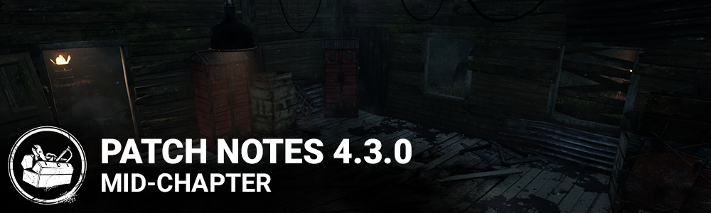

<!-- summary -->
## AI TL;DR

Executioner is rebalanced: canceling Rites of Judgement slows movement for one second and blocks attacks, and Punishment of the Damned cooldown is cut to 2.25 s. Perks are adjusted—Trail of Torment’s undetectable lasts until the generator stops regressing, Forced Penance’s broken timing, Blood Pact’s haste boost, and Any Means Necessary and For the People grant Bloodpoints; ranges and durations are tweaked. Generator terminology is clarified and text for Surge, Pop Goes the Weasel and Overcharge updated. Visuals add locker VFX, footstep and blood effects, 4K icons. The patch also fixes many Stadia bugs such as carrier issues, lingering control loss, Hex totem display errors and incorrect Executioner or Oni interactions; UI/audio fixes; wrong killer animation at match start remains.
<!-- /summary -->

<!-- nav -->
&larr; _oldest_ · [Archive: Stadia](../../index.md#archive-stadia) · [4.3.1 | Bugfix Patch](259-4-3-1-bugfix-patch.md) &rarr;
<!-- /nav -->

# 4.3.0 | Mid-Chapter

## FEATURES

### THE EXECUTIONER BALANCE UPDATE

At the moment, the cost of missing a Punishment of the Damned attack is too high, and it's too easy to fake Rites of Judgement into a basic attack. The following adjustments address these issues.

- After cancelling Rites of Judgement:
- Movement speed is 3.68 m/s for 1 second
- Further attacks cannot be made for 1 second
- Cooldown before further attacks after Punishment of the Damned reduced from 2.75 seconds to 2.25 seconds

**Perks:**

- Trail of Torment: Undetectable now lasts until the affected Generator stops regressing or a Survivor is injured or put into the dying state by any means
- Forced Penance: Broken Status effect lasts 60/70/80 seconds
- Blood Pact: Haste bonus is now 5%/6%/7%, and lasts until the Survivors are no longer within 16 meters of each other

**Perk Updates:**

- Any Means Necessary now awards Bloodpoints when used, and its cooldown has been reduced to 100/80/60 seconds
- For the People now awards Bloodpoints when used
- Thanataphobia no longer affects healing speed, and its penalties have been increased to 4%/4.5%/5%
- Mindbreaker's effect now lasts 3/4/5 seconds
- Cruel Limits's range has been increased to 32 meters
- Slippery Meat no longer affects Bear Trap escapes, and now increases hook escape attempt probabilities by 2%/3%/4%. These escape attempt percentages are additive, i.e. with this perk the chance of escaping the hook is now 6%/7%/8%
- Discordance now has limited range of 32/64/96 meters. It triggers one loud noise for a Generator when it's first marked. The aura of the Generator remains visible as long as the conditions are fulfilled. From the time the conditions are no longer fulfilled, the aura remains for another 8 seconds
- Hex: Huntress Lullaby now only affects healing and repairing skill checks
- Technician now prevents all Generator explosions from missed skill checks. The Generator loses and additional 5%/4%/3% progress for missed skill checks
- Pop Goes the Weasel now lasts 35/40/45 seconds
- We're Gonna Live Forever now increases healing speed by 100% when healing a Survivor in the dying state. Players now gain a token when rescuing a Survivor by stunning the Killer with a pallet or blinding them with a flashlight

**Generator Terminology changes and clarifications:**

- A Generator losing progress over time is "regressing"
- Putting a Generator into the regressing state is "damaging the Generator"
- If a Generator loses some of its progress immediately, this is "losing progress"
- A blocked Generator cannot change its progress
- A blocked Generator retains its regression state, but no progress is lost until it is no longer blocked
- A regressing Generator can lose progress due to other effects
- e.g. a Generator affected by Ruin can still lose progress due to Surge
- Surge, Pop Goes the Weasel, and Overcharge have had their text updated to reflect these changes

**Visual Update:**

- Visual updates to maps in The MacMillan Estates Realm.
- Visual update to Lockers.
- Added Footstep VFX.
- Visual update to all Blood VFX. On Screen Blood, Blood squirt on hit, Blood pool decals.
- Updated VFX for Trapper, Wraith and Hillbilly.
- Updated dissolve VFX in-game and in-lobbies.

**4K UI Icons**

- Updated Character portraits and customization icons for better resolution at 4K. *This may result in your custom icons being replaced when you update.*

**Perk rarity:**

All perks now have the same rarity:

- Tier 1: Uncommon
- Tier 2: Rare
- Tier 3: Very Rare

## BUG FIXES

**System:**

- Disabled daily rituals screen and claiming while in Custom Game
- Disabled audio sounds while being in the platform's store after proceeding from the In-game Store
- Added the player Cloud ID in the soft ban pop-up
- Stadia | Fixed an issue that caused a crash when cancelling a Crowd Choice right after starting one

**Gameplay:**

- Fixed an issue that might cause a survivor to remain in the being carried position after being hooked
- Fixed an issue that might cause players to have less control on their character after being unhooked
- Fixed an issue that caused the Cursed effect to appear before any token is earned on the perk Hex: Huntress Lullaby
- Fixed an issue that might cause Hex totems to appear as dull totems for some players
- Fixed an issue that caused the Make Your Choice perk to override a survivor's Calm Spirit while unhooking
- Fixed an issue that caused failed skill check animations to continue after a player lets go of the interaction button
- Fixed an issue that caused the survivor to hold the Deathslinger's chain with one hand after holding and dropping an item
- Fixed an issue that might cause players to receive the Torment effect at random times when playing against The Executioner
- Fixed an issue that caused survivors in the Cage of Atonement not to cause instant death if the remaining survivors are in the struggle phase
- Fixed an issue that caused The Oni's Blood Orbs to spawn too far from survivors

## KNOWN ISSUES

- The Killer will sometimes see an incorrect animation during the start of match camera pan.

<!-- nav -->
&larr; _oldest_ · [Archive: Stadia](../../index.md#archive-stadia) · [4.3.1 | Bugfix Patch](259-4-3-1-bugfix-patch.md) &rarr;
<!-- /nav -->
