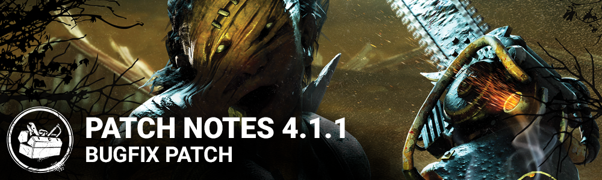

<!-- summary -->
## AI TL;DR

Aura visuals were swapped back to a more legible version after complaints about the 4.1.0 system, and a large batch of add-ons for The Cannibal and The Hillbilly were rebalanced - charge-replenish rates, rev limits, rarity tiers and penalties were adjusted, several penalties were removed, and Speed Limiter now grants double bloodpoints and is common. The remainder of the update is a bundle of bug fixes addressing overly bright interior lighting, stray blood droplets, Demogorgon shred misses and brief chases, item charge depletion, Nancy Wheeler facial animation, unintended offering consumption, Wraith Blind Warrior-Mud blindness, Hillbilly chainsaw clipping on Treatment Theatre, and Cannibal tantrum issues under poor network conditions.
<!-- /summary -->

<!-- nav -->
&larr; [4.1.0 | Mid-Chapter](210-4-1-0-mid-chapter.md) · [Archive: Steam](../../index.md#archive-steam) · [ 4.1.2 | Bug fix patch](219-4-1-2-bug-fix-patch.md) &rarr;
<!-- /nav -->

# 4.1.1 | Bug fix Patch

*This article was created from a* [*community discussion*](https://forum.deadbydaylight.com/en/discussion/177553/pc-4-1-1-bugfix-patch)*.*

## FEATURES

- Updated Auras: Patch 4.1.0 introduced a brand new aura system with new aura visuals. While we received positive feedback regarding their style, the consensus seems to be that they were not sufficiently visible, especially for small objects, at long range or in bright environments. In light of this, we have temporarily replaced the new aura visuals with a different type that should be much easier to see. Expect further aura improvements in future releases.

## Balance

Following the 4.1.0 PTB, it became clear that some of the add-ons for both The Cannibal and The Hillbilly needed further reworking. In this update, we address those addons, as well as pull back on some rebalancing changes that were too aggressive. (We're looking at you, Engravings.)

### The Cannibal

Initially, the Primer Bulb and Spark Plug add-ons sought to introduce a playstyle that revolved around going into tantrum and using a speed increase to catch up unsuspecting Survivors. In practice. the speed increase was too low for that playstyle to be worthwhile.

Now the Primer Bulb and Spark Plug add-ons will now increase rate at which Chainsaw charges replenish, providing a clearer advantage.

**Spark Plug:**

- Slightly increases the rate at which charges replenish

**Primer Bulb:**

- Moderately increases the rate at which charges replenish

Long Guide Bar and The Grease add-ons to increase the maximum rev before triggering a tantrum. This means you have more maneuverability around loops while revving your chainsaw.

**Long Guide Bar:**

- Slightly increase the amount of revving available before triggering a tantrum
- Updated rarity to Uncommon (from Common)

**The Grease:**

- Moderately increase the amount of revving available before triggering a tantrum

Furthermore, we've reassessed our previous nerf of the Knife Scratches and Beast's Marks add-ons. They were significantly nerfed because of The Cannibal's changes, but we might have been too hard on them - especially considering the Tantrum meter builds up while revving. This meant you'd almost always be 99% tantrum and the slightest mistake forced you to go through the tantrum.

**Knife Scratches:**

- Reverted the charge time penalty to -12%
- Increased the movement speed bonus to +2%

**Beast's Marks:**

- Reverted the charge time penalty to -12%
- Increased the movement speed bonus to 3%

Next on this list are two add-ons that were given unnecessary downsides. Hopefully removing them will make the add-ons worthy of their rarity and will make them more useful.

**Light Chassis:**

- Removed the speed decrease while revving

**Carburetor Tuning Guide:**

- Remove the increased recharge rate on Chainsaw charges

Finally, we've updated Speed Limiter to grant you even more bloodpoints on Chainsaw hits and we've lowered its rarity so it can be available more often.

**Speed Limiter:**

- Get 100% more points for Chainsaw score events.
- Updated rarity to Common (from Uncommon)

### The Hillbilly

With this update, we tried making add-ons with new and interesting effects. However, during the PTB, it became clear we needed to revisit some of these add-ons to better accomplish our goals.

**Black Grease:**

Black Grease was inspired by The Hillbilly's perk Enduring. It used to increase immunity to Blindness after being stunned by a pallet. We weren't happy with how it turned out, and have come up with a brand new effect inspired by Lightborn which should provide an obvious advantage that fits right in with the new Overheat mechanic.

- Moderately increases the Chainsaw's rate of cooling when a flashlight is shining on you. (-5 charges/second for those of you who love numbers)

**Mother's Helpers:**

Mother's Helpers was inspired by The Hillbilly's perk Lightborn. It used to increase your movement speed while a flashlight was shining on you. Unfortunately, flashlighting most often occurs while locked into animation, so players would usually not be able to make use of this speed boost. This new version is inspired by Enduring and should be interesting for fans of the old charge speed bonus add-ons.

- Slightly decreases chainsaw charge time for 30 seconds after being stunned by a pallet. (12% - the same as the old Spark Plug)

Next in line, we have various add-ons that needed some tweaks or that needed to be reverted (Engravings). Here they are:

**Lo Pro Chains:**

Lo Pro Chains shared the downside from Speed Limiter, but the upside wasn't enough to justify its rarity. We've updated it so it only deals a single health state for a short period after breaking a pallet or wall. We've also changed its rarity from Ultra Rare to Very Rare.

- Survivors hit with the Chainsaw within 5 seconds of breaking a pallet or a wall are damaged for a single health state.
- Updated rarity to Very Rare (from Ultra Rare)

**Apex Muffler:**

The Apex Muffler can enable some very strong builds. Because of that, we're increasing its rarity to Ultra Rare. We will continue to monitor this add-on closely.

- Updated rarity to Ultra Rare (from Very Rare)

**Dad's Boots:**

- Updated rarity to Uncommon (from Common)

**Death Engravings:**

The initial nerf to both Engravings add-ons was an unfortunate mistake. Additionally, seeing the Overheat mechanic in action, the Engravings add-ons were much too punishing. We have reverted them to their previous versions. We will continue to monitor these add-ons closely.

- Reverted the charge time penalty to -12%
- Reverted the movement speed increase to +15%

**Doom Engravings:**

- Reverted the charge time penalty to -12%
- Reverted the movement speed increase to +20%

**Heavy Clutch:**

This add-on had a downside which limited its use a bit too strictly. It has been removed. Hopefully by mixing it with other add-ons, we'll see new Billy sprints that aren't possible without the add-on.

- Removed the Chainsaw sprint steering downside

**Iridescent Brick:**

The Iridescent Brick used to start the Undetectable status effect timer after 5 seconds of a Chainsaw sprint. Unfortunately, that doesn't mean that you were Undetectable after 5 seconds, it meant the transition to being Undetectable started. This took away the add-on's value and made it unworthy of being an Ultra Rare. We've lowered the time required to transition to becoming Undetectable. We will continue to monitor this add-on closely.

- After maintaining a Chainsaw Sprint for 2 seconds, gain the Undetectable status effect until you stop sprinting.

**Tuned Carburetor:**

The downside of moving at 4.4 m/s requires something fairly strong to make up for it. In that sense, the previous decrease in charge time was barely noticeable. We've increased it to make this add-on more appealing.

- Moderately decrease Chainsaw charge time (20% up from 12%)

**Speed Limiter:**

Like The Cannibal's Speed Limiter, we've increased the bloodpoint bonus and changed its rarity.

- Get 100% more points for Chainsaw score events
- Updated rarity to Common (from Uncommon)

## Bug Fixes

- Fixed issues with overly bright lights on some interior maps.
- Fixed an issue causing blood droplets to sometimes remain in the air when the Executioner's Cage of Atonement moves.
- Fixed an issue causing the Demogorgon to sometimes miss Survivors when using the shred ability and landing exactly on the Survivor.
- Fixed an issue causing the Demogorgon to sometimes briefly enter a chase with Survivors while traversing the Upside Down.
- Fixed an issue causing some items to be depleted just before they run out of charges.
- Fixed an issue causing Nancy Wheeler's facial animations to not play correctly.
- Fixed an issue causing offerings to be consumed when the player switches characters in an online lobby.
- Fixed an issue causing the Wraith's **Blind Warrior - Mud** add-on to not inflict blindness.
- Fixed an issue causing Hillbilly's chainsaw to hit through a counter on the **Treatment Theatre** map.
- Fixed an issue causing various problems with the Cannibal's tantrum under poor network conditions.

<!-- nav -->
&larr; [4.1.0 | Mid-Chapter](210-4-1-0-mid-chapter.md) · [Archive: Steam](../../index.md#archive-steam) · [ 4.1.2 | Bug fix patch](219-4-1-2-bug-fix-patch.md) &rarr;
<!-- /nav -->
