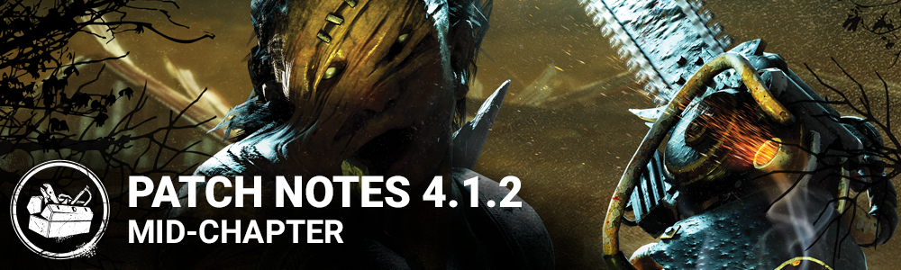

<!-- summary -->
## AI TL;DR

Hillbilly's heat dissipation was lowered from -5 to -3.5 charges per second, making the Overheat system relevant again and forcing players to manage the chainsaw heat.

The patch also addressed several bugs: it ensures the Hillbilly's chainsaw charge fully resets after stun and stops extreme lunges, prevents the Nurse from blinking into hills, stops killers from freezing mid-animation after high falls, and reduces Sync Error 111 on the Tally screen.
<!-- /summary -->

<!-- nav -->
&larr; [4.1.1 | Bug fix Patch](215-4-1-1-bug-fix-patch.md) · [Archive: Steam](../../index.md#archive-steam) · [4.1.3 | Bugfix Patch](227-4-1-3-bugfix-patch.md) &rarr;
<!-- /nav -->

#  4.1.2 | Bug fix patch

*This article was created from a* [*community discussion*](https://forum.deadbydaylight.com/en/discussion/180981/steam-bug-fix-patch-4-1-2)*.*

## Balance

**The Hillbilly**

The Overheat mechanic was added to limit The Hillbilly's ability to always use his chainsaw. With the previous increase in heat dissipation (up to -5 charges/second), and the fact that heat dissipates during various cooldown phases, the Chainsaw's heat meter rarely became relevant. With this change, we hope to that heat generation will reach thresholds where players have to manage the heat meter more than with our previous iteration.

- Decreased the base heat dissipation rate from -5 charges/second to -3.5 charges/second

## Bug Fixes

- Fixed an issue where the Hillbilly's chainsaw charge would not be fully reset properly after being stunned, leading to the Hillbilly having the ability to use the chainsaw too quickly after a stun.
- Fixed an issue where the Hillbilly would sometimes lunge at extremely high speeds after being stunned.
- Fixed an issue where the Nurse could sometimes blink inside hills and get stuck.
- Fixed an issue causing Killers to be stuck mid-animation after falling from a significant height.
- Reduce the occurrence of Sync Error code 111 on the Tally screen

<!-- nav -->
&larr; [4.1.1 | Bug fix Patch](215-4-1-1-bug-fix-patch.md) · [Archive: Steam](../../index.md#archive-steam) · [4.1.3 | Bugfix Patch](227-4-1-3-bugfix-patch.md) &rarr;
<!-- /nav -->
