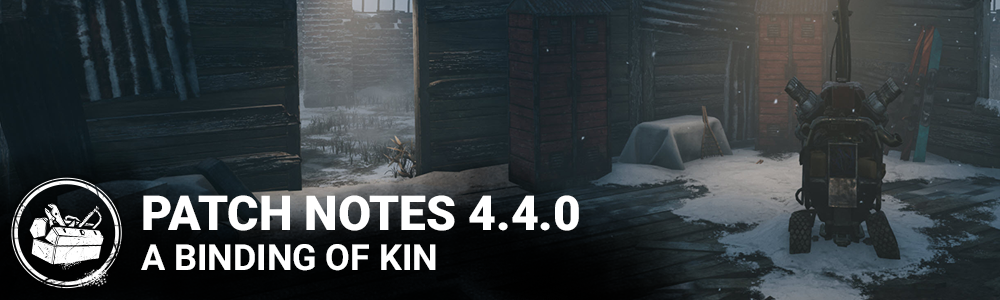

<!-- summary -->
## AI TL;DR

The A Binding of Kin chapter arrives, adding the Twins killer and survivor Élodie Rakoto, while the Nightmare on Elm Street DLC launches on Switch, Windows Store, Stadia, PS5 and Xbox Series X|S. Rituals were streamlined, blood-point values standardized, sabotage now needs four hooks, and Blight’s new add-ons adjust Rush token regen and trigger a difficult skill check at close range. Visual refreshes touch Ormond, Junkyard, the Hatch, Totem and the Twins lobby.

The update is a batch of fixes - correcting cloud-ID bans, chest interactions, animation glitches, map lighting, trap visibility, generator and wall bugs, and numerous killer-specific issues - plus platform-specific Xbox One and Switch patches. Known issues focus on the Twins’ locker mechanics and several of Élodie’s perks.
<!-- /summary -->

<!-- nav -->
&larr; [4.3.2 | Bugfix Patch](260-4-3-2-bugfix-patch.md) · [Archive: Steam](../../index.md#archive-steam) · [4.4.1 | Bugfix Patch](271-4-4-1-bugfix-patch.md) &rarr;
<!-- /nav -->

# 4.4.0 | A Binding of Kin

## Features & Content

**New Chapter: A Binding of Kin**

- Added A New Killer - The Twins
- Added a New Survivor - Élodie Rakoto

**Live Updates**

- The Nightmare on Elm Street DLC is now available through the in-game store on the Nintendo Switch, Windows Store, Stadia, Playstation 5, and Xbox Series X|S. The full DLC will start to appear on each platform's respective store shortly.
- Rite of The Ghost Face Daily Ritual has been simplified: "Mark 4 Survivors".
- All Daily Rituals that were worth less then 30k bloodpoints are now worth 30k bloodpoints.
- Sabotage Ritual now requires 4 Hooks to be sabotaged.
- Blight's Adrenaline Vial addon now makes Rush Tokens regenerate faster than in the previous release.
- Blight's Soul Chemical addon has a new function: During a rush, the moment you enter the 16 meter radius around a Survivor who is repairing or healing, trigger a tremendously difficult Skill Check for that Survivor. Can activate once per Survivor per Rush. Does not trigger for a Rush starting within 16 meters of the Survivor.

**Visual Update:**

- Visual updates to maps in Ormond and Junkyard.
- Visual update to the Hatch and Totem.
- Visual update on the Twins Lobby.

## Bug Fixes

- Fixed an issue that caused the player Cloud ID to be missing from the ban message.
- Fixed an issue that caused daily rituals to be consumed even if the claim of bloodpoints for a completed daily ritual failed.
- Fixed an issue that caused unavailable Archives cosmetics to appear on the Feature Store section if all the cosmetics were already purchased.
- Fixed an issue that caused a short freeze when opening a chest.
- Fixed an issue that prevented survivors from being able to start unlocking a chest from its side.
- Fixed an issue that caused survivors to be able to steal items from chests opened by other survivors.
- Fixed an issue that caused the animation of mending another survivor to be missing.
- Fixed an issue that caused the animation of waking up another survivor to be missing.
- Fixed an issue that caused firecrackers not to destroy Hag traps.
- Fixed an issue that caused Hag traps auras not to be visible while they are being burned by a flashlight.
- Fixed an issue that caused survivors to be able to see through walls when using a flashlight and hugging the wall.
- Fixed an issue that sometimes caused killers to be stuck inside a generator after damaging it.
- Fixed an issue that allowed survivors to sabotage hooks through walls.
- Fixed an issue that allowed survivors to complete a sixth generator when failing a skill check while the fifth generator is completed.
- Fixed an issue that prevented killers from damaging a breakable wall after getting stunned while breaking the wall.
- Fixed an issue that caused notifications bubble not to appear when completing a generator inside a building in Badham Preschool.
- Fixed an issue that caused Nurse blinks to be unreliable around the Blood Lodge.
- Fixed an issue that caused the corrupted Pool of Devotion sound effect to be heard in the beginning of a match against the Plague.
- Fixed an issue that caused the camera to pan left before panning right when entering the title screen.
- Fixed an issue that caused the Hillbilly's chainsaw to disappear during the pallet stun animation.
- Fixed an issue in windowed mode which made it sometimes possible to resize the window when rotating the camera while holding M1
- Fixed an issue which made exclusive cosmetics available to all
- Fixed an issue on various maps which showed extremely bright lighting in various colors
- Fixed an issue that may cause The Legion not to down survivors when hitting them while in Feral Frenzy when equipped with the Frank's Mixtape add on
- Fixed an issue that caused the confetti of forth anniversary items to trigger in the tally screen
- Fixed an issue that caused invisible collisions on the stairs leading to the Killer Basement on the Hawkins National Laboratory map
- Fixed an issue that caused The Spirit to see flashlight beams during Yamaoka's Haunting
- Fixed an issue that caused survivors' camera to clip through the generator pole when repairing a generator

**Xbox One only:**

- Fixed a crash on Xbox One when trying selecting 'View profile' of a XSX account

**Switch only:**

- Fixed an issue where the players would run at a slower speed when looking in certain directions

## Known Issues

**The Twins:**

- Victor may become stuck if he pounces on a locker with a healthy Survivor inside. Charlotte will be unable to search the locker until Victor is recalled.

**The Twins' perks:**

- Coup de Grâce: Missing visual feedback when performing a modified lunge attack
- Hoarder: The notification does not always work when Survivors pick up items in the basement
- Hoarder: The perk currently does not lower the rarity of items found in chests
- Hoarder: The perk currently does not spawn 2 extra chests

**Élodie's perks:**

- Appraisal: The perk grants the "Chest Unlocked" score event when performing the Rummage action
- Appraisal: Survivors keep rummaging through the chest for a brief moment after the action is completed
- Deception: The UI does not function as intended
- Deception: The feint locker animation may interfere with the rushed locker entry animation
- Deception: Various issues may occur when using the perk with high latency
- Power Struggle: The perk can't be used while actively wiggling
- Power Struggle: The perk cannot be used immediately if the wiggle threshold was reached before wiggling
- Power Struggle: Stunning the killer with this perk will sometimes snap the killer to the other side of the pallet
- Power Struggle: Survivors may become stuck inside pallets after using Power Struggle

## Changes from PTB

### The Twins

- Allow Victor to be recalled after having been on a survivor's back for 45 seconds
- The Twins' Spinning Top add on now causes the survivor to drop any held item when hit by Victor's pounce attack
- Increased Victor Pounce charge movement speed (from 2.0m/s to 2.4 m/s).
- Modified time it takes to reach 2.4m/s (From 0.25 sec to 0.75 sec)

### The Twins Bug Fixes

- Fixed an issue that might cause Victor's movement speed to be permanently reduced
- Fixed an issue that caused Victor to be unable to see the exit gate aura
- Fixed an issue that caused Victor to be able to see scratch marks left while Charlotte was controlled
- Fixed an issue that allowed Victor to pounce through the exit gate entity barrier
- Fixed an issue that allowed Victor to leap past the closed exit gates on some maps
- Fixed an issue that might cause Victor to be temporarily misaligned after latching on a survivor's back
- Fixed an issue that caused Victor to remain stuck in the air if a survivor disconnects while Victor is on its back
- Fixed an issue that might cause Victor to be stuck when landing on chests
- Fixed an issue that caused survivor's screens to turn completely black when The Twins use the Knock Out perk

### Perks

- Coup de Grace: Reduced the values from 60/80/100% to 40/50/60%

### Other PTB Bug Fixes

- Fixed an issue that caused Appraisal's Rummage's action to be influenced by other perks affecting unopened chest unlock speeds
- Fixed an issue that caused the sound effect to be missing when entering a locker with the perk Deception
- Fixed an issue that caused the extra chests not to be spawned when using the Hoarder perk
- Fixed an issue that caused players to be able to perform an action when another character stands in front of the interactable object
- Fixed an issue that caused survivors to not have any dying animation when The Huntress hits them with an hatchet that put them in the dying state
- Fixed an issue that caused survivors failing a skill check not to be woken up from the Dream World when playing against The Nightmare
- Fixed an issue that caused Balanced Landing's Haste effect not to display a timer
- Fixed an issue that caused The Trapper not to have any sound effects when stunned
- Fixed an issue that caused The Nightmare, The Hag, The Trapper and The Demorgorgon not to be able to place traps or portals inside the Blood Lodge
- Fixed an issue that caused a sound effect to play continually when holding a flashlight on a blinded killer's face

<!-- nav -->
&larr; [4.3.2 | Bugfix Patch](260-4-3-2-bugfix-patch.md) · [Archive: Steam](../../index.md#archive-steam) · [4.4.1 | Bugfix Patch](271-4-4-1-bugfix-patch.md) &rarr;
<!-- /nav -->
