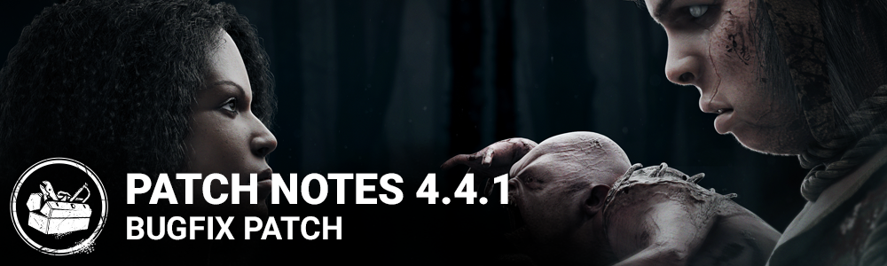

<!-- summary -->
## AI TL;DR

Technical Flashlight rework restores normal accuracy, adds new VFX, animations and audio cues for blinding, while Appraisal now limits chest rummaging to one per chest and Ebony & Ivory require the second hook phase. Victor can search lockers, blocking survivors up to ten seconds, and Hoarder’s detection radius is increased (32/48/64 m) with its rarity penalty removed. The update also expands Hoarder chest spawns and fixes Victor and Twins misalignments. Most of the patch is a wide-range bug-fix sweep covering flashlight beam behavior, Victor power glitches, Twins mechanics, cross-platform friend list visibility, perk icons and other interaction and networking issues, plus a Stadia-only friends-list fix. Known issue: the flashlight beam may disappear when using Lightborn to blind a killer.
<!-- /summary -->

<!-- nav -->
&larr; [4.4.0 | A Binding of Kin](270-4-4-0-a-binding-of-kin.md) · [Archive: Steam](../../index.md#archive-steam) · [4.4.2 | Bugfix Patch](272-4-4-2-bugfix-patch.md) &rarr;
<!-- /nav -->

# 4.4.1 | Bugfix Patch

## 4.4.0 Patch Notes Addendum:

- Technical Flashlight Rework and optimization
- Updated Flashlight VFX and animations
- Added audio feedback when using the Flashlight against Killers.

## Features

- Increased default Flashlight accuracy back to normal
- Appraisal now only allows Survivors to rummage through the same chest once
- Ebony and Ivory Memento Moris now require the targeted survivor to have reached the second hook phase
- Victor can now search lockers, if a Survivor is found inside, the player will be send back to control Charlotte while Victor will block the Survivor in the locker for up to 10 sec.

## Content

- Hoarder: Increased the distance at which Survivor locations are revealed from 24/36/48 meters to 32/48/64 meters
- Hoarder: Removed the stipulation that it decreases the rarity of items found in chests

## Bug Fixes

- Fixed an issue that allowed Victor to pounce on Survivors inside lockers
- Fixed an issue that could cause Unbreakable to grant too much recovery when spam clicking
- Fixed an issue that caused the Flashlight beam to stay narrow after successfully blinding the Killer.
- Fixed an issue that prevented Hoarder from spawning extra chests
- Fixed an issue where Victor was misaligned during the Twins mori
- Fixed a terminology issue in Hoarder's perk description
- Fixed an issue that caused cross-platform friends to no longer appear in the friends list after linking accounts
- Fixed an issue that caused the text in the redeem code box to be deletable
- Fixed an issue where Victor was misaligned in the lobby for The Twins
- Fixed an issue that caused the rain to be heard while the Temple of Purgation's basement.
- Fixed an issue that caused Victor to get stuck in the ground when released at certain locations.
- Fixed an issue that caused Victor to appear to fall through the ground from survivor's perspectives when released.
- Fixed an issue that may prevent releasing Victor after being stunned during the release interaction.
- Fixed an issue that may cause the screen to remain black after manually changing from Victor to Charlotte.
- Fixed an issue that caused the blinding effect to carry over when switching from Victor to Charlotte.
- Fixed an issue that caused the animation to continue when cancelling the Twins mori.
- Fixed an issue that caused Victor to remain on a survivor killed by the end game collapse.
- Fixed an issue that caused Victor to see blocked generator auras red instead of white.
- Fixed an issue that may cause the Twins power to become unusable under poor network conditions.
- Fixed an issue that allowed survivors to crawl out of the exit gate after being hit while having Victor on their back.
- Fixed an issue that caused survivors' hands to jitter when holding a lit flashlight.
- Fixed an issue that caused survivors to bounce when destroying Victor when standing on obstacles.
- Fixed an issue that caused the Lightborn perk icon not to appear for survivors when attempting to blind the killer with firecrackers.
- Fixed an issue that caused the Lightborn perk icon not to appear for survivors when blinding a killer that was already being blinded by another survivor.
- Fixed an issue that caused the Oni not to absorb blood orbs during his successful hit animation.
- Fixed an issue that caused the survivors to continue searching the chest after the progress bar is full when using the Appraisal perk.
- Fixed an issue that caused searching an open chest with the Appraisal perk to grant the Unlocked Chest score.
- Fixed an issue that caused the FOV of the Legion not to increase while running during Feral Frenzy.

Stadia only:

- Fixed an issue that caused an extra 'block' option to appear after selecting an offline friend profile in the friends list

## Known Issues

- Flashlight beam may disappear when blinding a Killer with Lightborn perk equipped.

<!-- nav -->
&larr; [4.4.0 | A Binding of Kin](270-4-4-0-a-binding-of-kin.md) · [Archive: Steam](../../index.md#archive-steam) · [4.4.2 | Bugfix Patch](272-4-4-2-bugfix-patch.md) &rarr;
<!-- /nav -->
