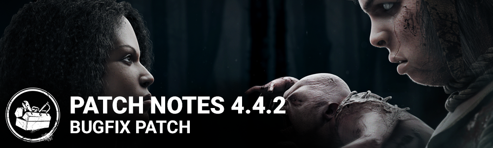

<!-- summary -->
## AI TL;DR

Victor’s recall timer has been reduced to 30 seconds after detaching from Charlotte, down from 45. The rest of the 4.4.2 update is a sweeping bug-fix pass: store UI now updates during outfit sales, bright lighting tiles and camera tilt issues are resolved, flashlight and survivor-perk interactions (Power Struggle, Deception, Oppression, etc.) are stabilized, and numerous Twins-related animation, aura, and exit-gate glitches are fixed. Map-specific glitches on Autohaven Wreckers and Gas Heaven, trap placement, outfit rendering, and badge reward messages have also been addressed, and the Deception perk icon now shows cooldown timing.
<!-- /summary -->

<!-- nav -->
&larr; [4.4.1 | Bugfix Patch](271-4-4-1-bugfix-patch.md) · [Archive: Steam](../../index.md#archive-steam) · [4.5.0 | Mid-Chapter](274-4-5-0-mid-chapter.md) &rarr;
<!-- /nav -->

# 4.4.2 | Bugfix Patch

## Balance

- Victor can now be recalled after being detached from Charlotte for 30 seconds (down from 45).

## Bug Fixes

- Fixed an issue where the store UI would not update properly when Outfit sales are active
- Fixed an issue on multiple maps, where there are tiles with extremely bright lighting in various colors.
- Fixed an issue that caused the Flashlight to work inconsistently over pallets and other objects in the environment.
- Fixed an issue that caused Barbecue & Chili's bonus bloodpoints not to be granted when controlling Victor when the game ends.
- Fixed an issue that caused the Twins not to recover their add-ons when using the Black Ward offering and controlling Victor when the game ends.
- Fixed an issue that caused Victor to always count as being in close hook proximity for Chaser emblem scoring.
- Fixed an issue that caused survivors sacrificed while controlling Victor not to count for Devout emblem scoring.
- Fixed an issue that caused the Oblivious effect inflicted by the Twins Drop of Perfume add-on to disappear if the survivor stops moving.
- Fixed an issue that caused the Undetectable effect granted by the Twins Silencing Cloth add-on to only trigger when manually returning to Charlotte.
- Fixed an issue that caused the music to change when switching between Victor and Charlotte.
- Fixed an issue that caused Charlotte to be unable to move during the wake up animation when returning from Victor for the first time in a game.
- Fixed an issue that caused the camera to become tilted after switching to Victor.
- Fixed an issue that caused the cooldown animation to loop after returning to Charlotte.
- Fixed an issue that caused Victor to float off Charlotte's body after respawning.
- Fixed an issue that caused Victor and Charlotte to be able to block off exit gate by standing in front of it.
- Fixed an issue that caused the exit gate blockers to be visible to all survivors when Victor is attached to one of them.
- Fixed an issue that caused the exit gate blockers to disappear for the killer after Charlotte downs a survivor with Victor on their back.
- Fixed an issue that caused survivors to be revealed by Killer Instinct as when close to Victor in various situations.
- Fixed an issue that may have caused Victor to be briefly misaligned after pouncing on survivors.
- Fixed an issue that may have caused Charlotte's movement to become jittery after being stunned during the release interaction.
- Fixed an issue that caused Victor not to see the aura of a hook with a hooked survivor.
- Fixed an issue that caused Victor's glow after missing a pounce to not match the actual duration of his vulnerability.
- Fixed an issue that caused no prestige reward message to be shown when progressing past level 50 in the bloodweb as Élodie Rakoto, The Twins, and Felix Richter.
- Fixed an issue that may have caused a survivor to be teleported to the wrong side of the pallet after stunning the killer with the Power Struggle perk.
- Fixed an issue that caused the Power Struggle not to be usable when actively wiggling.
- Fixed an issue that may have caused the Hoarder notifications not to work when the survivor is in the basement.
- Fixed an issue that caused the Oppression perk not to affect blocked generators.
- Fixed an issue that allowed a locker in the Deception perk's fake enter animation to be entered. Notably, this would cause the survivor to enter the locker right after using the perk when pressing the key more than once.
- Fixed an issue that may cause survivors using the Deception perk to become stuck in the locker.
- Fixed an issue that may have caused the Hillbillly's chainsaw to keep generating heat after using it.
- Fixed an issue that prevented some hatches from being opened with a key.
- Fixed an issue that prevented killers to place traps in the basement on the Autohaven Wreckers maps.
- Fixed an issue that caused the Trapper's Krampus outfit to have a line stretching out.
- Fixed an issue that made it possible for Survivors to navigate through a wall in the gas station on the Gas Heaven map
- Addressed "deadzone" reports in Autohaven Wreckers maps by promoting certain tiles to spawn more frequently than others.
- Updated the functionality of the Deception perk icon. It will now display the activation and cooldown times, and be lit up otherwise.

## Known Issues

- Flashlight beam stays narrow after successfully blinding the Killer.

<!-- nav -->
&larr; [4.4.1 | Bugfix Patch](271-4-4-1-bugfix-patch.md) · [Archive: Steam](../../index.md#archive-steam) · [4.5.0 | Mid-Chapter](274-4-5-0-mid-chapter.md) &rarr;
<!-- /nav -->
