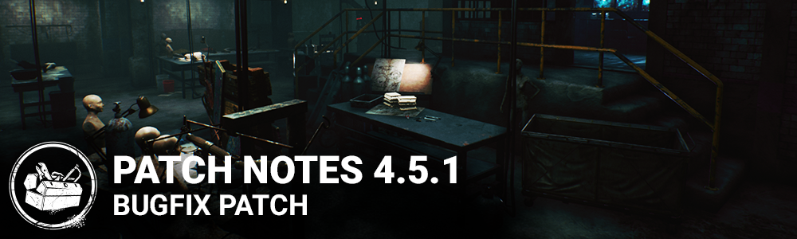

<!-- summary -->
## AI TL;DR

Floating survivors in the lobby, missing Auris model in the Observer’s hand, Meg’s Golden Summer outfit icon, and Victor’s incapacitated opacity were corrected, alongside UI text errors in Thai and French. Audio muting while spectating, missing tutorial SFX, and a spectator lock when the final survivor tallies were also fixed. Map-related bugs were addressed: glyph placement on Gideon Meat Plant, Sanctum of Wrath, The Pale Rose, Midwich Elementary School and both Asylum maps, plus collision problems in Autohaven Wreckers and Crotus Penn Asylum, which are now re-enabled. Additional fixes include unbreakable set breaking, pips carryover between matches, and a PS5-only crash on trial start after a party join. Known issue: killers cannot see their own charms on hooks.
<!-- /summary -->

<!-- nav -->
&larr; [4.5.0 | Mid-Chapter](274-4-5-0-mid-chapter.md) · [Archive: Steam](../../index.md#archive-steam) · [4.5.2 | Bugfix Patch](276-4-5-2-bugfix-patch.md) &rarr;
<!-- /nav -->

# 4.5.1 | Bugfix Patch

## Bug Fixes

- Fixed an issue that caused survivors to be floating in the lobby.
- Fixed an issue that caused various error messages to occur in a lobby or after a trial after specific conditions were met.
- Fixed an issue that caused the Auris in the Observer's hand to be missing when accessing the Archives from the widget.
- Fixed an issue that caused Meg's Golden Summer Outfit Icon to not appear.
- Fixed an issue where a spectator could be sometimes locked in the spectator screen when entering in spectator mode while the last Survivor reaches the tally screen.
- Fixed an issue where unbreakable sets could be broken.
- Fixed an issue where some UI texts show incorrect characters in Thai language on Steam.
- Fixed the opacity on Victor's incapacitated effect on the player status widget to be more visible.
- Fixed a missing character in Archive challenge text when the language is set to French.
- Fixed an issue where the audio is muted when spectating an other player
- Fixed an issue where there was no SFX on button prompts in the Tutorials
- Archives: Fixed Glyph placement issues in Gideon Meat Plant, Sanctum of Wrath, The Pale Rose, Midwich Elementary School, and both Asylum maps
- Fixed an issue where pips lost or gained in a Custom Match would be added to the pips lost or gained in the following Public Match
- Fixed various collision-related issues in Autohaven Wreckers and Crotus Penn Asylum. These maps have been re-enabled.

PS5 only:

- Fixed a crash when a trial starts after a player requests to join a party.

## Known Issues

- Killers can't see their own Charms on hooks.

<!-- nav -->
&larr; [4.5.0 | Mid-Chapter](274-4-5-0-mid-chapter.md) · [Archive: Steam](../../index.md#archive-steam) · [4.5.2 | Bugfix Patch](276-4-5-2-bugfix-patch.md) &rarr;
<!-- /nav -->
