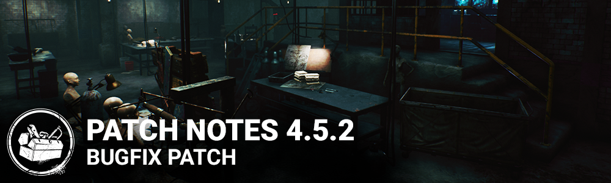

<!-- summary -->
## AI TL;DR

Camera height for crawling was restored and survivor locomotion animations tweaked for tighter controls, while the HUD got an overhaul: objectives moved to bottom-left, icons enlarged with shading, generator count font upsized, hook count widget reduced, player status widgets shifted lower, timer bars widened, and a new independent Skill Check size setting added. The patch also fixed gameplay bugs, correcting hit-registration distance errors, excessive crawl speed, missing event bloodpoints on indoor generators, interaction-priority glitches, Calm Spirit trap screams, Hex: The Third Seal and Undying reset issues, missing haste icon, early nurse fatigue attacks, Demogorgon add-on speed boosts, and various UI, collision and perk anomalies across killers and maps. Known issue: Skill Check UI scaler remains English-only until the next chapter.
<!-- /summary -->

<!-- nav -->
&larr; [4.5.1 | Bugfix Patch](275-4-5-1-bugfix-patch.md) · [Archive: Steam](../../index.md#archive-steam) · _newest_ &rarr;
<!-- /nav -->

# 4.5.2 | Bugfix Patch

## Content

- Raised camera to original position when crawling
- Changed transition animations in Survivor Locomotion to make the controls feel more responsive.

**HUD Layout Changes:**

- Moved the objectives from the top center of the screen to the bottom left corner and removed the additional text. Objectives are now icon based.
- Increased the size of the objectives icons and added background shading to help improve their visibility when viewed on bright environments.
- Increased the font size of the generator count number.
- Reduced the size of the Killer's hook count widget to be more in line with the other objectives.
- Lowered the stack of player status widgets from the top left corner to the lower left corner. They now sit just above the new objectives location and expand upwards.
- Increased the width and height of the timer bar under the player names in the player status widget.
- Added a new setting in the Settings menu to control the size of the Skill Check independently of the HUD scale setting.

## Bug Fixes

- Fixed an issue that could cause Killers to appear further away than they actually were on Survivor screens (This was the primary cause of the hit registration (hitbox) issues seen since 4.5.0)
- Fixed an issue that caused survivors to crawl faster than intended.
- Fixed an issue that prevented event bloodpoints from being awarded from certain indoor generator types used on maps including Midwich Elementary and Lery's Memorial Hospital.
- Fixed an issue with survivor camera-based interaction priority that could make it impossible to prioritize interactable objects on the ground (such as bear traps near pallets).
- Fixed an issue that could cause survivors with the perk Calm Spirit to scream when caught in a bear trap.
- Fixed an issue with Hex: The Third Seal and Hex: Undying that could cause the hexed players and hexed player count to be incorrectly reset when the Third Seal's totem is destroyed and Undying is still active.
- Fixed an issue that could cause the haste status effect icon not to show when using Refined Serum.
- Fixed an issue that could allow the nurse to attack during the first few frames of fatigue after a blink, and skip the fatigue.
- Fixed an issue that prevented the add-ons Black Heart and Mew's Guts from increasing the Demogorgon's recovery speed.
- Fixed an issue that caused the survivor's portrait become highlighted any time infection from the Plague was increasing. It should only highlight to indicate when a survivor has reached maximum sickness.
- Fixed an issue that could cause the speed boost from uncloaking with the Wraith add-on The Serpent to trigger too early to be of use.
- Fixed an in issue that could cause incorrect values for the Unbroken emblem.
- Fixed an issue that could cause players to end up on the wrong side of pallets when stunning a killer.
- Fixed an issue that could prevent the proper indicators from displaying for the Doctor when using Shock Therapy, Static Blast, or missed Snap Out Of It skill checks.
- Fixed an issue that caused survivors to keep the default outfit between the lobby and the loading screen to the trial when playing a Custom Game.
- Fixed an issue where old event items would sometimes appear in bloodwebs.
- Fixed an issue where the UI can show a healthy survivor as injured when healed for two health states very quickly.
- Fixed various collision-related issues Crotus Penn Asylum.
- Fixed an issue that would cause charms on hooks to not be visible to Killers.
- Fixed an issue that would cause the game to get stuck on the tally screen when entering spectator mode at the same time last Survivor reaches the tally screen.

## Bug Fixes missing from 4.5.1 and 4.5.0 Patch notes

**Following bugs were fixed, but not mentioned in previous Patch notes.**

- Fixed an issue that could cause injured survivor sounds be louder than intended after rush-entering a locker (they should be audible, but muffled) *(missing note from patch 4.5.1)*
- Fixed an issue that could prevent the Plague from being able to infect window vaults with Vile Purge *(missing note from patch 4.5.1)*
- Fixed an issue that could prevent the Shape from playing recoil animations or sound effects when hitting an obstruction in Evil Within III *(missing note from patch 4.5.1)*
- Fixed an issue that could reduce the Legion's acceleration while attacking with Feral Frenzy *(missing note from patch 4.5.1)*
- Fixed an issue that could prevent the Huntress from hearing audio feedback on a long-range hatchet hit *(missing note from patch 4.5.0)*
- Fixed an issue with the perk Deception that could cause a "Hide" prompt to appear but not be usable *(missing note from patch 4.5.0)*

\[Windows store only\]

- Fixed a crash that occurred when revoking the consent.

## Known Issues

- Skill Check UI Scaler option in the options menu appears in English for all non-English languages. This will be fixed with the next Chapter patch.

<!-- nav -->
&larr; [4.5.1 | Bugfix Patch](275-4-5-1-bugfix-patch.md) · [Archive: Steam](../../index.md#archive-steam) · _newest_ &rarr;
<!-- /nav -->
