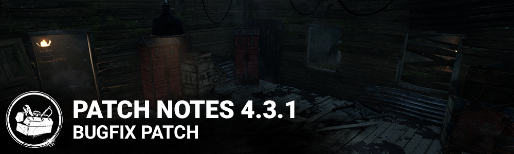

<!-- summary -->
## AI TL;DR

The patch resolves numerous bugs across killers, survivors and perks, including medkits with 32 charges not fully healing the second health state, Discordance auras disappearing during generator repairs, an incorrect first-person posture during killer intros, and missing Halloween hook auras. It also fixes the Nightmare’s mori dissolve, adds the Demogorgon’s Shred animation, prevents premature Blighted Serum power use, removes stray Visceral Canker spawns, stops survivor models lingering in Cage of Atonement after disconnects, corrects Madness audio level switches, and silences killer-theme music for spectators in custom lobbies.
<!-- /summary -->

<!-- nav -->
&larr; [4.3.0 | Mid-Chapter](251-4-3-0-mid-chapter.md) · [Archive: Windows Store](../../index.md#archive-windows-store) · [4.3.2 | Bugfix Patch](264-4-3-2-bugfix-patch.md) &rarr;
<!-- /nav -->

# 4.3.1 | Bugfix Patch

## Bug Fixes

- Fixed an issue that might prevent medkits with 32 charges to completely heal the second health state.
- Fixed an issue that caused survivors auras not to be shown if a killer equipped with the Discordance perk enters the activation range after the survivors have started repairing a generator.
- Fixed an issue that caused killers to have their first person view posture during the intro.
- Fixed an issue that caused Halloween event hook auras to display a base.
- Fixed an issue that cause the Nightmare not to dissolve at the end of his mori animation.
- Fixed an issue that caused the Demogorgon not to have an animation when using the Shred ability.
- Fixed an issue that may allow the killer to use its power before Blighted Rush after they hook a survivor while equipped with the Blighted Serum.
- Fixed an issue that caused a Visceral Canker to appear if a killer is the only user equipped with a quest that would cause a canker to spawn.
- Fixed an issue that caused a survivor's model to remain in a Cage of Atonement when disconnecting.
- Fixed an issue that caused Madness audio levels to be incorrect when switching spectated survivors.
- Fixed an issue that caused the killer's music theme to be heard as a spectator in a custom game lobby.

<!-- nav -->
&larr; [4.3.0 | Mid-Chapter](251-4-3-0-mid-chapter.md) · [Archive: Windows Store](../../index.md#archive-windows-store) · [4.3.2 | Bugfix Patch](264-4-3-2-bugfix-patch.md) &rarr;
<!-- /nav -->
