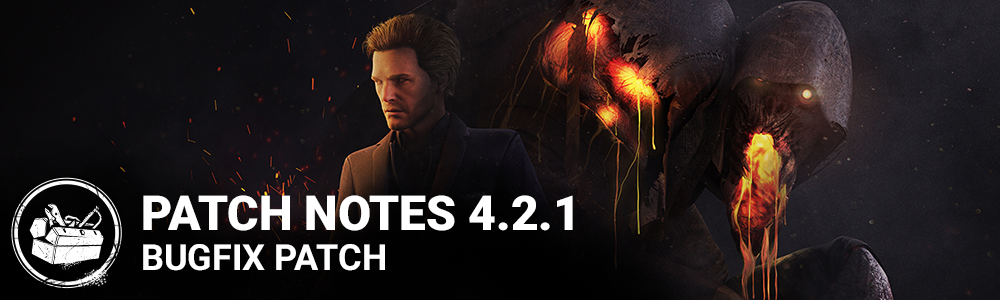

# 4.2.1 | Bugfix Patch

## Bug Fixes

- Fixed an issue that caused the "heartbeat" sound played for Survivors in the Terror Radius to be much quieter than intended.
- Fixed a number of issues that caused the Huntress' hatchets to have incorrect behavior when server-side hit validation is enabled.
- Fixed an issue that caused Survivors hooked in the basement to appear floating in the air in the floor above the basement.
- Fixed an issue that allowed PC/console players to add mobile players as friends.
- Fixed an issue that caused the Survivor screams triggered by the perk Dragon's Grip not being properly audible to the Killer.
- Fixed an issue that caused an FPS drop when looking at an activated generator.
- Fixed a post-process effect bug that was causing an FPS drop for some users.
