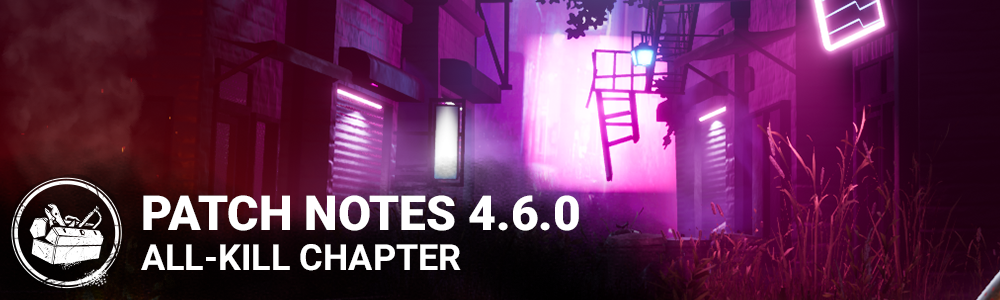

<!-- summary -->
## AI TL;DR

The Trickster joins the Killer roster and Yun-Jin Lee arrives as a new Survivor, while Party Privacy settings, a Chat Filter and Colorblind modes give players more control. HUD tweaks enlarge negative status timers and refine the player status bar; Decisive Strike now deactivates during certain actions and several perks (Smash Hit, Self Preservation, Starstruck, No Way Out) receive balance changes. Audio and visual updates refresh lobby, store and tally screens, and the Trickster gains new chase-mode voice lines.

The remainder centers on stability: Blight animation and camera tweaks, Wraith speed changes, collision and map fixes, plus numerous crash and UI patches across platforms and performance improvements. Known issues include a Stadia Dream-Token bug and a Windows Store consent crash.
<!-- /summary -->

<!-- nav -->
&larr; _oldest_ · [Live](../../index.md#live) · [4.6.1 | Bugfix Patch](280-4-6-1-bugfix-patch.md) &rarr;
<!-- /nav -->

# 4.6.0 | All-Kill

## Features

- Added a new Killer - The Trickster
- Added a new Survivor - Yun-Jin Lee
- Added Party Privacy options - You can now set your party privacy to automatically block join requests from strangers, allow friends to join without approval, etc.
- Added the Chat Filter feature
- Added an error message when a user fails to add a friend because he has too many friends

## Content

The Blight

- Adjusted his first person animations and camera position to be higher up
- Reworked the collision detection for his power. It should now be consistent with basic attack obstruction and no longer result in sliding off various surfaces.

The Wraith

- Increased his cloaked move speed
- Decreased his move speed while uncloaking
- Reduced the Windstorm addon move speed bonuses to compensate for the above speed changes
- Removed the uncloaking move speed penalties from the Windstorm addons

Accessibility

- Colorblind modes have been added and can be accessed VIA the Options menu.

Perks

- Decisive Strike - Now deactivates when performing certain actions that are not part of evading the Killer

HUD

- Increased the visibility and size of the negative status effect timer fill.
- Made adjustments to the player status timer bar to be more accurate and added back the glows to indicate when the timer bar is paused or requires attention.
- Improved performance.

Menus

- Updated the accept and cancel buttons on Friend and Group requests to have a greater visual difference.

## Audio

- The warning and max stingers for Laceration Meter (from Killer's perspective) have been changed
- The bat swing attenuation was reduced for Survivors
- The 2D scream on the Mori was fixed
- Main Event cooldown now has SFX support
- New VO for The Trickster while in Chase mode

## Visual Update

- Visual Update for the main Lobby, Store, and Tally

## Bug Fixes

- Fixed a crash in the initial interaction screen.
- Fixed a crash in the Play as Killer lobby that could occur when repeatedly holding the Ready button to cancel the search.
- Fixed an issue that could cause lockers to play loud noise notifications when slowly entered
- Fixed an issue that prevented Killers to drop on top of the chairs in Ormond's chalet.
- Fixed an issue that could cause a crash when using Victor to pounce on a survivor as they exit the trial.
- Fixed an issue that could cause Victor to stay stuck inside the hills unique to the Red Forest maps.
- Fixed an issue that caused the infected VFX behind the survivor icon to not be fully completed when the Survivor is affected by Broken status effect.
- Fixed an issue that could cause Survivors to remain standing until they move when downed from a Deep Wound status.
- Fixed an issue that caused Killers and Survivors to be seen floating in certain spots on hills in Asylum maps.
- Fixed an issue that caused the Survivor’s health bar to no longer flash when the timer is paused.
- Fixed an issue that could cause the Trail of Punishment of the Damned sound effect to keep playing even if no trails were left behind.
- Fixed an issue that caused Survivor to not stay on the ground after dying status animation has occurred
- Fixed an issue that could cause players to spawn inside a collision (therefore not being able to move) when loading into the Dead Dawg Saloon map
- Fixed an issue that could prevent repairing a generator from the light post side in Grim Pantry
- Fixed an issue that could prevent Survivor health bars from being visually accurate (bar would appear empty before Survivor dies).
- Fixed an issue that caused the item's icon on the ground to overlap with the progress bar when equipped with some specific items (only if the In-Game HUD scale is 85% or lower).
- Fixed an issue that would rarely cause the in-game UI to appear when entering spectator mode while the last survivor reaches the tally screen
- Fixed an issue that caused the Trapper's bear trap to clip into doors
- Fixed an issue that caused a collision between statue and a hill on Sanctum of Wrath map
- Fixed an issue that caused the Nurse to blink out of bound in the killer shack
- Fixed perks appearing as Tier 1 in the Match result screen of a Custom Game
- Fixed an issue in Spectate mode where the player could see the remaining generators left instead of the Exit Gate objective when the hatch is closed
- Fixed an issue where a player could lose pips when leaving during loading
- Fixed an issue that could cause the server to crash If multiple Survivors spam the heal interaction while crouching
- Fixed an issue that could prevent the Killer from picking up Survivors along the edge of the Exit Gate
- Fixed an issue that could cause disconnected players not to count towards progress on the Devout emblem
- Fixed an issue that could cause lockers to become horizontal
- Fixed an issue that could cause two survivors to swap positions if they quickly took turns attempting to unhook the same survivor
- Fixed an issue that prevented Hex: Blood Favor from showing survivors the "cursed' status when activated
- Fixed an issue that could cause the Legion's Feral Frenzy power to end incorrectly after hitting a second survivor
- Fixed an issue that could cause survivors hands to become misaligned when using the exit gate switch
- Fixed an issue that could cause survivors to gain interaction progress when successfully hitting a skill check from the perk Oppression
- Fixed an issue that could cause the Blight and the Demogorgon to stop moving while dashing if the menu is opened
- Fixed an issue that could cause hooked Survivors to float off the hook if the Killer downs an injured survivor attempting to unhook them.
- Fixed an issue that could cause Victor to remain suspended in the air if a Survivor disconnected while Victor was attached
- Fixed an issue that could cause the Blight's rush to hit an invisible collision where a Hatch could later spawn
- Fixed an issue that could cause camera snapping when quickly starting and stopping generator repairs
- Fixed an issue that could cause the perk Tinkerer to activate when the last generator is completed
- Fixed an issue that could cause survivors to become stuck in lockers in network conditions with high packet loss
- Fixed an issue that could cause the Killer to completely block the access to a specific hook on Disturbed Ward, Lery's Memorial Institute and Gideon maps.

**Switch only:**

- Fixed an issue where selecting an Archive cinematic would briefly play a few frames of the last previously viewed cinematic.
- Fixed a crash that may occur when holding both buttons to switch between Survivors in Spectator Mode.
- Fixed an issue where the HUD could display the same buff icon twice

**Stadia only:**

- Fixed an issue with the UI prompts showing for a wrong platform when using a keyboard and a controller.

**PS4 and PS5 only:**

- Fixed an issue where if a player using a PS5 invites a player using a PS4 the invitee can't accept the invitation.

**Xbox Series X|S only:**

- Fixed an issue where the application would crash when accepting an invitation sent to a signed-in but inactive account.

**Xbox One only:**

- Fixed an issue where Recently Played With XB1 players can enter a Public Lobby without requesting to join the Party
- Fixed an issue where the player could be soft-locked after disconnecting the Xbox Live profile while being in a Play as Survivor lobby.

## Known Issues

**Stadia only:**

- Description of The Nightmare's power states he can accumulate 5 Dream Tokens instead of 8.
- The DLC exclusive cosmetic for Chapter 19: All-Kill will not be awarded upon purchase. The cosmetic will be automatically applied to eligible players once this issue is fixed in an upcoming patch.
- (TENTATIVE) Missing string for Chapter name for DLC banner in in-game Store Featured page.

**Windows Store only:**

- The game crashes when revoking consent on the Microsoft Store version of the game

## Changes from PTB to Live

**The Trickster:**

- When activating Main Event, The Trickster will automatically throw Blades
- It is now possible to cancel Main Event by pressing the Ability button
- While in Main Event, the ammo count no longer decreases. If The Trickster had 50 Blades when it was activated, he will have 50 Blades when it ends.
- Improved visual feedback for Showstopper's cooldown after Main Event has ended
- Added additional states to The Trickster's power icon when in Main Event and when in cooldown after Main Event.
- Improved the Laceration Meter UI readability around the Survivor portraits
- Updated the Trick Blades add-on: Blades will now ricochet twice. Ricochet hits will grant bonus Bloodpoints. Ricochet hits no longer deal double laceration.

**Perks:**

- Smash Hit: Duration increased to 4 seconds
- Self Preservation: Now also hides pools of blood & grunts of pain
- Starstruck: Exposed effect now refreshes any time the Survivor enters your Terror Radius, and the effect persists for 26/28/30 seconds after leaving it. Cooldown reduced to 60 seconds
- No Way Out: Now has a base time of 10 seconds, +4/6/8 seconds for each token

**The Blight:**

- Updated rush hitbox to be higher and narrower in order to reduce collisions with objects on the edge of the player's screen or out of view

<!-- nav -->
&larr; _oldest_ · [Live](../../index.md#live) · [4.6.1 | Bugfix Patch](280-4-6-1-bugfix-patch.md) &rarr;
<!-- /nav -->
