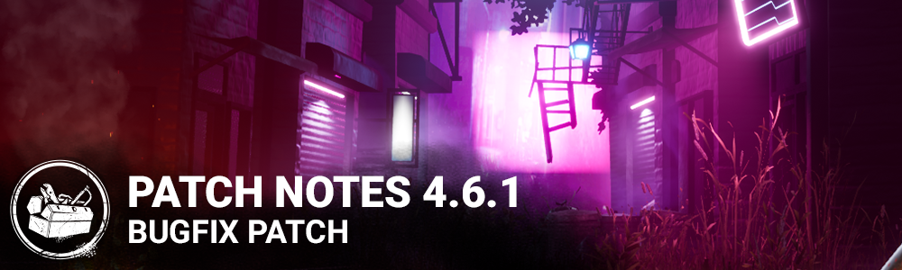

# 4.6.1 | Bugfix Patch

## Content

**The Trickster**

- Increased movement speed while in the throw state and while actively throwing Blades
- Decreased the recoil intensity and angle variation while throwing Blades
- Removed the spread while throwing Blades
- Decreased the Blade wind up time
- Increased the Blade wind down time
- Increased the time before the Laceration Meter begins decaying
- Increased Main Event movement speed
- Decreased Showstopper's cooldown after Main Event has ended
- Modified the Trickster's Laceration meter artwork so that it is more clear when the meter is full vs partially full.

**The Trickster add-ons**

- Decreased the effects of movement speed addons to account for the baseline movement speed increases in the above section:
- Killing Part Chords from 0.054 m/s to 0.04 m/s
- Caged Heart Shoes from 0.13 m/s to 0.1 m/s
- Iridescent Photocard will now injure survivors at maximum laceration

## Bug Fixes

- Fixed an issue that could prevent pallets from stunning killers under certain circumstances.
- Fixed an issue that could cause pallets broken with the perk Spirit Fury to leave a collision zone behind.
- Fixed an issue that prevented the Trickster from earning brutality points when injuring or downing survivors with blades.
- Fixed an issue that prevented the Trickster to earn Chaser Emblem points when injuring or downing survivors with blades.
- Fixed an issue that could prevent the add-ons Inferno Wires and Tequila Moonrock from increasing the duration of Main Event.
- Fixed an issue that could cause a small delay in the activation of the Wraith's post-uncloak speed boost.
- Fixed an issue that could prevent Decisive Strike from deactivating when a survivor unhooks another survivor once the generators are powered or the endgame collapse has started
- Fixed an issue that could cause Pyramid Head's power cancel animation to play while charging Rites of Judgement if the charge is quickly cancelled and restarted
- Fixed an issue that could cause the Oni to have incorrect rotation speed after hitting a survivor with a demon strike attack or after a demon dash.
- Fixed an issue that could prevent survivors from hearing the sound of the Blight's slam
- Fixed an issue that could prevent progress towards "Healthy Obsession" when healing the obsession.
- Fixed an issue that could prevent "Nerves of Steel" from properly tracking successful skill checks
- Fixed an issue that could prevent progress towards "Near Death Experience" if multiple survivors were downed during the match
- Fixed an issue where rank and pip changes in a public match are not correctly displayed in the Scoreboard if the user quits the Game.
- Fixed an issue that caused invisible collisions to block players on the side of exit gates in Red Forest maps.
- Fixed an issue that caused the Swamp maps to appears darker.
- Fixed an issue that caused the Survivor to be stuck between rocks after being hit by the Killer.
- Fixed an issue that caused the Survivor to be able to climb on a rock in Yamaoka Estate by using Dead Hard.
- Fixed an issue that caused Victor to pounce outside the map when facing the wall.
- Fixed an issue that made it impossible to have a full lobby when the Party Privacy is set to 'Public' or 'Friends Only.
- Fixed an issue where results screens sometimes do not correctly display rank and pip changes when a player quits a public match.
- Fixed an issue where a non-friend user that joined in a public lobby can then join the private lobby if both users have not backed out to the main menu.
- Fixed an issue with the "recently played with" feature which was not displaying players encountered during a trial.
- Fixed an issue that could cancel the Trickster's Main Event when activated with 0 blades remaining.
- Fixed an issue that prevented the Haste status effect's timer from displaying correctly when triggered by the perk Smash Hit.
- Fixed an issue that prevented the icon for the perk Smash Hit from displaying its activation state correctly
- Fixed an issue that could cause the Blight to collide with the lid of the hatch when visible and open.
- Fixed an issue that could cause survivors to become stuck in lockers when facing the Twins if hit by Charlotte when leaving a locker held closed by Victor.
- Fixed an issue that could cause the Trickster to remain stuck in the Main Event pose when performing certain actions just before entering the Main Event cooldown.
- Fixed an issue that could cause Victor to be able to pounce through vaults (pouncing over them is fine!).
- Fixed an issue that could prevent the Tricker's main event from ending correctly if the Aim Blade input is held.
- Fixed an issue that could allow players controlling Victor to see activated survivor glyphs.
- Fixed an issue that could prevent The Nurse from being slowed during her fatigue if stunned after or during a blink attack.
- Fixed an issue that could prevent Hex: Ruin from activating when a generator is no longer being repaired if one survivor is grabbed while another is repairing
- Fixed an issue that could cause the camera pan at the beginning of the trial to last too long
- Various crash fixes
- Fixed an issue that could cause the killer to not be able to pick up downed survivor on the basement stairs
- Fixed an issue that could cause the Trapper traps to clip in multiples places inside the Chapel stairs
- Fixed an issue that could cause the hatch to not open in the Gas Heaven's garage

**Xbox One only:**

- Fixed an issue where changing Party Privacy to Private and creating a Lobby disables inviting friends to game from the Xbox menu.

**Microsoft Store only:**

- Fixed a crash when revoking consent.

**Stadia only:**

- Fixed an issue where the value for 'Mouse Sensitivity' would be reset for Killer and Survivor when restarting the game.

**PS5 only:**

- Fixed an issue where the 'All Kill' DLC is unavailable to purchase from in-game store and is still seen as 'Coming Soon'.
