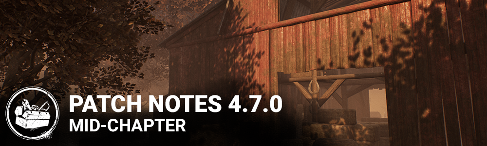

<!-- summary -->
## AI TL;DR

Mid-Chapter 4.7 adds Tome VII to the Archives, replaces settings checkboxes with ON/OFF steppers, refreshes all Coldwind Farm maps and optimizes the Doctor’s VFX. Killer updates include the Twins’ faster cooldown and stronger Ultra-Rare addons, the Demogorgon’s quicker portal traversal and Shred speed, the Nightmare’s reduced trap charges and new Dream-World sound cues, and a Huntress addon overhaul fixing rarity and hatchet limits. Survivors gain a new hook-struggle system using skill checks, while perks such as Small Game, Object of Obsession, Lucky Break and Zanshin Tactics are rebalanced. The patch also bundles extensive bug, audio and platform-specific fixes and minor map tweaks.
<!-- /summary -->

<!-- nav -->
&larr; [4.6.1 | Bugfix Patch](280-4-6-1-bugfix-patch.md) · [Live](../../index.md#live) · [4.7.1 | Bugfix Patch](282-4-7-1-bugfix-patch.md) &rarr;
<!-- /nav -->

# 4.7.0 | Mid-Chapter

## Content

**Tome VII**

- Tome VII for The Archives will start tomorrow, May 5th, at 11AM ET.
- Rift fragments for Level Completion rewards will now increase per Level.
- The required amount of Player XP per Rift fragment has been reduced to 500 XP (from 800XP) for faster Rift progression.

**UI**

- Settings menu: Replaced all checkboxes with text based steppers (with choices "ON"/"OFF") to be consistent with similar setting interactions.
- HUD - Visual improvements to Killer Power indicators behind Survivor portraits:
- General: Bottom of these indicators are no longer covered by the Survivor portraits.
- The Doctor: Madness levels now have a distinct visual for each level.
- The Plague: Improved Sickness meter texture colours for colourblind players.
- The Nightmare: Increased brightness of the Dream World indicator.
- The Ghostface: Increased contrast on the Stalking meter.

**Visual Update**

- Visual Update for all Coldwind Farm maps.

**The Doctor VFX Update**

- Optimized Doctor VFX to improve performance.
- Reduced the intensity of the glitch and madness screen effects.

**The Twins Post-Release Update**

With this update, we've tried to widen the window for counterplay when attempting to down multiple survivors with Victor. Also, the Ultra Rare addons were underperforming and have had their bonuses increased.

- Charlotte can now rotate while waking up.
- Victor's successful Pounce cooldown is 5 seconds (was 3 seconds).
- Victor can now move during the successful Pounce cooldown.
- Silencing Cloth grants Undetectable for 20 seconds (was 12 seconds).
- Iridescent Pendant inflicts Exposed for 30 seconds (was 12 seconds).

**The Demogorgon Gameplay Update**

The Demogorgon's portals have been adjusted to be usable more frequently, traverse distance faster, and grant a bit more stealth. The base move speed when charging Shred has also been increased, and the bonus from add-ons decreased. Some portal/traversal add-ons also had their values reduced in light of the base stat improvements. The end result should be as strong, or stronger. We will continue to monitor the performance of these addons and adjust them in future patches as needed.

**Power**

- Traverse the Upside Down cooldown: 10 seconds (was 14 seconds).
- Normal Traverse the Upside Down velocity: 20 m/s (was 17 m/s).
- Undetectable lasts 3 seconds after Traversing the Upside Down (was 2 seconds).
- Movement speed while charging Shred increased from 3.68 m/s to 3.86 m/s.

**Addons**

- Black Heart: Reduces cooldown time after a successful Shred attack by 20%.
- Rat Liver: +3.5% movement speed while charging Shred (was 9% but end result is unchanged due to increased base move speed).
- Rat Tail: +25% action speed while opening a portal (was 50%).
- Rotten Pumpkin: When traversing the Upside Down, the portal you enter is destroyed, blood points earned.
- Barb's Glasses: Slightly increases Shred recovery speed when breaking a pallet.
- Rotten Green Tripe: Increases Killer movement Speed while traversing the Upside Down by 15% (was 25%).
- Sticky Lining: increases the radius in which Survivors can be detected by Of the Abyss by 2.5m (was 1.5m).
- Brass Case Lighter: Inflicts 60 seconds of Blindness (was 45 seconds).
- Deer Lung: Increases Upside Down traversal speed by 40% (was 30%), now reduces portal count by 2.
- Eleven's Soda: Shows yellow Auras for Generators being repaired while traversing the Upside Down.
- Thorny Vines: Seal time +10% (was 14%), detection radius 1m (was 1.5m).
- Lifeguard Whistle: Survivors near activated Portals are indicated by Killer Instinct without having to charge Of the Abyss.
- Unknown Egg: Reduces power recovery time after traversing the Upside Down by 1.5 seconds (was 2.5 seconds).
- Leprose Lichen: Survivor auras remain for 3 seconds after emerging from a portal.
- Red Moss: When traversing the Upside Down, The Demogorgon emerges from the target portal silently but more slowly.

**The Nightmare Gameplay Update**

The Nightmare has been overperforming for some time, and his game slowdown addons were still causing more frustration than we would like. These have been removed and replaced with new effects based on Survivor sounds in the Dream World. We've also made adjustments to penalize spamming snares in chase and reduced the total number of traps that can be active at once, but the expect the core gameplay experience to remain intact.

**Power**

- Move speed now adjusted to 4.0 m/s while charging a Dream Snare.
- Dream Snare charges reduced to 5 (was 8).
- Dream Pallet charges reduced to 7 (was 10).
- Using a clock to wake up prevents falling asleep for 30 seconds; this includes when getting hit by Freddy.
- Added a new Killer Power visual behind the Survivor portraits to indicate the 30 second sleep immunity timer.

**Addons**

- Black Box: When a Gate is opened, the Entity blocks it for sleeping Survivors for 15 seconds.
- Jump Rope: While Survivors are in the Dream World, the sounds of their grunts of pain are 50% louder.
- Outdoor Rope: While Survivors are in the Dream World, the sounds of their generator repairs can be heard from 8 meters further away.
- Swing Chains: While Survivors are in the Dream World, the sounds of their footsteps are 50% louder.

**The Huntress Addon Update**

The Huntress was among the last of the older killers with incorrect add-on rarities, and this has now been fixed! Several addons have been altered to give more interesting effects and her most controversial addon has been adjusted so it no longer allows carrying more than one hatchet.

**Addons**

- Berus Toxin becomes Yellowed Cloth: +10% Hatchet flight speed.
- Coarse Stone: The grunts of pain from hit targets are increased by 50% until they are fully healed.
- Amanita Toxin: Hit target suffers from the Blindness status effect for 60 seconds (was 30 seconds).
- Deerskin Gloves: Now Rare.
- Fine Stone becomes Weighted Head: Hit target suffers from the Incapacitated status effect for 10 seconds.
- Yew Seed Brew is now Wooden Fox: Now Very Rare; grants the Undetectable status effect for 10 seconds after reloading.
- Yew Seed Concoction is now Rose Root: +20% Hatchet flight speed.
- Pungent Fiale is now Soldier's Puttee: Now Ultra Rare; The Huntress moves 4.6 m/s when she has no Hatchets.
- Venomous Concoction: Inflicts Exhausted status for 5 seconds (was 90 seconds).
- Iridescent Head: Prevents carrying more than one Hatchet.

**More Live Design**

Apart from the killer updates, the most significant live design change in this update is the change to Survivor's hook struggle inputs. One of the motivating factors behind this update is to reduce the number of inputs per second in order to make the game more accessible to those suffering from RSI. After the release of this mechanic for The Executioner's Cages and its positive reception by the community, we felt confident of making this change more broadly for all Sacrifice struggles.

The new Object of Obsession design previewed on the dev stream has been completed with a few tweaks. We hope solo Survivors will enjoy Small Game's new Totem-counting function, and Borrowed Time no longer triggers based on Terror Radius... it just *works*.

**New hook struggle**

- Struggling during the second stage on a hook is now a series of Skill Checks
- Failing to give any input for two successive Skill Checks will instantly complete the Sacrifice
- Missing a skill check will reduce the amount of time until the Entity claims the hooked Survivor

**Perks**

- Small Game: Gain tokens for each Totem any Survivor cleanses; tokens reduce cone width to increase accuracy; no longer triggers for the Totem you are currently cleansing.
- Lucky Break: Now hides scratch marks as well; duration reduced to 35/40/45 seconds.
- Soul Guard: Now has a 30 second cooldown between activations.
- Open-Handed: Increases aura reading range by 8/12/16 meters; Survivors may only be affected by one instance of Open-Handed.
- Zanshin Tactics: Now always active and range increased to 24/28/32 meters.
- Borrowed Time: No longer requires being in the Terror Radius to trigger; duration of Enduring status reduced to 8/10/12 seconds.
- Object of Obsession: This perk has been redesigned.
- *Whenever your aura is revealed to the Killer, the Killer's aura becomes visible to you and you gain a 2/4/6% bonus to healing, repairing and cleansing speed.*
- *If you are the Obsession, your aura is revealed to the killer for 3 seconds once every 30 seconds.*
- *Increases your chances of being the Obsession.*

**Other**

- Repairing while using a toolbox now increases the odds of getting Skill Checks by 5x (was 2x).
- When the Hatch is opened by a Key, it remains open for 10 seconds (was 30 seconds).
- Every trial will now start with an obsession, regardless of player loadouts.

**Archives**

- A new Tome and Rift will be added to the Archives in the next few days

**Changes from PTB to Live**

- The Nightmare's Black Box add-on activation time increased from 10 seconds to 15 seconds.
- Lucky Break's duration reduced from 70/80/90 to 35/40/45.
- Victor can now move during the pounce success cooldown.
- Demogorgon base speed while charging Shred increased from 3.68 m/s to 3.86 m/s.
- Demogorgon's "Rat Liver" add-on bonus adjusted to +3.5% for a resulting shred charge move speed of 4.0 m/s.
- Huntress' "Leather Loop" add-on rarity reverted to uncommon.
- Adjusted the cowshed and farmhouse map balance.
- Adjusted multiple collisions in farm maps.
- Adjusted the vault on the harvester to be easier to use.
- Miscellaneous bug fixes

**Audio**

- Survivor now screams audibly across the map when unhooking another survivor if killer perk Make Your Choice is active.
- Game audio is no longer caused to muffle if a game ends while The Trickster is in the Main Event state.
- Demogorgon Portal no longer audible by survivors until activated
- The Hillbilly chainsaw will now rev continuously while in the charge state

**Bug Fixes**

- Fixed an issue that could prevent pallets from stunning killers under certain circumstances.
- Fixed an issue that could cause rare items to appear in chests more often than intended.
- Fixed an issue that could prevent hooks from respawning if broken with the perk "Breakdown."
- Fixed an issue that caused the fatigue decreasing effect from the Nurse's add-on "Wooden Horse" to apply on successful hits.
- Fixed an issue that could prevent survivors from screaming when hit directly with the Clown's antidote bottle during certain interactions.
- Fixed an issue that could allow survivors to climb to inaccessible areas after being downed on certain rocks, benches or similar props.
- Fixed an issue that prevented bell sounds from the "Mr Elf" outfit from playing when rotating the character in the store.
- Fixed an issue that allowed Victor to pounce through window vault locations (pouncing over them is fine).
- Fixed an issue that would cause survivors to have default outfits when switching characters in the lobby.
- Fixed an issue that could cause a desync in the Trickster's knife reloading animation when using the perk "Iron Maiden."
- Fixed an issue that could sometimes prevent Dream Pallets from having collision while in the "up" position.
- Fixed an issue that could prevent the Blight's prestige cosmetic skins from showing their dripping effects.
- Fixed an issue which caused the watch to be floating when equipping the David King's Harrington Jacket cosmetic.
- Fixed an issue which sometimes caused a soft-lock when spamming the Escape Key while transitioning to the Tally Screen.
- Changed the way characters are displayed in the menus so they don't seem to be floating above the ground.
- Fixed an issue that could cause a survivor to become stuck in Pyramid Head's Cage of Atonement if they were in the exact location the cage spawns
- Fixed an issue that could allow survivors to position themselves between the exit spikes and the exit trigger volume and avoid the killer's attacks in all maps.
- Fixed an issue where the application would soft-lock when unlocking rift levels at a high speed.
- Miscellaneous crash fixes
- Fixed an issue which caused a fat shaming spot between two rocks of the Sanctum of Wrath

**PC only:**

- Fixed an issue where performance drops could happen when having a gamepad plugged while using a keyboard and mouse.

**Switch only:**

- Fixed an issue where the lobby privacy settings would not be applied correctly when taking over a lobby.

**Xbox One, Xbox Series X|S, Playstation 4, Playstation 5 only:**

- Fixed an issue where the application would crash after repeatedly pressing the Ready button in the Play as Survivor lobby.

<!-- nav -->
&larr; [4.6.1 | Bugfix Patch](280-4-6-1-bugfix-patch.md) · [Live](../../index.md#live) · [4.7.1 | Bugfix Patch](282-4-7-1-bugfix-patch.md) &rarr;
<!-- /nav -->
