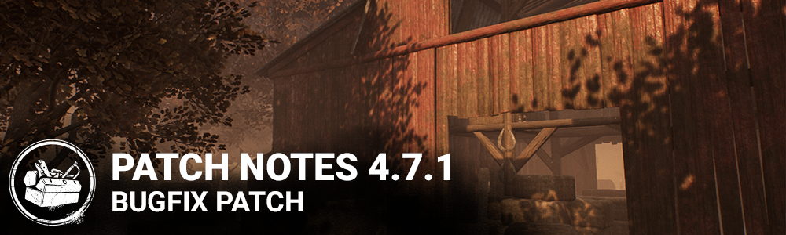

<!-- summary -->
## AI TL;DR

Blight's rush now has a per-frame turn-rate cap and higher controller sensitivity, and the Huntress' Wooden Fox add-on now triggers undetectable at reload start and lasts 15 seconds, with ammo count now updating after reload. The update also addresses a wide range of issues—from shop purchase glitches and stray survivor emotes to map-specific collision and interaction bugs on Torment Creek, Coldwind Farm, Léry's Memorial Institute and others, as well as visual and animation problems for killers like the Hag, Twins, Nightmare and Nurse, plus a console-only crash fix for Xbox Series X|S. Most of the patch consists of comprehensive bug fixes across characters, maps and UI.
<!-- /summary -->

<!-- nav -->
&larr; [4.7.0 | Mid-Chapter](281-4-7-0-mid-chapter.md) · [Live](../../index.md#live) · [4.7.2 | Bugfix Patch](283-4-7-2-bugfix-patch.md) &rarr;
<!-- /nav -->

# 4.7.1 | Bugfix Patch

## Balance

- Added a maximum turn rate per frame to the Blight's rush for very high sensitivity input.
- Increased controller sensitivity and controller maximum turn rate for the Blight's rush.
- The Huntress add-on "Wooden Fox" now triggers undetectable at the beginning of the reload interaction and its duration has been increased to 15 seconds

## Miscellaneous

- Huntress ammo count is now updated at the end of the reload interaction.

## Bug Fixes

- Fixed an issue that caused characters being sold with temporary discounts to not be purchasable with shards anymore.
- Fixed an issue that would cause survivor characters to emote when pressing Numpad 1 or Numpad 2 even if not bound to those keys.
- Fixed an issue that could cause a survivor to be unreachable if downed while unhooking another survivor.
- Fixed an issue that could prevent accessories from remaining properly attached to the Hag's mud phantasm while wearing certain outfits.
- Fixed an issue that could prevent the interaction progress bar from properly resetting to 0 when cancelling the seal portal interaction on the Demogorgon's portals (visual issue only).
- Fixed an issue that could cause the wrong first person animation to play when playing the Twins and taking control of Charlotte.
- Fixed an issue that could prevent progress towards "Getting the Hang of it" when ranking up.
- Fixed an issue that could prevent survivors from being hit by the Deathslinger's projectile while using a key.
- Fixed an issue that could cause the Hag's phantasm trap to display the aura of the Hag when placed in front of a generator.
- Fixed an issue that could prevent the Nightmare from seeing survivor's sleep immunity timers.
- Fixed an issue that could prevent a survivor's right arm from bending correctly when holding a firecracker.
- Fixed an issue that could cause the Nightmare to become permanently invisible from the perspective of a survivor being killed with a "mori" interaction if the action is cancelled before the animation begins.
- Fixed an issue that could cause motion blur when rotating characters in the store
- Fixed issues with the Trapper masks Worn Gaze, Redox Eyes and Iron Chuckles that prevented them from displaying properly.
- Fixed an issue that could cause held medkits, toolboxes or keys to clip with injured female survivor models while running
- Fixed an issue that could prevent the Nurse from blinking through the silo's cap on the map Torment Creek.
- Fixed an issue that could cause an unreachable bear trap to spawn inside the ground in the silo on the map Torment Creek.
- Fixed an issue that could prevent flashlights from blinding killers when used through the windows of Thompson's House
- Fixed an issue that could cause incorrect collision on the second floor of Father Campbell's Chapel.
- Fixed an issue that could cause incorrect collision when falling off a hill in Mount Ormond Resort
- Fixed an issue that could prevent downed survivors from being picked up next to a specific haystack on Coldwind Farm maps
- Fixed a collision issue on the harvester in Coldwind Farm maps that could prevent characters from reaching the haybales from the ramp
- Fixed an issue that could prevent a window vault location from displaying properly in Léry's Memorial Institute

Xbox Series X|S only:

- Fixed an issue that caused the application to crash upon Signing out of the active account on the initial interaction screen.

<!-- nav -->
&larr; [4.7.0 | Mid-Chapter](281-4-7-0-mid-chapter.md) · [Live](../../index.md#live) · [4.7.2 | Bugfix Patch](283-4-7-2-bugfix-patch.md) &rarr;
<!-- /nav -->
