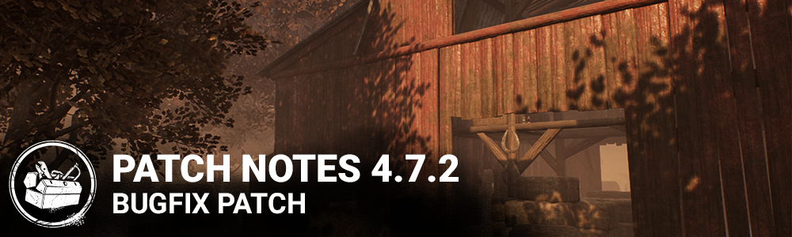

# 4.7.2 | Bugfix Patch

## Bug Fixes

- Fixed an issue which prevented scoring events from firing while struggling on the hook.
- Fixed an issue which prevented survivors from being picked up in a corner of the gas station car pile.
- Fixed an issue which prevented survivors from being picked up if close to certain basement walls.
- Fixed an issue which caused one hatch in Grim Pantry spawns above the ground.
- Fixed an issue which allowed Killers to completely block access to some Coldwind Farm basements.
- Fixed an issue which could cause the hook struggle prompt to display an incorrect skill check keybinding.
- Fixed an issue which could allow changing the selected Killer while searching for a match.
- Fixed an issue which could prevent accessories from remaining properly attached to the Hag’s mud phantasm while wearing certain outfits.
- Fixed an issue which could cause a desync for Killer players if a survivor disconnected while being killed.
- Fixed an issue which could cause the Deathslinger to become stuck in the reeling animation if a survivor disconnected after being shot.
- Fixed an issue which could cause the exit gates to spawn too close together on Rancid Abattoir.
- Fixed an issue which could cause a crash when exiting the survivor tutorial.
- Fixed an issue which caused the icon for the perk "Soul Guard" to start the trial lit.
- Fixed an issue which could cause "no network connection" errors while in the trial.
- Fixed an issue which could cause the Legion to visibly clip into pallets while vaulting them.
- Fixed an issue which prevented the time required for the "Wake Up" action from increasing for each use.

PC:

- Fixed an issue that could affect performance if a gamepad is plugged into a PC.
