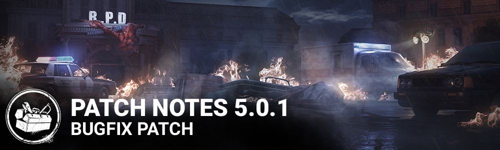

# 5.0.1 | Resident Evil

## Bug Fixes

- Fixed an issue that could cause The Nemesis's tentacle to flicker when quickly cancelling the Tentacle Strike charge.
- Fixed an issue that prevented The Nemesis from interrupting survivors who are unlocking a supply case.
- Fixed an issue that could cause the perk Bite the Bullet to stay active after being healed by two Survivors that have this perk at the same time.
- Fixed an issue that could cause an incorrect walking animation to play for The Nemesis when in Spectator Mode in a Custom Game.
- Fixed an issue that caused the "Contaminate Survivor" score event to grant objective points instead of deviousness points.
- Fixed an issue that could cause the auras of generators to show the entity claws after the effect of the perk "Corrupt Intervention" ends.
- Fixed an issue that could cause The Clown's bottles to seemingly pass through survivors from the survivor's perspective.
- Fixed an issue that could cause The Clown's bottle smoke VFX to be visible during the intro camera pan.
- Fixed an issue that could cause the player's camera to briefly clip out of world as The Demogorgon when tunneling through the Upside Down from certain locations.
- Fixed an issue that could prevent the killer theme from playing when selecting The Shape or The Nightmare.
- Fixed an issue that could cause the killer to become frozen in place if a Survivor disconnects while being carried.
- Fixed an issue that could cause the "collect" prompt to be displayed in English rather than the correct language.
- Fixed an issue that could cause pallets to seemingly disappear when the user moves their camera at a certain angle.
- Fixed an issue that could cause the tentacle to be missing from The Nemesis's left hand during the camera pan at the start of the trial.
- Fixed an issue that could cause survivors to briefly assume an a-pose animation when rescued from the Cage of Atonement.
- Fixed an issue that could cause an invisible collision blocking the projectiles above an asset in Gas Haven.
- Fixed an issue that could prevent a generator from being repaired on one side in Hawkins map.
- Fixed an issue that could cause a trap to clips into the roof in one of the Lampkin Lane houses.
- Fixed an issue that could cause a Zombie to land mid-air in the Chalet's map.
- Fixed an issue that could cause a killer not being able to pick up a survivor near the Grim Pantry human cage.
- Fixed an issue that could cause The Hag to hide Phantasm Traps on any grounded Virus Entity.
- Fixed an issue that caused some new settings to not be saved properly when playing on consoles.
- Fixed an issue that could cause some unbreakable outfits to be breakable.
- Fixed an issue that caused the Onboarding menu buttons to be unresponsive when the player switches account to play the game
- Fixed some localized Strings not properly translated in Thai in the Onboarding menu
- Fixed an issue in the Store where the text indicating that a character was locked behind the new Onboarding was cut off in multiple languages.
- Fixed a stability performance issue by improving the memory usage on the killer Nemesis.
- Fixed an issue that could cause Jonathan Byer’s face to appear distorted in lower quality settings.
- Fixed an animation-related issue that could cause a crash in the tally screen.
- Fixed an issue that could allow players to load into a public match through a custom lobby.
- Fixed an issue that could cause Ace's hair to become offset when he starts repairing a generator.
- Fixed an issue that could prevent survivors from properly aiming the flashlight while simultaneously injured, contaminated and crouching.

### Audio

- Fixed an issue that could cause the Halloween theme to be missing when selecting The Shape in Play as Killer
- Fixed an issue that could cause the Nightmare laugh to be missing when selected him in the Play as Killer section
- Fixed an issue that could cause the Blazing Bat weapon of the Trickster to be missing its SFX

### Other

- The **Raccoon City Police Station**map has been re-enabled for custom matches while we continue to investigate certain stability issues.
- The **RPD Badge** offering has been temporarily disabled. It can still be collected in blood webs but cannot be equipped for trials.

## Known Issues

- **Various performance issues.** The team is still actively investigating performance issues across multiple platforms, including consoles. Thank you for your patience as we work on a fix for this!
