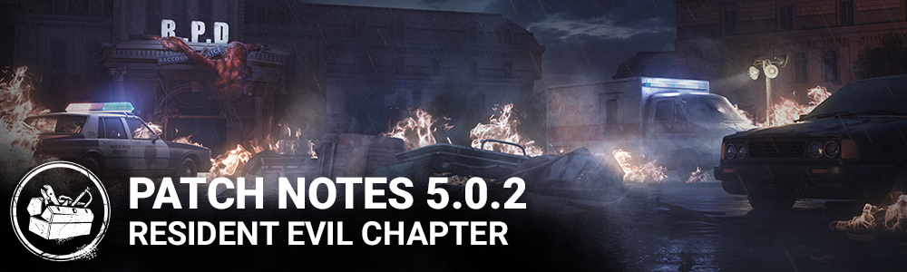

<!-- summary -->
## AI TL;DR

Performance on the Resident Evil chapter received a refresh: overall frame stability was boosted, especially for the Raccoon City Police Station map, while Switch visuals were scaled back to ease load and reduce crashes. The update also addressed a range of bugs, from The Nemesis’s tentacle failing to appear in menus and hitting survivors through walls, to UI glitches in tutorials, spectator mode, and customization, plus map-specific issues like generator repair on Pale Rose and stuck zombies in Ironworks of Misery. Additional fixes reduce out-of-memory crashes and correct various interaction and cursor bugs.
<!-- /summary -->

<!-- nav -->
&larr; [5.0.1 | Resident Evil](287-5-0-1-resident-evil.md) · [Live](../../index.md#live) · [5.1.0 | Mid-Chapter](290-5-1-0-mid-chapter.md) &rarr;
<!-- /nav -->

# 5.0.2 | Resident Evil

## Performance Issues

This update contains a few changes that should improve performance for many players. That said, some performance issues still remain. The team is still actively working on more fixes across multiple platforms, including consoles. We will be monitoring the changes made within this bugfix patch for stability.

We're hoping this update will also help performance on the Raccoon City Police Station map, but we want to ensure it is stable enough to be reinstated for live games. We will be monitoring how the map is doing in custom games with these new changes and provide you all with an update soon.

Thank you for your patience as we continue to work on further improvements to the game’s performance!

## Switch Performance

We have reduced the overall visual quality on Switch to help improve performance. The game may still crash when played on the Raccoon City Police Station map, but less frequently. Rest assured, we are still working on ensuring that the new map does not crash on this platform.

## Bug Fixes

- Fixed an issue that could prevent The Nemesis's tentacle from appearing in the menu during his idle animation.
- Fixed an issue that could prevent downed survivors from being picked up when near certain walls or corners.
- Fixed an issue that could display the wrong Dwight's head icon in a Tutorial Hud if a legendary outfit was equipped before starting the Tutorial
- Fixed an issue where no Player Statuses were displaying in Spectate mode
- Fixed an issue with the analog cursor speed in the Onboarding menu
- Fixed an issue in the Customization menu where multiple customization could remain highlighted as selected
- Fixed an issue where a synchronization error would sometimes occur when completing a Survivor tutorial.
- Fixed an issue where players could load into a public match through a custom lobby.
- Fixed an issue that would sometimes occur where players get a server connection error when opening their friends list.
- Fixed an issue where the cursor pointer would change to gamepad mode too early.
- Fixed an issue where completing a tutorial match with bots would cause customization and perks to be unequipped for all characters.
- Fixed an issue that could cause Nemesis's Tentacle strike to hit the Survivor through some of the windows and main buildings.
- Fixed an issue where the generator cannot be repaired on one side in the Pale Rose.
- Fixed an issue that could cause a global flicker in the environment while moving around the maps.
- Fixed an issue that could cause a Zombie getting stuck on a collision at the entrance of the foundry in the Ironworks of Misery.
- Fixed an issue where players could walk on a pallet in Yamaoka map by climbing a rock.
- Fixed an issue where a cleansed totem skulls remain floating at the back of the truck in the Junkyard map.
- Fixed an issue where the Survivors can't be picked up by the killer near the logs next to the Mother's Dwelling building and the corner of Gideon Meat Plant.
- Fixed an issue that could cause crashes due to OOM (out of memory) issue.

<!-- nav -->
&larr; [5.0.1 | Resident Evil](287-5-0-1-resident-evil.md) · [Live](../../index.md#live) · [5.1.0 | Mid-Chapter](290-5-1-0-mid-chapter.md) &rarr;
<!-- /nav -->
