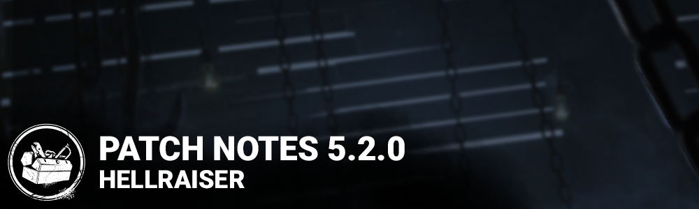

<!-- summary -->
## AI TL;DR

The update adds The Cenobite killer, replaces Ranks with Grades (five tiers with sub-levels), introduces a Large Text HUD option, enables Skill-Based Matchmaking, and refreshes pallet visuals. It also brings back Blood Lodge and The Game maps, boosts Nemesis’s Tier 3 tentacle charge speed and badge durations, and tweaks several Nemesis addons and rituals.

The bulk of the patch is performance and stability work—fixes for audio cues, perk timing, animation glitches, map collision and UI issues across many maps—and extensive Cenobite PTB refinements (gateway limits, chain mechanics, animation and VFX fixes). Known issues include translation gaps, a disabled Dead Dawg Saloon map and persistent large-text setting on consoles.
<!-- /summary -->

<!-- nav -->
&larr; [5.1.1 | Bugfix Patch](291-5-1-1-bugfix-patch.md) · [Live](../../index.md#live) · [5.2.1 | Bugfix Patch](295-5-2-1-bugfix-patch.md) &rarr;
<!-- /nav -->

# 5.2.0 | Hellraiser

## Features

- Added an new Killer - The Cenobite
- Match Results - When players leave a Trial with a Limited Item (Example: The Nemesis's Vaccine) they will now be notified that they do not get to keep it. *It has been consumed by The Entity.*
- Large Text Settings - The players can enable this option to enlarge all texts in the HUD, increasing readability.
- Skill Based Matchmaking will be enabled separately on September 8th at 11:00AM EDT.
- Visual Update of the Pallet

## Grades and Grade Rewards

- Grades are replacing Ranks
- Grades are broken up into five groupings: Ash, Bronze, Silver, Gold, and Iridescent
- Each grouping has four sub-groupings: IV, III, II, I
- Current Ranks will be translated into their corresponding Grade
- Rank 20 = Ash IV, Rank 19 = Ash III, Rank 18 = Ash II, Rank 17 = Ash I, Rank 16 = Bronze IV, etc.
- Grade Resets will happen on the 13th of each month, and all players will be reset to Ash IV for both Killer and Survivor, regardless of their previous Grade
- Bloodpoint rewards are given out when the reset occurs, based on your previous Grade
- It is no longer possible to lose enough pips to lose a Grade

## Content

**The Nemesis Update:**

- Movement speed while charging Tentacle Strike Tier 3 increased to 4.0m/s (was 3.8m/s)
- Shattered S.T.A.R.S. Badge effect duration increased to 60 seconds (was 30 seconds)
- Iridescent Umbrella Badge effect duration increased to 30 seconds (was 15 seconds, but was erroneously displayed as 12 seconds)
- Ritual of The Nemesis reduced to reaching maximum Mutation Rate one time (was 4)

**Miscellaneous:**

- Various bug fixes and improvements to address performance issues on the Family Residence, Sanctum of Wrath and Midwich Elementary School.
- Blood Lodge and The Game maps are re-enabled
- Updated a variety of survivors hair and facial hair cosmetics.

*Dev note: The Nemesis came out in a good state, but has been underperforming slightly in higher skill brackets. These players tend to hit Mutation Rate 3 more often, so a buff here should give him a slight boost at that level of play. Additionally, we have buffed two addons that were underperforming to make them more viable, and made the associated ritual less of a pain to complete.*

## Bug Fixes

- Fixed an issue that caused killers not to hear several sounds for survivors not currently visible on screen. This includes, but is not limited to, footsteps when using the Spirit's phase walk.
- Fixed an issue that may cause a hitch to occur when using the Dead Hard perk.
- Fixed an issue that may cause Dead Hard's invulnerability not to coincide with the dash effect.
- Fixed an issue that rarely caused survivors to keep some status effects, such as Lithe's speed boost, for the remainder of the trial. The icon may now remain, but the effect will not be applied.
- Fixed an issue that caused bubble indicators not to appear for the Doctor when survivors reach a new madness level, scream while in tier 3 Madness, or fail Snap Out of It skill checks.
- Fixed an issue that caused the exit gates to be permanently blocked after Victor is removed if he pounces on a Survivor near the exit gate.
- Fixed an issue that caused survivors not to be revealed by Killer Instinct when performing actions near Victor.
- Fixed an issue that caused teachable perks to not be unlocked after being bought in the shrine.
- Fixed an issue that caused bots to not always heal each other when next to a generator.
- Fixed an issue that sometimes caused survivor bots to get stuck in front of a killer blocking a vault point.
- Fixed an issue that caused player names containing a '#' to get truncated in game and on the tally screen.
- Fixed an issue that could cause a wrong benevolent emblem to be assigned.
- Fixed an issue that caused the unbreakable set to be breakable by the cosmetics previews in the store.
- Fixed an issue that caused purchases to fail when buying multiple items in a row in the store.
- Fixed an issue that caused frame hitches when a generator is repaired.
- Fixed an issue that caused frame hitches when a survivor is healed.
- Fixed an issue that caused the hook count and the generator count to overlap each other when spectating a custom game.
- Fixed an issue that caused the pause menu to open and close constantly when holding the Escape key.
- Fixed an issue that caused the Tricksters' charge indicator to carry over to other Killers after completing a match.
- Fixed an issue that caused the Prove Thyself icon to be displayed more than once in the HUD
- Fixed an issue that caused one hatch in the Treatment Theatre that can't be opened with keys
- Fixed an issue that caused one side of generator cannot be repaired from Hawkins tile
- Fixed an issue that caused a survivor can remain stuck near one of the building in Dead Dawg Saloon
- Fixed an issue that caused the Nurse and Cenobite to teleport out of bounds on top of the basement in the east wing
- Fixed an issue that caused survivor to clip into the stairs when cleansing a totem found under the stairs in some rooms in the Underground Complex
- Fixed an issue that caused survivor to clip into the stairs when cleansing a totem found near the gallows in Dead Dawg Saloon
- Fixed an issue that caused survivor not being able to interact with one of the Nightmare's clocks in Resident Evil map
- Fixed an issue that caused survivor to get stuck when cleansing a specific totem in the Disturbed Ward
- Fixed an issue that caused the Cow tree in the Farm map to have no collision and makes looping difficult
- Fixed an issue that caused an invisible collision for survivor and killer when falling off one side of a Hill
- Fixed an issue that caused the color of the pallet to be less vibrant
- Fixed an issue that caused loss of progress. Additional issues are still under active investigation.

## Known Issues

- The Cenobite's power description is not using the latest version in all translated languages.
- The Chain Hunt activation audio notification plays for all Survivors while a Survivor is holding the puzzle box
- Some text relating to Grades and Grade Rewards has not been translated into non-English languages.
- The Dead Dawg Saloon map is disabled and is planned on being re-enabled on 5.2.1.
- Unable to make progress on the Punch Drunk Achievement.
- It is possible to stun The Nightmare using a Dream Pallet.
- Upcoming Boon Totem description is displayed in the Tutorials page.
- Larger text setting does not save after restarting the application (Consoles only).

## Changes from PTB

**The Cenobite**

- The Cenobite's voice over lines have been removed due to complications with the audio files.
- Added a maximum time that The Cenobite can spend inside a gateway.
- Added a pitch threshold before going to a lower level when placing a gateway as The Cenobite to make placement easier in areas with multiple floors.
- Gave a short immunity from The Cenobite's Chain Hunt to recently unhooked survivors.
- Made the Deep Wound timer pause while performing the Remove Chains interaction.
- Chains broken with collisions now respawn faster.
- Increased the speed at which the chain spawner tries spawning a chain after a failed attempt.
- Increased the collision detection of the chain spawner.
- Updated the Chain Hunt to always spawn clusters of 3 chains, but the spawning interval is based on the number of healthy/injured Survivors.
- Picking up the Lament Configuration now stops other Survivor's Chain Hunt timers, but not the carrier's. It also stops the Chain Hunt for other Survivors, but not the carrier.
- To stop a Chain Hunt, the Survivor must Solve the Lament Configuration (if The Cenobite teleports, it also stops the Chain Hunt).
- Added a cooldown to the Solve interaction to prevent spamming.
- Increased the value of various score events.
- Updated the Lament Configuration spawn sound.

**Miscellaneous**

- Changed pallet hit boxes to prevent the killer from getting stunned when on the same side as the survivor dropping the pallet.

## Bug fixes

**The Cenobite**

- Fixed an issue that may make it impossible to remove the Cenobite's chains.
- Fixed an issue that caused the Cenobite's Burning Candle and Torture Pillar add-ons not to stack.
- Fixed an issue that may cause chains to appear with inconsistent timing when executing an interaction while holding the Lament Configuration.
- Fixed an issue that caused chains to remain visible if a survivor disconnects while hooked by the Cenobite's chains.
- Fixed an issue that may cause the Chain Hunt timer not to restart when a survivor disconnects while holding the Lament Configuration.
- Fixed an issue that may cause the Cenobite to remain stuck in the teleport interaction if a survivor disconnects during the teleportation.
- Fixed an issue that caused the Cenobite to play the wrong animation when attacking a survivor carrying the Lament Configuration while carrying a survivor.
- Fixed an issue that caused a chain to remain on the map after the Cenobite teleports to a survivor solving the Lament Configuration.
- Fixed an issue that caused survivors to remain stuck in the solving animation after having moved during a Lament Configuration skill check.
- Fixed an issue that caused the Lament Configuration to instantly teleport to the ground after being solved by a survivor.
- Fixed an issue that caused the Lament Configuration VFX to disappear when it spawns at a new location.
- Fixed an issue that may cause the Lament Configuration to spawn on the hatch.
- Fixed an issue that may cause the lightning VFX to be missing from the Cenobite's chains.
- Fixed an issue that caused the Cenobite's chains not to interrupt the Mend action.
- Fixed an issue that caused the Cenobite's chains not to interrupt the Sabotage action.
- Fixed an issue that caused the Cenobite's chains not to interrupt several item interactions.
- Fixed an issue that caused the Cenobite's chains not to interrupt the interactions of the Reset Pallet and Rummage interactions.
- Fixed an issue that caused input prompts to briefly appear after clicking the Create Gateway input.
- Fixed an issue that caused the Cenobite to lose the ability to open gateways when stunned while in the gate.
- Fixed an issue that caused the gateway to appear instantly at maximum range after the Cenobite gets stunned while possessing a gateway.
- Fixed an issue that caused input keys not to appear in the prompts when remapping some actions to the same input as emotes.
- Fixed an issue that may cause the Cenobite's weapon to remain visible when tilting his head.
- Fixed an issue that caused the Cenobite not to be granted a scoring event when surviviors escape without the Lament Configuration.
- Fixed an issue that caused survivors to be granted an incorrect amount of Bloodpoints when breaking multiple chains.
- Fixed an issue that caused an animation to be missing after the he creates a gateway when spectating the Cenobite.
- Fixed an issue that caused the prestige weapon not to appear in-game.
- Fixed an issue that caused the camera to shake violently when sending a possessed chain upright as the Cenobite.
- Fixed an issue that caused the Cenobite and Nurse's aiming reticles to float in the air when aiming on uneven ground.
- Fixed an issue that caused the Chain Hunt character portrait to disappear when a survivor enters a locker.
- Fixed an issue that caused a chain to appear on the left side of the screen while controlling the Gateway projectile as the Cenobite.
- Fixed an issue that caused the Cenobite's weapon to stay visible when going to a menu with the Cenobite selected
- Fixed an issue that caused the survivor's hand to be bleeding when repairing a generator
- Fixed an issue that caused an explosion of blood when the survivor are struck by the Killer weapon
- Fixed an issue that caused the visual effect for the Scourge Hook to not appear on Macmillan Estate map
- Fixed an issue that caused the VFX to not appear on the Lament Box during the Lobby's animation or when the match start
- Fixed an issue that caused the Trickster's blades to be floating next to his hand
- Fixed an issue that caused the blood VFX to be offset when hitting a Survivor with throwing knives.

<!-- nav -->
&larr; [5.1.1 | Bugfix Patch](291-5-1-1-bugfix-patch.md) · [Live](../../index.md#live) · [5.2.1 | Bugfix Patch](295-5-2-1-bugfix-patch.md) &rarr;
<!-- /nav -->
