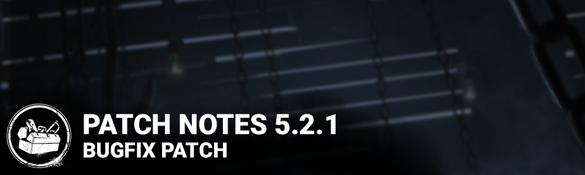

<!-- nav -->
&larr; [5.2.0 | Hellraiser](294-5-2-0-hellraiser.md) · [Live](../../index.md#live) · [5.2.2 | Bugfix Patch](296-5-2-2-bugfix-patch.md) &rarr;
<!-- /nav -->

# 5.2.1 | Bugfix Patch

## Content

### Pinhead

- Clusters of Chains targeting the Survivor carrying the Lament Configuration during Chain Hunt will respawn as soon as the interaction is stopped if the Survivor does not complete the Solve interaction.
- Teleport interaction will prioritize a location on the same level as the Survivor solving the puzzle box.

### Maps

- The Dead Dawg Saloon and Raccoon City Police Station maps have been re-enabled.

## Bug Fixes

- Fixed an issue that caused Steam Family Share to no longer share DLC.
- Fixed an issue that caused Cross Progression between Steam and Stadia to no longer share DLC.
- Fixed and issue that caused DLC to disappear on PS4 and PS5 accounts.
- Fixed an issue that caused all survivors to hear the Chain Hunt starting notification sound when it starts only for the survivor holding the Lament Configuration.
- Fixed an issue that may cause chains to hit the Cenobite when creating a gateway too close to himself.
- Fixed an issue that caused the "Remove Chains" text to appear in english in all languages.
- Fixed an issue that caused the Cenobite to gain bloodpoints when hitting a downed survivor with his chains.
- Fixed an issue that caused the Lament Configuration to clip with the survivor's hand when performing the Remove Chains action.
- Fixed an issue that caused the Gateway screen effect to remain when spectating the Cenobite while opening a gateway and switching to a survivor.
- Fixed an issue that caused the player name not to change properly when switching to spectating the Cenobite while he possesses a gateway.
- Fixed an issue that caused survivors to be able to stun the Nightmare with a Dream Pallet.
- Fixed an issue that caused the killer to be unable to pick up survivors downed while working on one of the short sides of a generator.
- Fixed an issue that caused the killer to be unable to pick up a survivor downed while trying to enter an occupied locker.
- Fixed an issue that caused the Locked & Found challenge not to track depleted keys.
- Fixed an issue that caused progress towards the Punch Drunk achievement not to be tracked.
- Fixed an issue that caused Feral Frenzy, Shadowborn and Monitor & Abuse not to change the player's FOV.
- Fixed an issue that caused the vault block duration to be incorrect for tier 1 of the Hex: Crowd Control perk.
- Fixed an issue that caused the item lost SFX to play when performing some actions in the tutorial.
- Fixed an issue that caused the item lost SFX to play when the Trapper places a bear trap.
- Fixed an issue that caused a red wireframe to appear after the Nemesis uses his Tentacle Strike.
- Fixed an issue where survivors could be seen loading into public lobbies a second time when equipped with a Legendary Outfit.
- Fixed an issue where entering the store from the Play as Killer screen would cause the killer to revert to the default outfit if the user bought an outfit for another killer.
- Fixed an issue where the Plague's Foul Gown cosmetic effects were clipping into the camera when vomiting.
- Fixed an issue where a completed generator's lights disappeared at certain camera angles.
- Fixed an issue where the Oni's Fire Moon Warrior pattern would remain red when not in Demon Mode.
- Fixed an issue where the Clown's speed vignette was yellow instead of purple when using the VHS Porn AddOn.
- Fixed an issue where the Cenobite's Bloody Hook and Chain still appeared in the menu.
- Fixed an issue where the Cenobite's blue outline would stay on screen when spectating him and switching to a Survivor.
- Fixed an issue where survivors can get blocked by the collision of a rock at the stone structure in Red Forest.
- Fixed an issue where there's an invisible collision blocking the flow of a chase at any drops from the 2nd floor in Ormond.
- Fixed an issue where a Plague's fountain collision prevents going up a set of stairs in Hawkins National Laboratory.
- Fixed an issue where one of the main hall generators doesn't count toward Raccoon City Recruit.
- Fixed an issue where the survivors can use dead hard to jump over garbage bags in Haddonfield.
- Fixed an issue where a hatch in RPD cannot be opened with a key.
- Fixed an issue where survivors could escape the Trial by forcing collision with a rail near the stairs while healing another Survivor in the helicopter area of RPD.
- Fixed an issue where survivor can't interact with one of the Nightmare's clocks in Raccoon City Police Station.
- Fixed an issue where the killers snap on top of a sink when kicking a generator in RPD.
- Fixed an issue where there is an invisible collision for survivor and killer when falling off one side of a Hill.
- Fixed an issue where Claudette's Patrol cap sinks inside her head while repairing generators.
- Fixed an issue where the chase music stops abruptly when killer interrupts survivor fixing a generator.
- Fixed an issue where a drop item sound was playing incorrectly in the killer tutorial.

## Known Issues

- The Cenobites chase music fails to restart after using Summons of Pain.

<!-- nav -->
&larr; [5.2.0 | Hellraiser](294-5-2-0-hellraiser.md) · [Live](../../index.md#live) · [5.2.2 | Bugfix Patch](296-5-2-2-bugfix-patch.md) &rarr;
<!-- /nav -->
