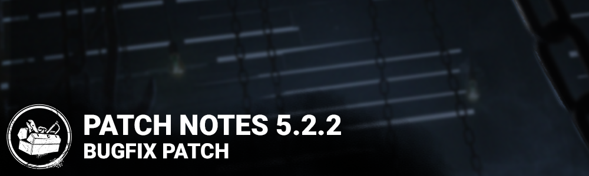

<!-- nav -->
&larr; [5.2.1 | Bugfix Patch](295-5-2-1-bugfix-patch.md) · [Live](../../index.md#live) · [5.3.0 | Hour of the Witch](298-5-3-0-hour-of-the-witch.md) &rarr;
<!-- /nav -->

# 5.2.2 | Bugfix Patch

## Content

- Reverted the pallet to the old visuals. The updated pallet will return in a future update.

## Bug Fixes

- Fixed an issue that caused several Cenobite scoring events to incorrectly count as Bonus BP
- Fixed an issue with the Nemesis' move speed while charging Level 3 Tentacle Strike
- Fixed an issue that caused the Survivor models in a lobby to not always reflect what the other Survivors selected.
- Fixed an issue that caused players to not always receive disconnection penalties when leaving a match as Killer.
- Fixed an issue that may cause a loss of momentum when changing directions during a lunge attack when playing as the Cenobite.
- Fixed an issue that caused the Cenobite's chase music not to restart after using Summons of Pain during a chase.
- Fixed an issue that caused the Cenobite's Lament Guardian score event to be counted in an incorrect category.
- Fixed an issue that caused a grunt sound effect to be played when switching to the Cenobite when spectating a custom game.
- Fixed an issue that a "generator completed" sound notification to play when switching between Victor and Charlotte or when switching spectated players.
- Fixed an issue that caused the Engineer's Guild archive quest not to progress.
- Fixed an issue that caused two hooks too close to one another at the east stairs in Resident Evil map.
- Fixed an issue that prevented one side of a pallet in Gideon Meat Plant from being destroyed by the killer,
- Fixed an issue where the Cenobite's Gateway SFX continues to play after triggering the attack.
- Fixed an issue that caused the chain hunt start notification sound to trigger when switching to a survivor's perspective while spectating.
- Fixed several misaligned banners in the Store.
- (PC only) Fixed an issue with 4K resolution being enabled by default for some players, sometimes resulting in performance drop
- Fixed a possible softlock when spamming the ESC key during the Loading screen
- Fixed an issue with the Grade Reset popup not opening if the date changed while the Game is still opened
- Fixed a crash in the Tally screen related to the Season End Grade Reset

## Known Issues

- The Dead Dawg Saloon map is disabled and is planned to be fixed for the next update.

<!-- nav -->
&larr; [5.2.1 | Bugfix Patch](295-5-2-1-bugfix-patch.md) · [Live](../../index.md#live) · [5.3.0 | Hour of the Witch](298-5-3-0-hour-of-the-witch.md) &rarr;
<!-- /nav -->
