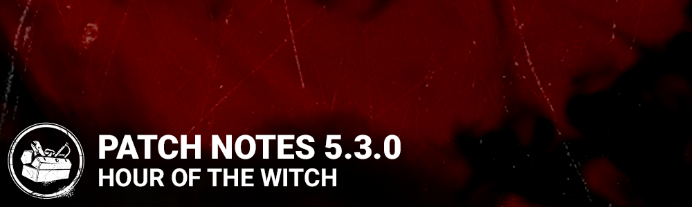

<!-- nav -->
&larr; [5.2.2 | Bugfix Patch](296-5-2-2-bugfix-patch.md) · [Live](../../index.md#live) · [5.3.0a | Hotfix](300-5-3-0a-hotfix.md) &rarr;
<!-- /nav -->

# 5.3.0 | Hour of the Witch

## Features

- System to support event content within The Archives

## Content

- Added a new Survivor: Mikaela Reid.
- Updated the Character Select portraits for several Survivors. (David, Jake, Nea, Kate, Quentin, and Feng)
- "The Midnight Grove" Halloween limited-time event (starts Oct. 21st 11AM ET)
- Tome IX of The Archives (starts Oct. 20th 11AM ET)

## General

- Item and Add-on descriptions have been rewritten
- “Considerably” and other vague terms have been replaced with number values
- Added in reminder text for Status Effects: Any Add-ons that trigger status effect also include a brief description on the status effect
- The hatch will now only appear when one survivor is left alive
- Survivors can open the hatch after it has been kicked shut by using a key
- Key interaction takes 2.5 seconds, and does not lose progress when interrupted
- The achievement “Where Did They Go!?” has been changed to “The Key to Escaping”

*Developer notes: The hatch change is effectively the much asked for Key nerf in disguise, preventing survivors from escaping a trial prematurely. It is also intended to reduce situations where survivors would camp the hatch, waiting for their teammates to die so they could escape.*

### The Trapper

- Base trap carrying capacity and starting traps increased to 2 (was 1)
- Trap aura color changed from red to white to be consistent with other killer object auras
- The number of traps spawned on a given map is now always 6 (was random 4-6)
- Add-on – Trapper Gloves: Setting speed bonus increased to 30% (was 20%)
- Add-on – Wax Brick: Trap escape modifier removed. Added effect: 33% increase to rescue and escape time. Rarity decreased to Uncommon (was Rare)
- Add-on – Trapper Bag: Reduced number of additional traps to 1 (was 2). Rarity increased to Rare (was Uncommon)
- Add-on – Secondary Coil: Increased trap disarm time to 50% (was 43%)
- Add-on – Fastening Tools: Trap escape modifier removed. Added effect: 25% increase to rescue and escape time. Rarity decreased to Rare (was Very Rare)
- Reworked Add-on – Oily Coil: When resetting a Bear Trap, reveal the aura of the most recent Survivor to disarm it for 5 seconds
- Reworked Add-on – Trapper Sack: Bear Traps are carried at the beginning of the trial instead of spawning on the map. Bear Traps cannot be picked up
- New Add-on – Bear Oil: Setting a Bear Trap is silent
- New Add-on – Makeshift Wrap: The Trapper cannot be caught by his Bear Traps. The Bear Trap will be disarmed if The Trapper steps on it
- New Add-on – Coffee Grinds: Gain a 5% Haste status effect for 5 seconds after setting a Bear Trap
- New Add-on – Lengthened Jaws: Bear Traps inflict Deep Wound on Survivors
- New Add-on – Tension Spring: The Bear Trap resets 2 seconds after a Survivor escapes from it
- The following add-ons have been removed: Strong Coil Spring, Trap Setters, Logwood Dye, Setting Tools, Stitched Bag
- New Bear Trap SFX when using Padded Jaws add-on

*Developer notes: The Trapper is DbD’s oldest killer, and he needed some love to bring him up to our modern standard of play. Many of these changes are focused around bringing him into line with how the rest of our Killers behave. Traps have been balanced to provide more consistent game experiences, and his add-ons have been overhauled to give a greater variety of options.*

### The Wraith

- Uncloaking speed boost duration reduced to 1 seconds (was 1.25 seconds)
- Add-on – All Seeing: Blood: Aura reveal range decreased to 8 meters (was 12 meters)

*Developer notes: Recent buffs to The Wraith have made him a wee bit over powered, so these changes are intended to adjust two of the most obviously overpowered elements. We’ll continue monitoring how he performs, and potentially have more changes for him in the future.*

### The Hillbilly

- Add-on – Death Engravings: Added effect: Decreases heat generated while charging by 14%
- Add-on – Doom Engravings: Added effect: Decreases heat generated while charging by 14%
- Add-on – Mother’s Helpers: Charge speed bonus after being stunned increased to 18% (was 12%)
- Add-on – Tuned Carburetor: Charge speed bonus increased to 25% (was 20%)
- Reworked Add-on – Black Grease: Increases Chainsaw charge speed by 18% for 30 seconds after being blinded
- Reworked Add-on – Pighouse Gloves: While overheated, increases action speed by 20% when breaking pallets or walls, or damaging generators. While overheated, decreases duration of pallet stuns by 50%

*Developer notes: The engraving add-ons are very popular with players, but the increased charge time means he generates significantly more heat for a full charge with these add-ons than without. A heat reduction modifier has been added to keep the amount of heat produced for one full charge constant, and we’ve also improved some underperforming add-ons to make them more enticing.*

### The Nurse

- Add-on – Torn Bookmark: Removed line of sight restriction. Added effect: Increases Blink recharge time by 50%

*Developer notes: The line of sight restriction on Torn Book wasn’t terribly fun to play with, so we’ve replaced that a new downside which we feel is more in line with what players would expect.*

### The Shape

- Add-on – Memorial Flower: Rarity decreased to Common (was Uncommon)
- Add-on – Vanity Mirror: Removed speed penalty
- Add-on – Judith’s Tombstone: Speed penalty now only applies to Evil Within III

*Developer notes: The rarity change to Memorial Flower brings The Shape in line with all our other killers in terms of add-on rarity distribution. Additionally, we have removed the movement speed penalties that prevented two add-ons from realistically enabling their intended play styles. Our condolences to players who used these add-ons for comedic purposes.*

### The Hag

- Add-on – Waterlogged Shoe: Increased speed bonus to 4.5% (was 2%)

*Developer notes: Waterlogged Show was The Hag’s worst performing add-on, so we’ve given it a buff to help make it more viable. It will now make The Hag move at regular killer speed, 4.6m/s.*

### The Pig

- Add-on – Bag of Gears: Increased Reverse Bear Trap setting speed bonus to 50% (was 20%)
- Add-on – Crate of Gears: Decreased Jigsaw Box search penalty to 33% (was 43%)
- Add-on – Tampered Timer: Decreased Reverse Bear Trap death timer modification to 20 seconds (was 30 seconds)
- Add-on – Rule Set N.2: Decreased rarity to Rare (was Ultra Rare)
- Add-on – Amanda’s Letter: Jigsaw Box reduction removed. Aura reveal range increased to 16 meters (was 12 meters)
- Reworked Add-on – John’s Medical File: Increases crouched move speed by 6%
- Reworked Add-on – Razor Wires: Failing a Jigsaw Box skill check while uninjured will injure the survivor
- Reworked Add-on – Workshop Grease: Increases Ambush attack charge speed by 50%. Decreases Ambush attack miss cooldown by 25%. Increased rarity to Uncommon (was Common)
- Reworked Add-on – Last Will: Increases Ambush attack movement speed by 6%. Increases time to charge Ambush attack by 66%
- Reworked Add-on – Interlocking Razor: Failing a Jigsaw Box skill check while injured will inflict Deep Wound on the Survivor
- Reworked Add-on – Jigsaw’s Annotated Plan: Increases available Reverse Bear Traps by 1. Increases Reverse Bear Trap death timer by 10 seconds. Whenever a generator is completed, 10 seconds is removed from the death timer of all active Reverse Bear Traps
- Reworked Add-on – Jigsaw’s Sketch: Increases available Reverse Bear Traps by 1. When a Survivor with a Reverse Bear Trap is working on a generator, that generator’s aura is revealed to you
- Reworked Add-on – Video Tape: Survivors begin the trial with Reverse Bear Traps installed. Rarity increased to Ultra Rare (was Uncommon)

*Developer notes: We are happy to announce The Pig is getting an add-on balance pass! We have replaced a number of underperforming or unpopular add-ons with new effects and increased the values on others to make them more effective. On the other end, Tampered Timer and Crate of Gears could sometimes be too strong (especially when combined) so their values have been reduced. The end result should be an add-on set that is overall stronger, more diverse, and more fun to play.*

### The Spirit

- While phase walking Survivors within 24 meters of The Spirit (*not the husk)* hear a directional audio cue that gains volume with proximity
- Add-on – Juniper Bonsai: Added effect: Increases Passive Phasing duration by 50%
- Reworked Add-on – Dried Cherry Blossom: Survivors trigger Killer Instinct when they come within 4 meters of The Spirit while she is phasing. Scratch marks are no longer visible while using Yamaoka’s Haunting
- Reworked Add-on – Wakizashi Saya: During Yamaoka’s Haunting, use the Active Ability button to return to the husk and end the haunting
- New Add-on – Mother’s Glasses: Survivors trigger Killer Instinct when they come within 2 meters of the husk. Scratch marks are no longer visible while using Yamaoka’s Haunting
- New Add-on – Uchiwa: Instantly recharges Yamoka’s Haunting when stunned by a pallet
- New Add-on – Senko Hanabi: When Yamaoka’s Haunting ends, The Spirit’s husk explodes and any vaults within 4 meters are blocked for 5 seconds
- New Add-on – Furin: The phasing sound is heard by all Survivors
- New Add-on – Kintsugi Teacup: Instantly recharges Yamaoka’s Haunting after breaking a pallet or wall
- The following add-ons have been removed: Bloody Hair Brooch, Dirty Uwabaki, Katsumori Talisman, Prayer Beads Bracelet, Father’s Glasses
- New Terror Radius music

*Developer notes: The Spirit’s phase walking mind-games have evolved into something of a Kobayashi Maru. By adding some audio cues, it should give sharp survivors a chance to figure out what she’s doing and react accordingly. Along with this, we’ve replaced some of her more problematic / boring add-ons with new ones that should provide more varied options for potential playstyles.*

### The Plague

- If the power button is released early, Vile Purge will continue charging to the minimum threshold instead of cancelling and entering cooldown
- Vile Purge cooldown move speed increased from 2.3m/s to 3.6m/s
- Base object infection time increased to 40 seconds (was 35 seconds)
- Interacting with infected objects generates 2x more sickness over time than interacting with non-infected objects
- Time to cleanse at a fountain increased to 8 seconds (was 6 seconds)
- Add-on – Limestone Seal: Object infection bonus increased to 20 seconds (was 5 seconds)
- Add-on – Emetic Potion: Increased Vile Purge effectiveness bonus to 30% (was 25%)
- Add-on – Hematite Seal: Object infection bonus increased to 30 seconds (was 10 seconds)
- Add-on – Infected Emetic: Decreased Vile Purge effectiveness bonus to 40% (was 50%)
- Add-on – Ashen Apple: Removed object infection duration modifier. Added effect: Increases the number of Pools of Devotion in the trial by 1
- Add-on – Rubbing Oil: Reduced Vile Purge charge speed bonus to 50% (was 100%)
- Add-on – Exorcism Amulet: Increased Corrupt Purge duration bonus to 10 seconds (was 6 seconds)
- Add-on – Devotees Amulet: Increased Corrupt Purge duration bonus to 20 seconds (was 8 seconds)
- Add-on – Black Incense: Decreased survivor aura reveal duration to 3 seconds (was 5 seconds)
- Add-on – Iridescent Seal: Removed speed penalty while holding Corrupt Purge
- Reworked Add-on – Prayer Tablet Fragment: Vile Purge no longer affects Survivors. Increases object infection duration by 40 seconds. Increases infection from infected objects by 100%. Increases Devious Bloodpoints by 100%
- Reworked Add-on – Olibanum Incense: Survivors who cleanse at fountains have their auras revealed for 4 seconds
- Reworked Add-on – Prophylactic Amulet: Decreases the number of Pools of Devotion in the trial by 2
- Reworked Add-on – Incensed Ointment: Ingesting the corruption at a Pool of Devotion causes all Survivors within The Plague’s Terror Radius to scream and reveal their locations
- Reworked Add-on – Vile Emetic: Increases velocity of vomit projectiles by 10%

*Developer notes: These changes are intended to be a general buff and to enhance quality-of-life for The Plague. It was far too common for players to attempt a quick purge only to accidentally release the charge a fraction of a second too early and unintentionally end up in cooldown, so we’ve changed the behaviour of early releases to charge to a minimum threshold instead of going on cooldown. We have also buffed the options for focusing on infecting objects during the trial, with infected objects now increasing infection faster than non-infected ones.*

### The Deathslinger

- The Deathslinger must now wait for the Enter Aim animation to complete before being able to fire (0.4 seconds)
- The Deathslinger must now wait for the Exit Aim animation to complete before being able to attack (0.6 seconds)
- Increased movement speed when aiming down sights to 85% (was 75%)
- The cooldown when a survivor breaks free is now the same duration as a successful hit cooldown
- Increased terror radius to 32 meters (was 24 meters)
- Add-on – Gold Creek Whiskey: Removed movement speed penalty
- Add-on – Marshal’s Badge: Removed movement speed penalty
- Add-on – Iridescent Coin: Decreased range requirement to 12 meters (was 15 meters)
- Add-on - Wanted Poster: Decreased movement speed while aiming to 2.5% (was 10%)
- Add-on - Jaw Smasher: Decreased movement speed while aiming to 1% (was 5%)
- Reworked Add-on – Hellshire Iron: When a Survivor is speared, gain Undetectable. The effect persists for 10 seconds after the Survivor is no longer speared.

*Developer notes: We were unhappy with how easy it was for players to “insta-scope” survivors, especially given how little counterplay this had for survivor players. To combat this, The Deathslinger now has minimum enter / exit times when aiming down sights before being able to shoot / attack normally. We have also adjusted the stun when survivors break free to be the same as a successful hit, giving players a choice to break the reel early in exchange for losing out on the damage / deep wound. Wanted Poster and Jaw Smasher are to account for his new base movement speed while aiming: When stacked The Deathslinger moves at ~3.9m/s, which is very close to Survivor move speed of 4.0 m/s.*

### The Ghost Face

- Night Shroud recovery time decreased to 24 seconds (was 30 seconds)
- Add-on – Walleye’s Matchbook: Decreased Night Shroud recovery modifier to 2 seconds (was 4 seconds)
- Add-on – Olson’s Address Book: Decreased Night Shroud recovery modifier to 3 seconds (was 6 seconds)
- Add-on – Chewed Pen: Decreased Night Shroud recovery modifier to 4 seconds (was 8 seconds)

*Developer notes: Player feedback about Ghost Face's add-ons was very clear: decreased recovery time was more appealing than any other option. In light of this, we have 'baked in' roughly half the effect of these add-ons to encourage a wider variety of selection.*

### The Blight

- Add-on – Adrenaline Vial: Increased rush token recharge bonus to 1 second (was 0.75 seconds). Added effect: Increases Rushing speed by 10%
- Add-on – Summoning Stone: Increased pallet blocking range to 16 meters (was 12 meters). Increased pallet blocking duration to 15 seconds (was 6 seconds)

*Developer notes: The add-on Adrenaline Vial is supposed to enable an alternate "straight line dash" playstyle for players interested in novelty. While it's still unlikely to be stronger than baseline Blight play, increased movement speed and token recharge should make the alternate playstyle a bit more viable. Additionally, the values on Summoning Stone have been increased to better reflect the perk it is referencing (Hex: Blood Favor).*

### The Oni

- Add-on – Scalped Topknot: Reduced Demon Dash activation reduction to 0.5 seconds (was 1 second)

*Developer notes: Easy one here, Scalped Topknot was over performing when used, so it needed an adjustment to bring it in line.*

### The Trickster

- Add-on – Ji-Woon's Autograph: Decreased the reduction of blades required to 1 (was 2)

*Developer notes: There was an error that caused Ji-Woon's Autograph and Fizz-Spin Soda to bother reduce the blades required by 2, so we've reduced the power of the more common add-on.*

### Survivor Perks

The following perks have become General Perks, and their names have changed:

- Babysitter is now Guardian
- Camaraderie is now Kinship
- Second Wind is now Renewal
- Better Together is now Situational Awareness
- Fixated is now Self-Aware
- Inner Strength is now Inner Healing

Perk Balancing

- Vigil: Recovery bonus increased to 20/25/30% (was 10/15/20%). Added Broken, Exposed, and Oblivious to the status effects modified by the perk
- Guardian (formerly Babysitter): Added a 7% Haste status effect for the rescued survivor. Removed the Killer seeing your aura. Killer aura visibility for you increased to 8 seconds (was 4 seconds)
- For the People: Reduced the duration of the Broken status effect to 80/70/60 seconds (was 110/100/90 seconds)
- Windows of Opportunity: Increased effective range to 24/28/32 meters (was 20 meters). Removed cooldown after vaulting / dropping a Pallet
- Repressed Alliance: Generator repair requirement reduced to 55/50/45 seconds (was 80/70/60 seconds)
- Built to Last – Reworked: After hiding inside a Locker for 14/13/12 seconds with a depleted item in hand, 99% of its charges are refilled. Each use of Built to Last reduces the amount of charges refilled by 33%. Added stinger audio when item charges are refilled
- Any Means Necessary: Added effect: You can see the auras of dropped pallets
- No Mither: Grunts of pain reduction increased to 25/50/75% (was 0/25/50%). Added effect: Your recovery speed is increased by 15/20/25%

*Developer notes: All of these perks have a low usage rate, low success rate, or both. They have all seen buffs to make them more appealing and more effective.*

### Killer Perks

The following perks have become General Perks, and their names have changed:

- Surge is now Jolt
- Mindbreaker is now Fearmonger
- Cruel Limits is now Claustrophobia

Perk Balancing

- Hex: Retribution: Oblivious condition changed to trigger from interacting with any type of totem (was just cleansing hex totems): Increased aura reveal time to 15 seconds (was 10 seconds)
- Hex: Blood Favor: Pallet blocking effect now triggers off survivors losing a health state (was basic attacks). Pallet blocking radius increased to 32 meters (was 16 meters). Pallet blocking is now centered around the survivor losing health. Cooldown has been removed
- Hex: The Third Seal: Blindness effect now triggers off basic attacks and special attacks (was just basic attacks)
- Hex: Thrill of the Hunt: Survivor penalty now applies to both Cleansing and Blessing actions (was just Cleansing). Penalty stacks increased to 8/9/10% per stack (was 4/5/6%). Maximum penalty increased to 40/45/50% (was 30%). Loud noise notification has been removed
- Fearmonger (formerly Mindbreaker): Now applies Exhausted and Blindness to survivors (was just Exhausted)

*Developer notes: Hex: Retribution and Hex: Thrill of the Hunt have been adjusted to take the new Boon Totem perks into account. The other perks have been generally unpopular, so some buffs are warranted to increase viability.*

## Bug Fixes

- Fixed an issue that may cause the Cenobite's Lament Configuration to get stuck underneath pallets.
- Fixed an issue that caused the Cenobite to be able to chain a survivor without teleporting when starting the teleport just as the survivor solves the Lament Configuration.
- Fixed an issue that may cause survivors to be unable to move if the Cenobite attempts to teleport just as the survivor solves the Lament Configuration.
- Fixed an issue that made it impossible to cleanse a totem next to a cabinet in the Treatment Theatre map.
- Fixed an issue that made it impossible to cleanse a totem between a barrel and a box of crates in The Underground Complex map.
- Fixed an issue that made it impossible to cleanse a totem behind a staircase and log pile in the Dead Dawg Saloon map.
- Fixed an issue that caused the collision of the hatch to appear before the hatch itself.
- Fixed an issue that caused the Clown's gas to dissipate quickly in any house basement.
- Fixed an issue that may cause a status effect's icon to remain indefinitely on screen.
- Fixed an issue that caused stalking progress to jump upon ending the stalk when the distance to the stalked survivor changes.
- Fixed an issue that caused survivors' faces to distort when being unhooked by a survivor of the opposite gender.
- Fixed an issue that caused survivors to recoil back when failing the second skill check while using the Brand New Part add-on.
- Fixed an issue that caused the carrying music to continue playing when a survivor disconnects while being picked up.
- Fixed an issue that caused killers to clip through the ground when walking in the Tally screen.
- Fixed an issue that caused the auras of carried survivors to be revealed when using the Aftercare, Situational Awareness (formerly Better Together) and No One Left Behind perks.
- Fixed an issue that caused the aura of the survivor sent to a Cage of Atonement to be revealed when using the Iridescent Seal of Metatron Pyramid Head add-on.
- Fixed an issue that caused survivors Laceration meter to continue to decrease for other survivors after they escape the challenge.
- Fixed an issue that caused the Alert perk not to reveal the Nemesis Tentacle Strike pallet action.
- Fixed an issue that caused the interaction prompt button icons on the HUD to not be affected by the Large Text Setting.
- Fixed an issue with the Buff Icon missing from the HUD whenever the Clown steps into a Antidote Gas Cloud and gains Haste.
- Fixed a Back button disappearance in the Search for Friends screen in 4k resolution.
- Fixed an issue where holding the backspace key to clear the chat didn't work anymore.
- Fixed an issue that caused some of Claudette's head icons to appear darker.
- Fixed an issue that caused bots to sometimes enter lockers while in the killer's view.
- Fixed an issue that caused an error to sometimes occur while linking accounts.
- Fixed an issue that caused an error to sometimes occur while unlinking an unified account.
- Fixed an issue that caused "" to be displayed in the public match and tally chats instead when entering blank text.
- Fixed an issue that caused a pallet that can't be vaulted near the main building in Wretched Shop.
- Fixed an issue that caused the Executioner's sfx to be delayed when he plants his blade into the ground.
- Fixed an issue that caused a missing sfx during the chains animation when wearing the Chatterer outfit.
- Fixed an issue that caused the splash SFX to be muffled when a survivor is hooked at certain locations in the Springwood map.
- Fixed an issue that caused survivors to be able to use the Dead Hard and Sprint Burst sprints at the same time.
- Fixed an issue that caused the survivor's voice to keep playing after the Cenobite's mori.
- Fixed an issue that caused survivors to be able to walk over bear traps next to a window vault by spamming the vault button.
- Fixed an issue that caused the mori music not to play for the survivor.
- Fixed an issue that caused zombies not to react to bubble indicators.
- Fixed an issue that caused the bonfire sound effect to be played on the Offering screen.
- Fixed an issue that caused the Cenobite's music to be played despite being back in the default main menu.
- Fixed an issue that caused the new Spirit's chase music to not be played on the Killer side.
- Fixed an issue that caused the default killer theme to overlap with The Shape's Halloween theme in the main menu.
- Fixed an issue that caused the terror radius to not always be played when affected by the Discipline add-on.
- Fixed an issue that caused the carrying music to continue playing when a survivor disconnects while being picked up by the Killer.
- Fixed an issue that caused a generator that can't be kicked by the killer in Hospital Map and Treatment Theatre.
- Fixed an issue that caused the Killer not being able to pick up Survivor in a specific corner in Dead Dawg Saloon.
- Fixed an issue that caused the generator in one of Midwich's classrooms that can't be repaired from one side.
- Fixed an issue that caused Survivors can't be picked up near the fences and bushes in Lampkin Lane.
- Fixed an issue that caused a generator near one of Lery's exit gate from being kicked on one side.
- Fixed an issue that caused Victor to fall out of bounds in a hole near the Exit Gate in Midwich.
- Fixed an issue that caused two pallets to spawn very close to each other in Badham Preschool IV near the big house.
- Fixed an issue that caused a generator in Grim Pantry not being able to be damaged from one side.
- Fixed an issue that caused the Killer to stand in a weird place on Crotus Prenn Asylum.
- Fixed an issue that caused Reverse Bear Traps that survivors start with at the begin of the match when the pig uses the Video Tape add-on not to activate properly.
- Fixed an issue with the Progression Available button disappearing in the Tally after coming back from the Spectate mode
- Fixed an issue that caused the "Beginner Mode" Setting not to affect the Score Categories Tooltips visibility on the Tally screen
- Fixed an issue causing a softlock when changing the Language in the Settings menu and immediately restore the Settings to Default
- Fixed an issue that caused survivors not to be able to move for a short while after stopping the Cleansing or Blessing actions.
- Fixed an issue that caused the Killer not to be able to do the Snuff action on some totems.
- Fixed an issue that caused the Oni's Renjiro's Bloody Glove add-on to reveal survivors for the entire match.
- Fixed an issue that caused the Trapper's attacks to be cancelled upon stepping on a bear trap with the Makeshift Wrap add-on equipped.
- Fixed an issue that caused the Trapper to have an extra bear trap during the tutorial.
- Fixed an issue that caused the Thrill of the Hunt perk to display a loud noise notification when a survivor cleanses or blesses a hex totem.
- Fixed an issue that caused the Mettle of Man perk not to activate.
- Fixed an issue that caused Survivors to become invisible after switching role in the custom game lobby while on the charm selection menu as Killer.
- Fixed an issue when players could change a Daily Ritual multiple times by restarting the application after removing a Daily Ritual.
- Tentatively fixed an issue when players would lose all of their characters progress after a save game error.
- Tentatively fixed an issue when occasionally the ready button wouldn't work after an error pop-up in a survivor lobby.
- Fixed an issue that could cause incorrect press detection on the Onboarding menu buttons.
- Fixed an issue that prevented the Tutorial objectives keyboard prompt icons from increasing with the large text setting.

## Changes from PTB

Hex: Blood Favor

- Now triggers when a survivor loses a health state, and the area of effect is centered on the survivor

Boon Perks

- Multiple instances of the same Boon Perk no longer stack when the areas of effect overlap from multiple totems
- Blessing a Hex Totem now takes 24 seconds (was 14 seconds)
- Boon Totem range has been reduced to 24 meters (was 28 meters)

The Deathslinger

- Add-on - Wanted Poster: Decreased movement speed while aiming to 2.5% (was 10%)
- Add-on - Jaw Smasher: Decreased movement speed while aiming to 1% (was 5%)

The Trickster

- Add-on – Ji-Woon's Autograph
- Decreased the reduction of blades required to 1 (was 2)

Mikaela Reid

- Lowered Mikaela Reid's voice

*Dev notes: Blood Favor was changed to use healthstates instead of attacks to be more balanced for killers like Legion and Trickster, as well as recentering the trigger location on the survivor to prevent situations where a survivor was injured at a distance. Boon Totems were a bit too strong on the PTB, but these changes should bring them into line with our expectations. The Deathslinger add-ons were adjusted to account for his buffed base movement speed. Ji-Woon's Autograph had an error that caused it to have the same reduction as the rarer addon Fizz-Spin Soda.*

## Known Issues

- Add-on text in non-English languages is not completely updated / translated.

<!-- nav -->
&larr; [5.2.2 | Bugfix Patch](296-5-2-2-bugfix-patch.md) · [Live](../../index.md#live) · [5.3.0a | Hotfix](300-5-3-0a-hotfix.md) &rarr;
<!-- /nav -->
