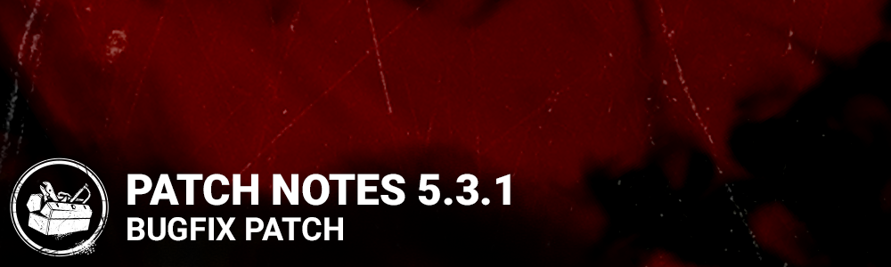

# 5.3.1 | Bugfix Patch

## Content

- Perk – Clairvoyance: Added the Hatch to the auras revealed. The Hatch aura is only visible after The Hatch has spawned.
- Perk - Dead Hard: Added hit validation
- The Midnight Grove Event - Selecting a Halloween challenge involving the event pumpkins will cause pumpkins to react to your presence.

*Dev note: Previously, Dead Hard's invulnerability was calculated on the Killer's client, which led to survivors needing to anticipate the killer's swing to an unreasonable degree in order for it to work. With hit validation, the server will decide if the hit would have landed and reject it if Dead Hard was active without relying on the Killer's client.*

## Bug Fixes

- (Steam, Windows Store, PS4, PS5, Xbox One, Xbox Series S|X) Tentatively fixed an issue which could cause players to get stuck in an infinite loading screen
- Fixed an issue that caused Halloween pumpkins not to rotate to face the player.
- Fixed an issue that caused Halloween pumpkins not to appear lit when a related challenge is active.
- Fixed an issue that caused Halloween hooks' auras not to be orange when viewed by survivors.
- Fixed an issue that caused the haste timer not to function properly when having haste both from the Halloween pumpkins and from the Clown's Afterpiece Antidote.
- Fixed an issue that may cause the game to crash when using the Boon: Circle of Healing perk.
- Fixed an issue that caused the Boon: Circle of Healing perk to give the Self Care prompt.
- Fixed an issue that caused the heal speed not to be adjusted when a medkit runs of charges when self healing with a medkit within the range of Boon: Circle of Healing.
- Fixed an issue that caused the Clairvoyance perk to remain activated when used while being healed and holding an item.
- Fixed an issue that caused the Spirit to be able to teleport to a destroyed husk when using the Wakizashi Saya add-on.
- Fixed an issue that caused the Life Giver archive challenge not to gain progress when gaining health from the Adrenaline, For the People, Resurgence, Second Wind, or Solidarity perks.
- Fixed an issue that caused the Appeal to Heal archive challenge not to gain progress when consuming a medkit by using the Styptic Agent or Anti-Hemorrhagic Syringe add-ons.
- Fixed an issue that caused the Power Struggle perk not to reliably stun the killer since the same side pallet stuns were removed.
- Fixed an issue in the cosmetic icons where Jonathan Byers' head would appear distorted in his outfit and torso icons.
- Fixed an issue that caused users to be able to change a Daily Ritual multiple time by restarting the application after removing a Daily Ritual.
- Fixed an issue that caused Players to sometimes load into trials with little to no lighting.
- Fixed an issue that caused some hatch spawns on Midwitch Elementary can not be opened with a key.
- Fixed an issue that caused the Survivors can't be picked up in crevasse on Lery's Memorial Institute.
- Fixed an issue that caused the First to the Punch achievement not to gain progress when a survivor is downed other than by a basic attack. It now gains progress whenever a survivor is downed next to a pallet, no matter the reason.
- Fixed an issue that caused the Humanitarian achievement not to gain progress when unhooking a survivor with the Borrowed Time perk.
- Fixed an issue that caused the Cenobite to appear inside of the ground when teleporting to a survivor solving the Lament Configuration on the top level of the maze in the Pale Rose map.
- Fixed an issue that caused the Twins' Drop of Perfume add-on's oblivious range not to be affected by other add-ons affecting Victor's Shriek radius.
- Fixed an issue that caused Victor's alert range not to be affected by other add-ons affecting Victor's Shriek radius.
- Fixed an issue that caused survivors to be able to use the Dead Hard and Balanced Landing perks at the same time.
- Fixed an issue that caused the 5th Killer Instinct VFX "tick" to not appear if a Survivor affected by Killer Instinct is behind an asset.
- Fixed an issue with various totem locations which caused the Killer to be unable to snuff them.

## Known Issues

- Treatment Theatre Map is disabled.
- The Killer can only earn 1 point of progress per Tangled Hook for the Halloween Hook challenge.
