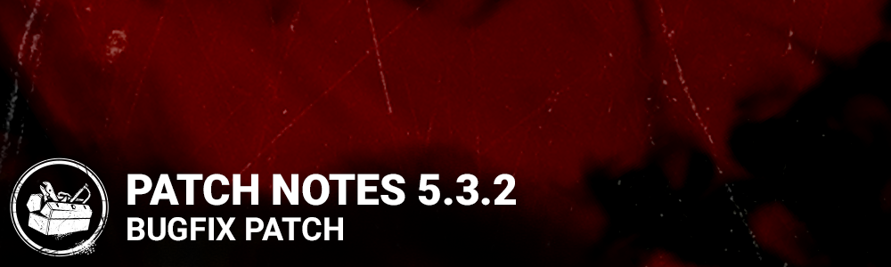

<!-- summary -->
## AI TL;DR

Boon Totems have had their animation restriction lifted, making all totems snuffable for killers (temporarily until repositioning). The patch also delivers a sweep of bug fixes: archive UI now shows the correct challenge, store purchase errors no longer grant free survivors, and dual Bloodweb leveling is blocked, while the Clairvoyance perk stops pushing teammates and consuming each other. Interaction bar color works when blessing hexes, the Pig’s Video Tape add-on correctly kills with reverse bear traps and lets survivors move after generator completion, Adrenaline triggers at exit gates, foliage graphics stay intact, and various UI, performance and loading issues are resolved. Known issues remain with the Halloween Hook challenge, archive level refresh delays, and occasional Clairvoyance glitches.
<!-- /summary -->

<!-- nav -->
&larr; [5.3.1 | Bugfix Patch](302-5-3-1-bugfix-patch.md) · [Live](../../index.md#live) · [5.4.0 | Portrait of a Murder](306-5-4-0-portrait-of-a-murder.md) &rarr;
<!-- /nav -->

# 5.3.2 | Bugfix Patch

## Features

**Boon Totems**

- Disabled an animation restriction that caused many boon totems to be unsnuffable by the killer due to the placement of the totems

*Dev Note: We intend to re-enable this in a future patch, once we have had time to locate and reposition all offending totems so that they play nice. This will result in some totems being snuffable through collision, but we are erring on the side of caution to ensure that all totems can be snuffed by the killer until then. Enjoy it while it lasts, Killer Mains!*

## Bug Fixes

- Fixed an issue that caused the archive widget to appear without any challenge selected when there would be a challenge selected in the tome page.
- Fixed an issue that caused the purchased survivor to be unlocked and no Auric Cells to be spent after getting a "Purchase Failed" error in the store.
- Fixed an issue that caused the player to be able to level up two character Bloodwebs at the same time.
- Fixed an issue that caused Survivors using the Clairvoyance perk to be able to push other players.
- Fixed an issue that caused the interaction bar not to become red when blessing a hex totem.
- Fixed an issue that may cause reverse bear traps installed by the Pig's Video Tape add-on not to kill survivors when the timer runs out.
- Fixed an issue that may cause survivors to be unable to move when a generator is completed when the Pig has the Video Tape add-on equipped.
- Fixed an issue that caused the Adrenaline perk not to trigger if the Survivor was not eligible to receive the effect when the exit gates are powered.
- Fixed an issue that caused the grass and foliage to become partially black as players walk through.
- Fixed a potential wrong active node state in the Archives.
- Fixed an issue that caused survivors repeatedly scream when crouching while being puked on.

Switch only:

- Fixed a text overlapping issue in the Keybinding menu.
- Fixed a performance issue in docked state by deactivating the menu movement when moving the cursor.
- Fixed an issue that could cause an excessively long / infinite loading screen.

## Known Issues

- The Killer can only earn 1 point of progress per Tangled Hook for the Halloween Hook challenge.
- When completing a level in the Archives, the level status is not immediately refreshed. However leaving and re-entering the menu will refresh and reflect the completed status.
- We are aware of an issue with the perk Clairvoyance, where the effects may not be disabled in some cases
- A Survivor with an activated Clairvoyance can consume another Survivor's activated Clairvoyance when they are close to each other.

<!-- nav -->
&larr; [5.3.1 | Bugfix Patch](302-5-3-1-bugfix-patch.md) · [Live](../../index.md#live) · [5.4.0 | Portrait of a Murder](306-5-4-0-portrait-of-a-murder.md) &rarr;
<!-- /nav -->
