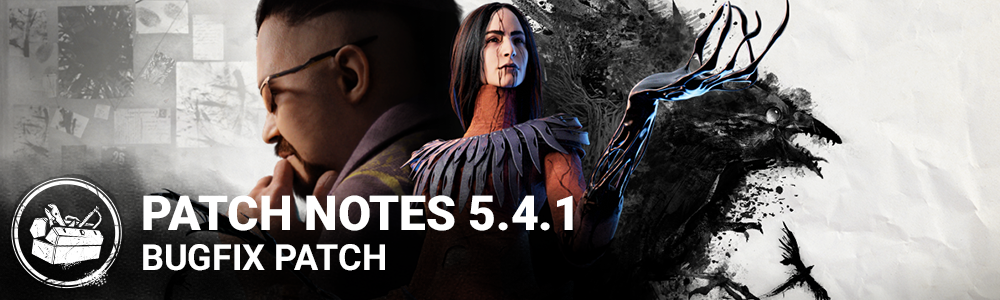

# 5.4.1 | Bugfix Patch

## Bug Fixes

- Fixed an issue that caused the Crow Food archive challenge not to gain progress.
- Fixed an issue that caused the Sprint & Slash archive challenge not to gain progress.
- Fixed an issue that caused the Beast Awakens archive challenge not to gain progress.
- Fixed an issue that allowed players to surpass the Blight turn rate limits by using frame rate limiting software.
- Fixed an issue that allowed survivors to complete the opening of the hatch when put into dying state
- Fixed an issue that sometimes caused the Oni and Spirit's hair to disappear during the intro pan.
- Fixed an issue that caused The Artist's Crows' aura to remain visible after downing a Survivor who was repelling crows
- Fixed an issue that caused the damaging crows not to be counted as protective hits
- Fixed an issue that caused Corrective Action not to consume a token when another Survivor failed a skill check
- Fixed an issue that caused the New and Sale badges to not disappear after clicking the Store buttons.
- Fixed an issue that prevented the killer player from hearing a boon totem being blessed.
- Fixed an issue that prevented the boon totem blessing SFX from looping correctly.
- Fixed an issue that prevented Survivors to be picked up at a corner near the Exit Gates in Autohaven Wreckers.
- Fixed an issue that caused missing Thai accents and punctuation in the Subtitles Settings text.
- Fixed several texts exceeding the button size in the Game Manual in some languages
- Fixed an issue with the hook 3D model remaining visible in Play as Killer when switching from an empty charm slot to a Killer cosmetic slot in the Lobby.
- Fixed an issue that caused the spotlight to be delayed when fully repairing a short pole or yellow generator
- Fixed an issue that cause the black ink VFX to be missing from the survivor's eyes and mouth when getting Mori'ed by the Artist.
- Fixed an issue that caused Coup de Grace to get too many tokens
