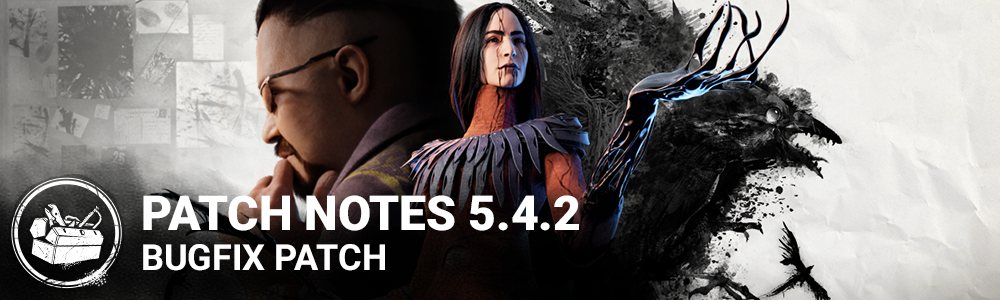

<!-- summary -->
## AI TL;DR

The Artist’s performance was optimized when using all Dire Crows, and the patch addressed a wide range of bugs: resolution slider issues, UI localization and menu overlap, broken Lament Configuration audio/visuals, collision problems on Suffocation Pit stairs and Eyrie of Crows trees, generator kick limitations on Grim Pantry, incorrect crow swarm spread with Severed Hands, Prowler achievement tracking, Thrill of the Hunt token reset, Corrective Action token consumption, invisible Cenobite Mori for female survivors, Nemesis double-triggered footsteps, missing Spirit chase music, Snowmen interaction stutter in the Bone Chill event, generator light and spark visual glitches, and an Irridescent Flesh add-on token bug for the Cannibal.
<!-- /summary -->

<!-- nav -->
&larr; [5.4.1 | Bugfix Patch](307-5-4-1-bugfix-patch.md) · [Live](../../index.md#live) · [5.5.0 | Mid-Chapter](311-5-5-0-mid-chapter.md) &rarr;
<!-- /nav -->

# 5.4.2 | Bugfix Patch

## Optimization

- Improved performance when The Artist uses all of the Dire Crows at once

## Bug Fixes

- Fixed an issue with the Resolution percent slider not changing the resolution on Low/Medium quality.
- Fixed a string not localized in the Character Info screen.
- Fixed an issue in the Settings screen where the language selection menu could overlap with Tabs.
- Fixed an issue that caused the Lament Configuration SFX and VFX to stop playing when the Cenobite interrupts or down a survivor holding the box.
- Fixed an issue that caused a one way collision at the top of the basement stairs in the main building of the Suffocation Pit.
- Fixed an issue that caused Killers to get stuck in a tree by falling onto it from a climbable rock in Eyrie of Crows.
- Fixed an issue that caused Killers not being able to kick a side of a generator next to a rock on Grim Pantry.
- Fixed an issue that caused crow swarms to spread to some Survivors incorrectly when The Artist used the Severed Hands add-on.
- Fixed an issue that caused the Prowler achievement to only track progress when playing The Artist.
- Fixed an issue that caused the Thrill of the Hunt not to regain a token when a cleansed Hex: Pentimento totem is rekindled.
- Fixed an issue that caused the Corrective Action perk to consume tokens when assisting survivors succeed skill checks.
- Fixed an issue that caused the Cenobite Mori to loop invisibly for female survivors.
- Fixed an issue that caused the Nemesis' footsteps to double-trigger while Tentacle Strike Charge.
- Fixed an issue that prevented the Spirit's new chase music from playing for Killers.
- Fixed an issue for Bone Chill event where Survivors could get stuck after interacting with specific Snowmen locations on the Raccoon City Police Station map.
- Fixed an issue that caused the remaining generators not to have the repaired lights and SFX after the generators required to power the exit gates have been repaired.
- Fixed an issue that may cause the Hex: Ruin regression sparks to appear when a generator is actively being repaired.
- Fixed an issue that may cause the Cannibal to gain tokens every time the chainsaw is revved when equipped with the Irridescent Flesh add-on.

<!-- nav -->
&larr; [5.4.1 | Bugfix Patch](307-5-4-1-bugfix-patch.md) · [Live](../../index.md#live) · [5.5.0 | Mid-Chapter](311-5-5-0-mid-chapter.md) &rarr;
<!-- /nav -->
