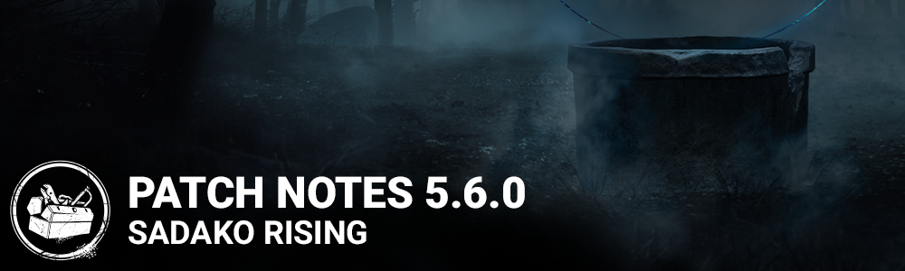

# 5.6.0 | Sadako Rising

## Features

- Added a new Killer - The Onryō
- Perks - Scourge Hook: Floods of Rage, Call of Brine, Merciless Storm
- Added a new Survivor - Yoichi Asakawa
- Perks - Parental Guidance, Empathic Connection, Boon: Dark Theory
- The Nurse is back in rotation after a bug fix
- Forum and support links now redirect based on your selected language when applicable.
- Added new custom SFX Intros to all Maps.
- Added an option to lock viewport aspect ratio to 16:9.
- Added subtitles in the Lobby.
- Improved detection of modified or corrupted game files.
- Daily Rituals will be reset the first time a player starts the game

*Dev Note: The tracking system for Daily Rituals has been reworked, which requires all rituals to be reset with this patch*

## Bug Fixes

- Fixed an issue that may cause valid skill checks to be rejected under high network latency.
- Fixed an issue that caused the Nurse to be stuck and unable to move after a grab attempt after blinking is invalidated.
- Fixed an issue that caused the AI controlled Meg to fail to drop the pallet in the killer and survivor tutorials, making it impossible to complete them.
- Fixed an issue that caused survivors' positions not to be revealed if they are crouching when the Cenobite picks up the lament configuration.
- Fixed an issue that caused the camera to follow the survivor after a hit is invalidated because of a survivor using Dead Hard.
- Fixed an issue that may cause a desync to appear in the HUD if a survivor is picked up at the same moment as they bleed out.
- Fixed an issue in the Loadout panel that when hovering over an add-on from a past event, the message "No longer available" was showing if the associated item was equipped.
- Fixed an issue with killer loading tips not displaying randomly after playing a few matches.
- Fixed an issue that may cause the Cenobite to remain stuck when interrupting a survivor at the same time as they get hit by a chain.
- Fixed an issue that caused the Spirit's Husk not to be destroyed when stunned by the Head On perk.
- Fixed an issue that caused survivors to be able to destroy Victor while inside a locker.
- Fixed an issue that may cause the Nemesis' zombies to be attracted to survivor in the dying state.
- Fixed an issue that caused the Distortion perk to consume tokens when standing inside Boon: Shadow Step's area.
- Fixed an issue that caused completed generators to be blocked by the Dead Man's Switch perk.
- Fixed an issue that caused the Broken status icon not to appear when under the effect of the Renewal perk.
- Fixed an issue that caused the Haste status icon not to appear when under the effect of the Guardian perk.
- Fixed an issue that allowed users to unlink unbreakable outfits in the store.
- Fixed an issue that caused Dwight's and the Trapper's loadout to be reset after playing a tutorial bot match.
- Fixed an issue that caused some of the Trickster's subtitles to disappear too early.
- Fixed an issue where pressing Alt+Tab in the keybinding menu would cause any further key remapping to not work properly. (Stadia only)
- Fixed an issue that sometimes caused a wrong cosmetic to be displayed after switching a killer's outfit in the store.
- Fixed an issue that caused survivors to keep breathing loudly when stopping to open a chest after running.
- Fixed an issue that caused the Chase Music for the Trapper to occasionally cut out during gameplay.
- Fixed an issue that allowed players to play the game with Stretched Resolution to gain an unfair advantage.
- Tentatively fixed an issue that causes players to disconnect during Steam maintenance.
- Fixed an issue where the teachable Perks from Stranger Things characters displayed in the Store Character info page could be the one from the previous character selected.
- Fixed an issue in Custom Game spectate mode where a "None" prompt could appear under the Item of the spectated Survivor.
- Fixed an issue with Player names using Asian characters were no longer displayed correctly in-game.
- Fixed an issue that caused the Built to Last perk to continue to recharge items when a survivor is grabbed from the locker by the killer.
- Fixed an issue that allowed survivors to interaction with totems while inside lockers.
- Fixed an issue that caused the Overcome perk to trigger when the survivor has the Endurance status.
- Fixed an issue that caused generator auras to appear incorrectly when using the Hex: Ruin and Surveillance perks together.
- Fixed an issue that caused the Oppression skill check to remove progression.
- Fixed an issue that may cause the audio to be delayed on the opening trailer video. (Xbox One/XSX/Stadia only)
- Fixed an issue that caused certain purchased DLC-related cosmetics to not be unlocked. (EGS only)
- Fixed an issue that may cause a grade progress error message to appear at the end of a match.
- Tentatively fixed an issue that may cause survivors to receive a disconnection penalty when the killer disconnects from the match.
- Fixed an issue that caused the interaction icon not to switch to the hand icon after an item is depleted during an interaction.
- Fixed an issue that caused the arrow icon to disappear when consuming an item during an interaction when still affected by a positive speed effect.
- Fixed an issue that may cause friend list statuses to not update properly.
- Fixed a minor misalignment of the Main Menu.
- Fixed an issue that could cause the Custom Game button on the Main Menu to flicker when hovered.
- Fixed a number of Loading Screen tips that had incorrect icons.
- Fixed an issue that caused the wiggle skill check sfx to trigger too soon after being pulled from a locker
- Fixed an issue that prevented spawning sfx from triggering when a survivor loads into a lobby
- Fixed an issue that caused the Undetectable VFX to move ahead when blinking as as the Nurse
- Fixed an issue that caused the Plague's infection to remain when the pallet is dropped by an infected survivor.
- Fixed an issue that caused the VFX to be visible in the Blight's POV with his "Ferryman of the Underworld" outfit.
- Fixed an issue that caused the blood droplet to remain in the air when a survivor is removed from the Cage of Atonement
- Fixed an issue that caused the Artist's Crow head to vanish during the spawning idle animation.
- Fixed an issue that caused the ink vfx to remain in the air when a hook in the Eyrie of Crows's map is sabotaged
- Fixed an issue that caused hooked vfx to persist after being unhooked

### Fixes from PTB

- Fixed an issue that caused the Brand New Part add-on to trigger the Merciless Storm skill checks.
- Fixed an issue that caused the first skill check of any kind to be red after failing a skill check from Merciless Storm.
- Fixed an issue that cause the external perk icon for the Empathic Connection perk to be missing.
- Fixed an issue that made it possible to bypass the constrained aspect ratio black bars
- Fixed an issue that caused the HUD not to be constrained at the start of trials.
- Fixed an issue with the HUD position when the game was in portrait mode and the 16:9 Aspect Ratio option was set to ON.
- Fixed an issue that caused the Blood Pact perk to reveal the auras of all survivors.
- Fixed an issue that caused missing and incorrect survivor voices on Legendary cosmetics.
- Adjusted the intensity of all Onryō's weapons, the Condemned's VFX, the mini-mori's transition and the glitch effect inside the Lobby.
- Fixed an issue that caused the glitch effect to stay in all menus.
- Fixed an issue that caused the Onryō's weapon to not appear correctly inside the lobby.
- Fixed an issue that may cause a rituals sync error to occur at the end of a match.
- Fixed an issue that caused bonus bloodpoints to not be granted at the end of a match.
- Fixed an issue that caused daily rituals progress to be saved for games where the user disconnected.
- Fixed an issue that caused FPS drops when survivors were inflicted with full Condemned stacks.
- Fixed an issue that caused bloodpoints to be granted for the last remaining survivor even if they disconnected.
- Fixed an issue that caused Iridescent Videotape to turn on televisions which were closed by survivors inserting a tape.
- Fixed an issue that caused the Videotape Copy add-on not to give bonus bloodpoints when performing an Apparition or Transposition.
- Fixed an issue that caused The Onryō to move around the Main Menu level if rotated while doing her jump scare animation.
- Fixed an issue that caused the Other World effects to be removed if cancelling The Onryō's Manifest just before it completes.
- Fixed an issue that caused survivors in lockers to clip with weapon ammo assets when grabbed by The Onryō.
- Fixed an issue that caused The Onryō to be able to attack immediately after demanifesting when lagging.
- Fixed an issue that caused the Survivor death animation to play a second time at the end of The Onryō's Mori or Mini Mori.
- Fixed an issue that caused The Onryō not to receive a Psychic Torsion score event when performing a Condemn Mini Mori.
- Fixed an issue that caused The Onryō's red stain to be out of sync with her visibility after entering the physical world.
- Fixed an issue that caused The Onryō to enter an invalid state when teleporting after manifesting under conditions of network lag.
- Fixed an issue that caused the black smoke to be missing when The Onryō is Undetectable.
- Fixed an issue that caused The Onryō to have a collision while not being Manifested.
- Fixed an issue that caused survivors to sometimes be unable to interact with televisions previously teleported to by The Onryō.
- Fixed an issue that caused The Onryō to appear standing up for a frame before crawling out of a television.
- Fixed an issue that caused the Well Stone add-on not to reduce the time for a turned-off television to turn back on.
- Fixed an issue that caused The Onryō's Water Well Add-on to remain inactive after some interactions.

## Changes from PTB

- The Onryō
- Decreased Manifest charge time to 1.5 seconds (was 2.5 seconds)
- Decreased Demanifest charge time to 1.5 seconds (was 2.5 seconds)
- Decreased maximum visibility range to 24 meters (was 32 meters)
- Decreased Terror Radius to 24 meters (was 32 meters)
- Decreased passive Comdemned fill time per segment when holding the Videotape to 25 seconds (was 30 seconds)
- Decreased the amount of Condemned segments removed when inserting the tape to 3 (was 4)
- Add-on - Yoichi's Fishing Net - Decreased time modifier to 12% (was 20%)
- Smoothed the movement transition when Manifesting
- Changed some of The Onryō's VFX to help with photo sensitivity concerns
- Reduced the intensity of The Onryō’s attack VFX
- Reduced the intensity of the Condemned VFX
- Reduced the intensity of screen effects in the lobby
- Improvements to The Onryō’s mini-mori transition

*Dev Note: These changes are intended to make The Onryō more viable on open maps, and allow her to Manifest more frequently during chases. In addition, passive Condemned progression has been buffed (and removal nerfed) to make it more threatening overall.*

- Perk - Parental Guidance
- Duration decreased to 5/6/7 seconds (was 8/9/10 seconds)
- Perk - Corrective Action
- Updated description to clarify that the perk only effects normal skill checks

*Dev Note: Corrective Actions already had this behavior, it just wasn't clearly stated in the description on the PTB.*

## Known Issues

- Charms are misplaced when Survivors repair generators.
- The Haddonfield map and the Strode Realty Key offering remain disabled.
- In certain resolutions, objective, notification and other indicators can appear outside of the in-game viewport.
- On PS4, in the Killer tutorial, there is a ~1m delay before Meg dies on the hook.
- It is possible for the Onryo's model to bend towards the ground.
- Two Generators can't be damaged by the Killer from one side in Backwater Swamp.
- Missing UI and Survivor model when coming back to Lobby from the Archives. Re-entering the lobby (going to the Store and back, Main Menu and back, etc.) should correct the issue.
- Wake Up perk has been disabled due to a bug.
