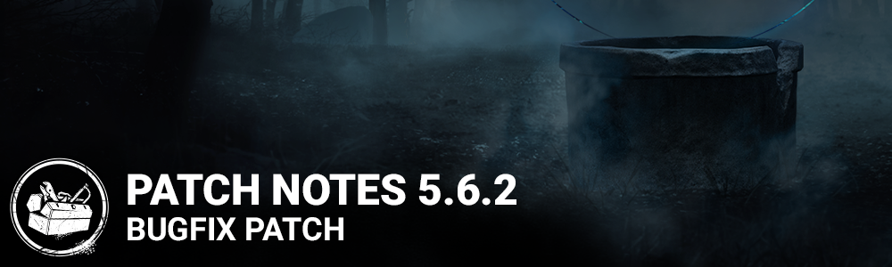

# 5.6.2 | Bugfix Patch

## Bug Fixes

- Fixed an issue that caused the Bloodletting, Vector Victory and Pulcinella cosmetics to be unlocked for free. (Epic Games Store only)
- Fixed an issue which sometimes allowed purchasing of the same perk multiple times in the Shrine of Secrets.
- Fixed an issue which prevented unlocking of Sadako Rising DLC achievements. (PS4 only)
- Fixed a crash which could occur when equipping the Boon: Dark Theory perk. (Switch only)
- Fixed an issue which prevented purchasing of discounted outfits using Shards.
- Fixed an issue that caused killer being able to block the ''Unhook'' prompt with one of the hook in MacMillan Estate maps.
- Fixed an issue that preventing The Onryo sfx from playing when opening an empty locker.
- Fixed an issue that sometimes prevented The Hillbilly's chainsaw SFX from playing during a sprint.
- Fixed a crash that would sometimes occur when entering the perimeter of Yoichi Asakawa's Boon: Dark Theory.
- Fixed an issue that prevented progress in the Triage achievement if the healed Survivor was unhooked.
- Fixed an issue that prevented The Onryo's Condemned kills from counting towards the Tome 10 Execution challenge.
- Fixed an issue that caused an incorrect camera orientation while projecting as The Onryo to a nearby near TV.
- Fixed an issue that prevented a Survivor using perk Head On from killing The Nemesis' zombies when dashing out of a locker.
- Fixed an issue that caused a generic icon to be shown when using a Killer power.
- Fixed an issue that caused The Nurse's blink charge animation to loop when charging her power.
- Fixed an issue that prevented progress of The Demogorgon's Daily Ritual.
- Fixed an issue that prevented The Nurse's blink charge time from being increased when using Kavanagh's Last Breath and Heavy Panting add-ons.
- Fixed an issue that caused Survivor to instantly wiggle free when being downed while the Killer was carrying another Survivor with 90% or more wiggle progress.
- Fixed an issue that caused the makeup to be missing from Elodie's 50's Night Out outfit icon.

## Known Issues

- Killer sound effects are missing when going from the Play as Killer menu to the Store. Swapping to a different Killer in the Store will fix the issue.
