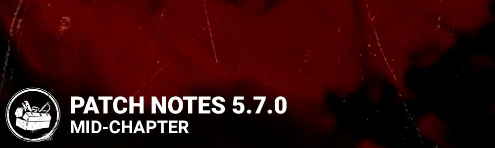

# 5.7.0 | Mid-Chapter

## Features

UI Update - Added an indicator to the Searching for Friends popup when loading data.

## Content

**Visual Update for Haddonfield Map.**

**General**

- Difficulty ratings for Survivors have been removed
- Difficulty ratings for Killers are now Easy, Moderate, Hard, or Very Hard
- Easy: These Killers are the easiest for a first-time player
- Moderate: Require the player to be comfortable with the basics of the role, though the Killers share common mechanics with those from the Easy category
- Hard: Use mechanics that are specific to the Killer and require more practice to be effective
- Very Hard: Require a high amount of practice and understanding, inexperienced players would likely find little success when using them
- Switch players should update to 14.1.0-1.0 firmware or newer to fix an issue with Auric Cell Purchases failing.

*Dev Note: Since all Survivors have the same mechanics, they are no longer separated into different difficulty tiers. Killer difficulty is based on overall mechanical and strategic complexity, specifically for newer players.*

**Hemorrhage Rework**

- New Effect: Survivors affected by the Hemorrhage Status Effect have their healing progression regress at a steady rate when not being healed
- Healing regresses at a rate of 7% per second (this means a 99% full heal would take 14 seconds to completely empty)
- Sloppy Butcher and The Nightmare's "Z" Block Add-on have been modified to take the new effect into account (changes listed below)

*Dev Note: Hemorrhage has had a reputation of being a "useless" status effect, so we reworked it to have a more meaningful impact on the core mechanic of survivor healing.*

**Perks**

- Boil Over
- Increases struggling effects by 60/70/80% (was 50/75/100%)

*Dev Note: Boil Over's wiggle impact was causing some players to have significant issues navigating certain maps, beyond the intended impact of the perk. We are planning to look at wiggle impact more generally in a future patch, but for now we are toning down the impact from Boil Over to prevent particularly egregious cases.*

- Boon: Circle of Healing
- Increases healing speed bonus by 40/45/50% (was 65/70/75%)

*Dev Note: As it was foretold, so it has been delivered.*

- Sloppy Butcher
- Modified to account for the Hemorrhage Rework
- Increases the rate at which healing progression is lost by 15/20/25%

*Dev Note: On the PTB, all mentions of Sloppy Butcher increasing bleed frequency were removed, but the mechanic remained! The strings have been updated to clarify that increase bleed frequency is still present on Sloppy Butcher, in addition to the new effect.*

**The Nightmare**

- Add-on - "Z" Block
- Modified to account for the Hemorrhage Rework
- Survivors interacting with a Dream Trap suffer from the Hemorrhage Status Effect for 90 seconds (was 60 seconds)

**The Legion**

- The Legion now has unique Terror Radius and Chase music, which can be modified by the Mix Tape add-ons
- New: Each successful hit with Feral Slash now increases The Legion's movement speed by +0.2m/s for the remainder of Feral Frenzy
- New: After 4 successful hits with Feral Slash, the next Feral Slash will put the survivor into the dying state and end Feral Frenzy
- Removed the loss of power gauge on successful basic attacks
- When Feral Frenzy ends, the power gauge now starts charging immediately (Previously waited for the fatigue sequence to end)
- Fatigue after Feral Frenzy lasts for 3 seconds (was 4 seconds)
- Add-on - Mischief List
- Increases the Duration of Feral Frenzy by 2 seconds (was 1 second)
- Add-on - Scratched Ruler
- Decreases Feral Frenzy recharge time by 5 seconds (was 2 seconds)
- Add-on - Suzie's Mix Tape
- Increases Killer Instinct detection range by 20 meters (was 16 meters)
- Add-on - Filthy Blade
- Increases time required for Survivors to mend by 4 seconds (was 2.5 seconds)
- Add-on - Iridescent Button
- Removed effect where Terror Radius extends to the entire map
- Reworked Add-on - Stab Wounds Study
- The auras of Survivors who self-mend a Deep Wound from Feral Frenzy are shown for 4 seconds afterwards
- Reworked Add-on - Friendship Bracelet
- Increases duration of lunges during Feral Frenzy by 0.3 seconds
- Reworked Add-on - Smiley Face Pin
- Survivors who self-mend a Deep Wound from Feral Frenzy are inflicted with Blindness for 60 seconds
- Reworked Add-on - Defaced Smiley Pin
- Survivors who self-mend a Deep Wound from Feral Frenzy are inflicted with Mangled
- Reworked Add-on - Etched Ruler
- Survivors hit by Feral Slash are inflicted with Oblivious for 60 seconds
- Reworked Add-on - Julie's Mix Tape
- If The Legion is stunned during Feral Frenzy, the power gauge refills once the duration of the stun ends
- Reworked Add-on - Mural Sketch
- Increases Speed Boost per hit during Feral Frenzy to 0.3m/s
- Reworked Add-on - Never-sleep Pills
- The Legion's base move speed during Feral Frenzy is 4.6/ms
- Increases the duration of Feral Frenzy by 10 seconds
- Gain 100 to 500 bonus Bloodpoints for each successive hit on a Survivor during Feral Frenzy
- Reworked Add-on - Joey's Mix Tape
- Survivors who self-mend a Deep Wound from Feral Frenzy are inflicted with Hemorrhage until fully healed
- Reworked Add-on - Stolen Sketchbook
- During Feral Frenzy from the second chained hit onward, hit Survivors drop their item
- Reworked Add-on - The Legion Pin
- Survivors who self-mend a Deep Wound from Feral Frenzy are inflicted with Broken for 60 seconds
- Reworked Add-on - Frank's Mix Tape
- While using Feral Frenzy: Damaging generators is 20% faster, breaking walls is 30% faster the power gauge pauses while performing these actions
- Reworked Add-on - Fuming Mix Tape
- While using Feral Frenzy: The repair progress of generators can be determined by the intensity of their auras, generators not being worked on regress
- Note: Regression effect *does* stack with Hex: Ruin or other regression effects
- New Add-on - Stylish Sunglasses
- Shows the auras of Survivors who are mending within a 24 meter radius
- New Add-on - BFFs
- Earn tokens for hitting Survivors during Feral Frenzy
- Second chained hit: 2 token
- Third chained hit: 3 tokens
- Fourth chained hit: 4 tokens
- Fifth chained hit: 5 tokens
- Once the gates are powered, if 15 or more tokens have been collected, gain a 4% movement speed boost when not using Feral Frenzy
- Removed Add-ons: Nasty Blade, Cold Dirt

*Dev Note: This update for Legion leans into their signature - Running really fast with a knife! The stacking movement speed from Feral Strike gives a better reward from each hit, and they now have a way to down survivors at the end of a great chain. Add-ons have also seen a major overhaul to provide more variety of playstyles.*

**The Ghost Face**

- The Ghost Face can no longer be revealed by Marked Survivors
- Marked now lasts for 60 seconds (was 45 seconds)
- The Ghost Face now has unique Terror Radius and Chase music
- Reviewed the technical implementation of the stalk and reveal mechanics
- Fixed an issue that could lead some player's reveal to be ignored completely when multiple survivors are revealing at the same time
- Reveal progress will now regress over a short time when a survivor loses sight of Ghost Face and resume when revealing starts again (Previously, losing sight of Ghost Face for a single frame would cause all reveal progress to be lost)
- Added in differentiation of the sighting zone (the zone in your screen where the target must be to be revealed or stalked) for killers and survivors to better account for the differences between 1st and 3rd person cameras
- Made it possible to reveal Ghost Face / stalk Survivors when they are not in the center of the screen but still take up a large amount of the screen (eg when they are very close to you)
- Fixed some issues which caused the stalk / reveal sighting zone to scale incorrectly on non-16:9 resolutions
- Add-on - Cheap Cologne
- Increases Marked duration by 10 seconds (was 5 seconds)
- Add-on - Headline Cutouts
- Increases movement speed while stalking by 40% (was 10%)
- Add-on - Walleye's Matchbook
- Decreases Night Shroud recovery time by 6 seconds (was 2 seconds)
- Add-on - Marked Map
- Increases duration of Killer Instinct after being revealed by 2 seconds (was 1 second)
- Add-on - Leather Knife Sheath
- Increases crouched movement speed by 10% (was 5.6%)
- Add-on - Outdoor Security Camera
- The auras of all Survivors are revealed for 7 seconds when a Marked Survivor is put into the dying state (was 4 seconds)
- Now applies to all survivors (was limited to Survivors inside the Terror Radius)
- Reworked Add-on - "Philly"
- Decreases time required to Mark a Survivor by 20%
- Reworked Add-on - Cinch Straps
- Night Shroud remains active after a failed basic attack
- Reworked Add-on - Olsen's Address Book
- Survivors that are Marked reveal their auras for 5 seconds when performing rushed actions
- Reworked Add-on - Olsen's Journal
- A Survivor that is Marked is inflicted with Oblivious until the Mark expires
- Reworked Add-on - Telephoto Lens
- A Survivor that reveals The Ghost Face is inflicted with Oblivious for 60 seconds
- Reworked Add-on - Chewed Pen
- Survivors that are in the dying state take 3 seconds to reveal The Ghost Face
- Reworked Add-on - Knife Belt Clip
- Reduces the Terror Radius by 8 meters when crouching
- Reworked Add-on - Lasting Perfume
- Survivors that are on a hook take 3 seconds to reveal The Ghost Face
- Reworked Add-on - Olsen's Wallet
- Breaking a pallet or wall immediately recharges Night Shroud
- Reworked Add-on - Drop-Leg Knife Sheath
- The Ghost Face gains 10% movement speed for 5 seconds after Marking a Survivor
- Reworked Add-on - Night Vision Monocular
- A Survivor that reveals The Ghost Face is inflicted with Exhausted for 5 seconds
- Reworked Add-on - Victim's Detailed Routine
- After being Marked, Survivors are inflicted with Exhausted for 5 seconds
- Reworked Add-on - "Ghost Face caught on Tape"
- Instantly recharges Night Shroud after a successful basic attack puts a Survivor into the dying state

*Dev Note: Ghost Face was having a tough time generally, and his add-ons were particularly uninteresting overall. This change boosts the effectiveness of the Marked effect, and also overhauls his Add-on loadout for more interesting and powerful combinations. The reveal and stalking mechanics have also been tuned to be more predictable and intuitive.*

**Changes from PTB**

- The Nightmare's "Z" Block Add-on has had the bleed frequency modifier returned
- Hemorrhage no longer reduces healing progress when downed
- The Shape's stalk and The Ghost Face's stalk / reveal mechanics have had their values tuned to account for the technical rework to stalking / revealing
- **The Legion**
- Removed the loss of power gauge on successful basic attacks
- The following Add-ons have been adjusted from the PTB: Frank's Mixtape, Julie's Mixtape, Stolen Sketchbook, Stab Wounds Study, BFFs, and Etched Ruler

**The Archives**

- "Tome 11: DEVOTION" of The Archives (starts April 28th 11AM ET)
- The "Blood Debt" challenge in Tome 8: DELIVERANCE - Level 4 has had its completion goal reduced from 10 to 5.
- Changed instances of Roman numerals in Tome names to Arabic numerals in all related contexts
- Reworked the description texts of Glyph Challenges and Dual Role challenges to make them consistent and clearer

**Engine Update And Download Size**

- We continued to improve our patching process in an attempt to reduce download size during an update. However, due to an engine update, expect a bigger than usual download this time.

## Bug Fixes

- Fixed an issue that caused the shower drain leak VFX to float slightly above the floor in the Léry showers.
- Fixed an issue that caused floating debris from breakable walls to be visible when one side has a noticeable slope in elevation.
- Fixed an issue that caused Ace's Trilby hats to clip through his head on the killer side when in the dream world.
- Fixed an issue that caused the sleep VFX to flicker on Jake when wearing the Western Wrangler torso.
- Fixed an issue that caused the dream state outline to clip into Nea’s default torso in various animations.
- Fixed an issue that caused Yun-Jin's 'Lunar Hanbok' torso customization to flicker when in the dream world.
- Fixed an issue that caused the Dream world sky on Coldwind Farm to have unusual lines in the grainy texture.
- Fixed an issue that caused some visual corruption in the sky on Haddonfield when in the Dream World.
- Fixed an issue that caused the Onryo's legs to clip through the backside of the TV after projecting.
- Fixed an issue that sometimes caused subtitles for Ash to be displayed when selecting another survivor.
- Fixed an issue that sometimes caused the survivor settings from the 'Play as Survivor' lobby to be carried over to the custom game lobby.
- Fixed an issue that caused custom game lobby warning messages to not be displayed.
- Fixed a hardlock when minimizing the Game during a Loading screen after a match.
- Fixed an incorrect formatting on tutorial messages when the screen resolution is lower than 100%.
- Fixed an issue with a wrong UI prompt "Scroll List" appearing in the Support menu.
- Fixed an issue with the controller "Pause" button not able to close the Pause/Overlay Menu.
- Fixed an issue where the report button was not disabled for a Custom Game in the Tally screen.
- Fixed an issue in the Archives Compendium section where the tooltip was not showing if an active node has been completed.
- Fixed an issue that caused projectiles passing through Thompson's House windows when thrown from the inside of the building.
- Fixed an issue that caused survivors dying in the Executioner's Cage of Atonement to be considered killed instead of sacrificed, leading to various side effects.
- Fixed an issue that caused the Executioner's Torment VFX to remain visible after killing a survivor by Mori or Final Judgement.
- Fixed an issue that caused survivors to be stuck in T-pose when Adrenaline triggers while in a Cage of Atonement.
- Fixed an issue that caused survivors to be momentarily shown as crawling after being rescued from a Cage of Atonement.
- Fixed an issue that caused the Nightmare to be prevented from putting down another Dream Snare when standing on one.
- Fixed an issue that caused the Artists Crows to despawn immediately when spawned near the exit gates on the Léry's Memorial Institute - Treatment Theatre map.
- Fixed an issue that caused the Cenobite's chains to hit a collision over survivors in the dying state.
- Fixed an issue that may cause the Wraith to appear invisible to survivors while uncloaked.
- Fixed an issue that may cause the Wraith to be visible while cloaked after cancelling the damage generator interaction when equipped with the The Serpent - Soot add-on.
- Fixed an issue that caused the Cannibal's Shop Lubricant add-on not to hide the aura of survivors downed with the chainsaw.
- Fixed an issue that caused Victor to be missing from the match results screen.
- Fixed an issue that caused the Hag's traps not to be triggered for other survivors when a survivor in the dying state is on the trap.
- Fixed an issue that caused the Hag's Disfigured Ear add-on not to deafen the survivor.
- Fixed an issue that caused failing to unhook a survivor during the Struggle phase to reset their skill check progress.
- Fixed an issue that caused Dance with Me's cooldown not to be shown on the perk's icon.
- Fixed an issue that caused the Shape's standing mori to not be usable against survivors using the Clairvoyance interaction.
- Fixed an issue that caused the Clairvoyance's interaction not to end when put into the dying state.
- Fixed an issue that caused the Boil Over icon to be missing on the killer's side when carrying a survivor equipped with the perk.
- Fixed an issue that made it impossible to pick up survivors put in the dying state in front of a locker in the Killer basement.
- Fixed an issue that caused the screaming animation to be played twice when passing from the injured to the dying state while screaming.
- Fixed an issue that caused the Modern Tale theme to keep playing when equipping cosmetics not in the collection.
- Fixed an issue that caused the weapon of the Plague to become invisible in the middle of a basic attack swing.
- Fixed an issue that occasionally caused survivor deafness at the start of a trial
- Fixed an issue that sometimes prevented the Demogorgon scream from triggering after a missed pounced.
- Fixed an issue that caused survivors to hear Ghost Face's reveal sfx to play map-wide.
- Fixed an issue that caused visceral cankers to prevent sliding doors from opening.
- Fixed an issue that prevented the text "The Onryo" from being accepted in Crowd Choice.
- Fixed an issue that caused game to disconnect during Steam maintenance.
- Fixed an issue that caused survivor to go invisible when switching between lobby and store.
- Fixed an issue that prevented the purchasing of DLC characters and auric cells.
- Fixed an issue that caused mouse slow down after closing the game.
- Fixed an issue that gave incorrect disconnection penalty.
- Fixed an issue that caused friend list to not update properly.
- Fixed an issue that caused the Onryo's TV SFX to still be heard after a survivor retrieved a tape and closed the TV.
- Fixed an issue that caused the Garage Door to have to wrong SFX when hit by the killer in the Gas Heaven Map.
- Fixed an issue that caused David's breathing to be heard map wide.
- Fixed an issue that caused the ambiance music to stop in the Getting Started Menu when getting back from the Game's Manual's.
- Fixed an issue that caused the Ghost Face crouching SFX to still be heard when breaking a pallet or a breakable wall.
- Fixed an issue that caused the survivor to scream when healing to full while being afflicted with x duration Hemorrhage.
- Fixed an issue where the options in the setting menu disappear before the settings UI is fully closed after changing a setting.
- Fixed an issue where sometimes, the Bloodpoints score events disappear too fast in the Hud.
- Fixed an issue in the Tally screen where smashing buttons while also selecting the spectate option could bring you back to the Hud with a black screen.
- Fixed an issue that caused a misplaced collision on stair railing in the basement of the school.
- Fixed an issue where one generator in Pale Rose cannot be repaired from one side.
- Fixed an issue where the hooks on the second floor of the Library aren't spawning in RPD map.
- Fixed an issue where a Survivor can climb on a speaker and a table using the cleanse or bless totem action at the Press room in RPD map.
- Fixed an issue where a Survivor can't be picked up by the Killer between some assets on the first floor of Gideon Meat Plant.
- Fixed an issue that caused a gap that can be mistaken for a passable path behind the ramp of the Swamp maze.
- Fixed an issue that caused a fat shaming spot around the killer shack in Disturbed Ward.
- Fixed an issue where a Survivor can fall onto a rock near the big boat in Swamp Pale Rose when put into the dying state by the Killer.
- Fixed an issue that caused darker Dreamworld for the Survivor POV when entering a basement area.
- Fixed an issue that caused low FPS on the main menu. (Switch only)
- Fixed a visual glitch which could occur when toggling between the Killer lobby and main menu.
- Fixed an issue that caused an infinite loading screen after using 'Instant on' or 'Instant sign in' mode while in a match. (Xbox One only)
- Fixed an issue that caused Hex: Ruin to not regress generators after Hex: Undying is destroyed.
- Fixed an issue that may cause the Nurse to instantly fully blink a second time when playing with high latency.
- Fixed an issue that caused all survivors to lose laceration when the Trickster attacks someone.
- Fixed an issue that caused the cooldown of the Cannibal's successful chainsaw attack to be 3 seconds instead of 2.
- Fixed an issue that may cause the survivor to become invisible during the Cenobite's mori.
- Fixed an issue that caused reversed skill checks not to be hit reliably on Stadia.
- Fixed an issue that caused the hand icon next to the interaction bar when Victor uses his power.
- Fixed an issue that caused dark lighting inside the houses in Haddonfield map.
- Fixed an issue that caused confusion on vaultable windows on the second floors in Haddonfield map.

**Fixes from PTB**

- Adjusted the Ghost Face's chase music.
- Fixed an issue where sometimes survivor playerTags were not visible when entering a lobby.
- Fixed an issue that caused the Legion to gain stacks to Feral Slash when hitting a hooked survivor.
- Fixed an issue that caused The Mixtape Legions chase music to continue being applied in subsequent matches after using the mixtape.
- Fixed an issue that caused the Legion's Fuming Mix Tape generator regression not to apply to generators not being repaired when starting Frenzy.
- Fixed an issue that caused the kick sound effect on Generator or Breakable Wall to be missing when using the new animations with Julie's and Frank's mix tape add-ons equipped.
- Fixed an issue that caused the Legion's attack animation to be lengthened instead of the lunge when equipped with the Friendship Bracelet add-on.
- Fixed an issue that caused the Shape to continue stalking at Tier 3.
- Fixed an issue that caused healing progression to regress during the failed skill check penalty when affected by the Hemorrhage status effect.
- Fixed an issue that caused the Hemorrhage effect applied by the Sloppy Butcher perk to regress healing at a lower rate than intended.
- Fixed an issue that caused the progress bar animation to be missing when affected by the Hemorrhage perk and depleting a medkit while healing self.

## Known Issues

- The Hex: Ruin effect is cancelled when a survivor stops repairing a generator during Feral Frenzy when equipped with the Fuming Mix Tape add-on.
- When dismissing a daily ritual, an incorrect amount of reward might be displayed. This is purely visual, and does not affect the actual amount of reward you will receive. Reopening the daily ritual window should correct this.
- In Haddonfield map, downing a Survivor next to a fence prevents the Killer from picking up the Survivor.
- There's a specific Green glyph that cannot be interacted with in the Wreckers Yard.
- It is impossible to grab a Survivor from a specific side of multiple generators in Haddonfield map.
- Meg is sometimes unable to Vault in the Killer Tutorial.
- There is a one sided collision preventing smooth passage in the Eyrie of the crows map.
- The Credits appear as a placeholder text string in all non-English languages on PS5, Switch and Stadia platforms.
