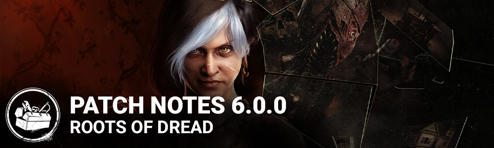

# 6.0.0 | Roots of Dread

## Features

- New Killer - The Dredge
  - New Perk: Dissolution
    - 3 seconds after injuring a Survivor by any means, Dissolution activates for 12/16/20 second(s). While Dissolution is active, if a Survivor fast vaults over a pallet inside of your Terror Radius, the Entity will break the pallet at the end of the vault, and Dissolution deactivates.
  - New Perk: Darkness Revealed
    - When you open a locker, the auras of all Survivors within 8 meters of any lockers are revealed to you for 3/4/5 seconds. This perk has a 30 second cooldown.
  - New Perk: Septic Touch
    - Whenever a Survivor performs the healing action within your Terror Radius, they suffer from Blindness and Exhaustion. These effects linger for 6/8/10 seconds after a healing action is interrupted by any means.
- New Survivor - Haddie Kaur
  - New Perk: Inner Focus
    - You can see other Survivors' Scratch Marks within a 32 meters range of you. Whenever another Survivor loses a health state within a 32 meters range of you, the Killer's aura is revealed to you for 3/4/5 seconds.
  - New Perk: Residual Manifest
    - After a successful Killer Blind action, the Killer is affected by the Blindness status effect for 20/25/30 seconds. This perk grants the ability to rummage through an opened chest once per Trial and will guarantee a basic Flashlight.
  - New Perk: Overzealous
    - After cleansing any totem, this perk activates. Your generator repair speed is increased by 4%/5%/6%. This Perk deactivates when you lose a health state by any means.

- New General Killer Perk - Shattered Hope
  - When you destroy a Boon Totem this way, the auras of all Survivors inside the Boon Totem range are revealed to you for 6/7/8 seconds.
  - UI
    - Layout change to the Main Menu - Allows more room to gaze longingly into the campfire.
    - Menu movement when using a Controller has been removed across all screens.
  - Presets - For Loadouts & Customizations
    - The ability to save your favorite Loadout builds and Customizations has been added to the Loadout and Customizations menus respectively.
  - The Ghost Face
    - Reworked Add-on - Driver's License
      - When Marking a Survivor repairing a generator, the generator explodes and loses 20% progress. The affected generator becomes blocked for 15 seconds. When Marking multiple Survivors at the same time, the loss of progress only applies once.
  - The Pig
    - Added an extra Jigsaw Box to all matches
    - Survivors are guaranteed to find the key for their Reverse Beartrap at a maximum of 4 boxes searched (It can still be found sooner, but you will never need to search more than 4 boxes)
    - The box system has been adjusted to be more consistent overall and have a slightly higher average number of searches needed, from 2.5 to 3 (Yes, this is a buff)

  *Dev Note: Some Pig players have been camping out in front of the final Jigsaw Box, blocking a survivor from being able to get rid of their Reverse Beartrap. With these changes, this strategy will no longer work! We also tweaked the way box searches are determined to prevent extreme cases of very few searches / too many searches, as well as a small buff to the average number of searches required to escape the Reverse Beartrap. Overall, this should make the boxes more consistent and slightly more powerful for The Pig.*
  - Miscellaneous
    - Changed the text for Entity Displeased on the tally screen. It now reads "The Entity Hungers..."
    - Added a warning message in the Custom Games Lobby to indicate that matches do not count toward Achievements.
    - Updated desktop icon.

  ## Content
  - "Twisted Masquerade" 6th Anniversary limited-time event (starting June 16th 11AM ET)
  - Archives
    - Twisted Masquerade event tome (also starting June 16th 11AM ET)
    - Fixed the localization of the Green Glyph challenge description text to better clarify the spawn rules and aura reveal information.
    - Added a timer to the Main Menu indicating time remaining until the Rift closes.
  - New Map: Garden of Joy

  

  ## Bug Fixes
  - Tentatively fixed an issue that could cause the Onryo's power to sometimes not load properly at the start of a match.
  - Tentatively fixed an issue that could cause the Oni to have the Demon Dash prompt when Blood Fury was inactive.
  - Tentatively fixed an issue that could cause the Deathslinger to be unable to aim down sights or reload.
  - Tentatively fixed an issue that could cause the screen to stay black after the Cenobite uses Summons of Pain.
  - Tentatively fixed an issue that could cause Survivors' items to not function properly when loading into a match.
  - Fixed an issue that may cause the hook indicator not to update upon entering the struggle phase.
  - Fixed an issue that caused the Hillbilly to be able to use his momentum to reach inaccessible areas.
  - Fixed an issue that may cause killers not to be able to use their power for the duration of the trial.
  - Fixed an issue that caused survivors to be misaligned when hooked after being picked up from a locker in the basement.
  - Fixed an issue that caused the killer's camera to become stuck after interrupting a survivor closing a white glyph.
  - Fixed an issue where the Legion Chase music (and the addons mixtapes) was too loud.
  - Fixed an issue where multiple assets in the Léry's Memorial Institute maps have the wrong impact sfx.
  - Fixed an issue that caused an inaccessible green glyph in a locker in the Midwich Elementary map.
  - Fixed an issue that occasionally caused the daily rituals to show an incorrect amount of bloodpoints temporarily.
  - Fixed the disabled states in the Tutorials menu so that it's easier to understand when they are locked / disabled.
  - Fixed a misaligned button in the Redeem Promo Code popup.
  - Fixed an issue that caused Nemesis zombies to become stuck when climbing basement stairs.
  - Fixed an issue which caused blocked generators to lose progression when the Eruption perk is triggered.
  - Fixed an issue that caused the perk Kindred to remain active when the Survivor using it disconnected.
  - Fixed an issue that caused a bush to disappear from distance in the Eyrie of Crow.
  - Fixed an issue that could cause a totem to be unreachable at the top of the stairs in Midwich Elementary School
  - Fixed an issue that caused survivors working on the side of the generator with the light pole not to be targeted by the Cenobite's Chain Hunt.
  - Fixed an issue that may prevent the killer from picking up survivors downed next to a fence in the Haddonfield map.
  - Fixed an issue that caused survivors unable to wake up using a clock on the second floor of the house in Haddonfield map.
  - Fixed an issue that occasionally caused some players to appear disconnected even when they have not disconnected.
  - Fixed an issue that caused lag while the game was saving for some players.
  - Fixed an issue that caused bonus bloodpoints from Barbecue & Chilli to not appear in the tally match total.
  - Tentatively fixed an issue that caused EAC error 10022 when launching the game.
  - Fixed an issue that caused Dwight's Bloodletting T-Shirt to not be added to the Steam inventory when redeemed. (Steam only)
  - Fixed an issue that prevented some users from unlinking their Steam or EGS accounts. (Steam/EGS only)
  - Fixed an issue caused custom games to start failing after several consecutive matches in the same lobby.
  - Fixed an issue where the game partially softlocks when attempting to spectate at the same time as the last survivor reaches the tally screen.
  - Fixed an issue that caused The Pig's add-on Amanda's Letter not to show survivor auras.
  - Fixed an issue that caused the Botanist Extraordinaire archive challenge to not be completable in some cases.
  - Fixed an issue that caused the White Glyph challenge to get completed without having performed the required actions.
  - Fixed an issue that caused survivors to be seen passing through the ground when being moried by The Cenobite.
  - Fixed an issue that caused The Spirit to be unable to use her power more than once in a Trial.
  - Fixed an issue that caused the Blinding Legion mid lunge attack to not reset the Feral Frenzy combo.
  - Fixed an issue that caused the perk No One Left Behind to not add bonus Bloodpoints.
  - Fixed an issue that caused Onryo exiting a television via teleport to be easily blinded by a flashlight.
  - Fixed an issue that caused the killer perk Save The Best For Last to have no effect on a successful basic attack cooldown.
  - Fixed an issue that caused The Deathslinger to be able to avoid a chain breaking fatigue animation by pressing M2 at the end of the Chain Reel.
  - Fixed an issue that caused The Artist to be unable to attack if a Survivor runs into Dire Crow when it is launched.
  - Fixed an issue that caused the Deathslinger's harpoon to bounce off survivors who are fast vaulting a pallet.
  - Fixed an issue that caused Pallet Stuns to move a killer if they are on the same side of the pallet as the survivor.

  

  ## Fixes from PTB
  - Fixed an issue that caused the jumpscare stinger to not play if the Dredge exits a locker too quickly.
  - Fixed an issue that caused the survivors to not scream at the end of The Dredge's Mori Animation.
  - Fixed an issue that caused some missing SFX when walking through the Purple Hydrangea Bush by any character in the Garden of Joy map.
  - Fixed an issue that caused some Dredge actions to lower the volume of some gameplay object like the generator.
  - Fixed an issue that caused the voices starvations in Midwich Highschool to cut in and out for a couple seconds.
  - Fixed an issue that caused a generator not being able to be repaired from the short side when spawned on the hill in Sanctum of Wrath.
  - Fixed an issue that caused the bottom of some windows missing from the Grim Pantry's main building.
  - Fixed an issue that caused an invisible collision allowing characters to walk over a hole in Gideon Map.
  - Fixed an issue in the Loadout Panel where the Charm Zoom button can lose functionality when swapping Loadout Presets.
  - Fixed an issue that caused the game to crash when swapping to the Spectator role.
  - Fixed an issue that sometimes caused a crash when The Dredge exits a locker carrying a survivor.
  - Fixed an issue that caused The Pig's Workshop Grease add-on to have no effect on the Ambush charge speed.
  - Fixed an issue that caused The Survivor's Jigsaw Box search speed to be unaffected by the Pig's Bag of Gears and Crate of Gears add-ons.
  - Fixed an issue that caused The Pig's Ambush attack charge time to be unaffected by the Last Will uncommon Add-on.
  - Fixed an issue that caused a survivor's body to remain visible after after being moried by the Dredge.
  - Fixed an issue that caused The Dredge to sometimes become unable to exit a locker if teleporting at the same time as a Survivor exits.
  - Fixed an issue that caused The Dredge can be blinded during the first part of locker search.
  - Fixed an issue that caused The Dredge's Nightfall Meter to stop charging once a survivor is downed.
  - Fixed an issue that caused The Dredge's locker teleport to individually select lockers within a cluster.
  - Fixed multiple issues with how The Dredge's Septic Touch perk applies Blindness and Exhaustion status effects.
  - Fixed an issue that caused The Dredge's Darkness Revealed perk to incorrectly show the auras of hooked survivors.
  - Fixed an issue that caused the Spine Chill perk to activate incorrectly when The Dredge is in a locker.
  - Fixed an issue that caused a spurious skill check when a survivor is abducted in a locker by The Dredge.
  - Fixed an issue that caused The Dredge's Destroyed Pillow add-on to decrease the teleport cooldown during the daytime instead of Nightfall.
  - Fixed an issue that caused some lockers to be missing their aura when using The Dredge's teleport power.
  - Fixed an issue that caused VFX to be sometimes be incorrectly visible when charging The Dredge's teleport power.
  - Fixed an issue that caused VFX to be incorrectly visible when spectating The Dredge during a teleport.
  - Fixed an issue that caused The Dredge's add-on Haddie's Calendar not to decrease the time to exit a locked locker.
  - Fixed an issue that caused chest auras to be white instead of pink.
  - Fixed an issue that caused spectators not to move along with The Dredge during a locker teleport.
  - Fixed an issue that caused the Decisive Strike perk to not activate when The Dredge abducts a survivor from a locker.
  - Fixed an issue that caused The Dredge's add-on Caffeine Tablets to not show a yellow aura on lockers while charging a teleport.
  - Fixed an issue that caused The Dredge's arms to behave incorrectly during a mori.
  - Fixed an issue that caused The Dredge's hand to be momentarily visible when switching cameras upon entering a locker.
  - Fixed an issue that caused locker locks to be sometimes difficult for The Dredge to break.
  - Fixed an issue that caused the Nightfall effects to be missing when a survivor is moried during Nightfall.
  - Fixed an issue that caused a survivor with Head On to be able to stun The Dredge when the latter is inside or entering a Locker.
  - Fixed an issue that caused the Dredge not to receive a score event for abducting a Survivor from a locker.
  - Fixed an issue that caused The Wraith to be unaffected by the Blast Mine perk when cloaked.
  - Fixed an issue that caused the Dredge to appear incorrectly when he teleport as Nightfall is trigger
  - Fixed an issue that caused the Dredge to see through blindness when charging his power
  - Fixed an issue that caused the Survivor's body to be visible when he get mori by the Dredge
  - Fixed an issue that caused the quantity number on Loadout Inventory buttons to overlap with the selected markers.
  - Fixed an issue that caused Archive Challenges with no progress to incorrectly use the "in progress" state.
  - Fixed an issue that caused the left side Lobby UI to be positioned lower than intended, causing overlapping UI elements on smaller resolutions.

  

  ## Known Issues
  - PS5 | Outrun the Overlap trophy description uses English text in certain languages.
  - The Dredge has no animation on the match result screen if they are in a locker when the match ends.
  - The Dredge's weapon is distorted during locker interrupts.
  - The Dredge's Very Rare Twisted Plaything outfit stretches during its apparition in menus (All platforms except Steam and Epic).
  - It is possible for Survivors to get stuck when searching a locker as the Dredge teleports to it with high packet loss.
  - The Trapper and the Wraith's weapons snap after they stop moving.
  - Killer Instinct and Loud Noise notification appear black and white during the Dredge's Nightfall.
  - The generator notification from the perk Tinkerer is slightly misaligned with the generator.
  - The Dredge smoke may not appear in certain situations.
  - The Dredge's body can be visible when teleporting to a locker with a survivor inside
  - Some players are experiencing rubber banding since 5.7.0 - this issue is being investigated
