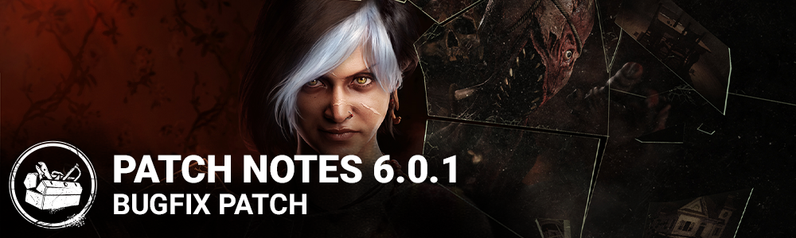

<!-- summary -->
## AI TL;DR

Twisted Masquerade’s 6th-Anniversary event has been pushed to start June 16 at 11:30 AM ET. The update focuses on a broad sweep of bug fixes - performance lag in the loadout menu and an occasional survivor crawl-speed boost were tentatively addressed, while crashes tied to The Dredge’s teleport and other killers were resolved. Almost every Dredge-related visual, sound and locker-interaction issue was corrected, including missing smoke, vignette desaturation, duplicate impact SFX, and animation glitches. Additional UI glitches, audio bugs, and map collision problems were also patched, with known rubber-banding and tutorial-match crashes still under investigation.
<!-- /summary -->

<!-- nav -->
&larr; [6.0.0 | Roots of Dread](334-6-0-0-roots-of-dread.md) · [Live](../../index.md#live) · [6.0.2 | Bugfix Patch](339-6-0-2-bugfix-patch.md) &rarr;
<!-- /nav -->

# 6.0.1 | Bugfix Patch

## Content

- "Twisted Masquerade" 6th Anniversary limited-time event start time has shifted (now starting June 16th 11:30AM ET)

## Bug Fixes

- Tentatively fixed an issue that caused lag while navigating the loadout menu.
- Tentatively fixed an issue that could cause Survivors crawl speed to be higher than normal.
- Fixed an issue that could occasionally cause the game to crash when teleporting as The Dredge.
- Fixed an issue that could occasionally cause the game to crash when playing against the Huntress or the Trickster.
- Fixed an issue that caused the Dredge's Very Rare Twisted Plaything outfit to stretch during its apparition in menus. (All platforms except Steam and Epic)
- Fixed an issue that allowed bloodpoint offerings to be displayed in custom game loadout presets.
- Fixed an issue that caused some tabs in the UI to display broken background images when the tab text was short.
- Fixed an issue that could cause the Game Manual list of entries to scroll too slowly on some platforms.
- Fixed an issue that sometimes caused the Cannibals Chainsaw to be silent for survivors.
- Fixed an issue that caused survivors to continue their injured grunt SFX when fully healed themselves using the Solidarity Perk.
- Fixed an issue that caused two impact SFXs to be heard when The Dredge is breaking a wall.
- Fixed an issue that caused an incorrect surface SFX to be played when a specific part of the Garden Of Joy hook is hit by a killer.
- Fixed an issue that caused the SFX and VFX Nightfall warning to be missing when the Killer injures a survivor right before the notification threshold.
- Fixed an issue that caused the Dredge's smoke to be missing.
- Fixed an issue that caused the Dredge to be visible when teleporting to a locker.
- Fixed an issue that caused the Entity Spikes on blocked lockers to sometimes disappear when looking at them from higher ground.
- Fixed an issue that caused Survivors to pop forward during the locker grab animation when the Dredge teleported to a locker with a Survivor inside.
- Fixed an issue that caused part of the Dredge to clip through the camera when exiting a locker immediately after teleporting to it.
- Fixed an issue that caused the Dredge's vignette during nightfall to desaturate the Killer instinct and Loud Noise notifications.
- Fixed an issue that caused the Dredge to be blinded by blinding items (firecrackers, flashbangs, flashlights) while teleporting to a locker.
- Fixed an issue that caused the undetectable smoke VFX to be visible for a few seconds when the Dredge exits a locker during the Nightfall.
- Fixed an issue that could cause the Blindness and Exhausted status effects from the Fearmonger perk to stay on Survivors after they stop repairing a generator.
- Fixed an issue that caused Survivors within 5 meters of a locker and in the dying state to trigger the Dredge's Lavalier Microphone add-on.
- Fixed an issue that caused Survivors to suffer from the Exposed status effect for the whole Nightfall duration if the last generator is repaired during the end of Nightfall with the Dredge's Iridescent Wood Plan and Field Recorder add-ons.
- Fixed an issue that caused the From The Deep achievement (trophy on Sony platforms) to gain progress when the Dredge is hiding in a locker and the Survivor interacts with it.
- Fixed an issue that caused the Dredge to have no animation on the match result screen when the match ends while it was in a locker.
- Fixed an issue that caused the aspect ratio black bars to disappear when the Dredge is in a locker.
- Fixed an issue that could cause Survivors to get stuck when searching a locker as the Dredge is teleporting to it with high packet loss.
- Fixed an issue that could cause Survivors to get in a broken state inside a locker if the Killer is stunned by another Survivor using the Head On perk when searching a locker.
- Fixed an issue that allowed characters to get on top of some crates and buckets by dropping down from the second floor of the main building in Coal Tower.
- Fixed an issue that caused an invisible collision blocking the hole in the second floor in Badham Preschool maps.
- Fixed an issue that caused the old Ghost Face's chase music to be played again.
- Fixed an issue that caused the Play With Your Food perk not to consume a token when injuring a Survivor using a Possessed Chain with the Cenobite's Engineer's Fang add-on.
- Fixed an issue that caused the Overlap trophy description not to be translated in certain languages. (PS5 only)

## Known Issues

- Some players are experiencing rubber banding since 5.7.0 - This issue is being investigated.
- Players on console might experience crashes when starting a tutorial bot match before fully download the game. To work around the issue, wait for the game to fully downloaded before starting the tutorial bot match.

<!-- nav -->
&larr; [6.0.0 | Roots of Dread](334-6-0-0-roots-of-dread.md) · [Live](../../index.md#live) · [6.0.2 | Bugfix Patch](339-6-0-2-bugfix-patch.md) &rarr;
<!-- /nav -->
