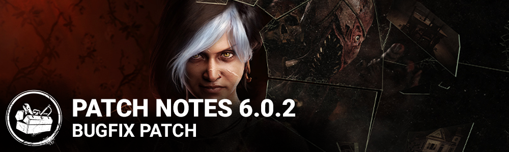

<!-- nav -->
&larr; [6.0.1 | Bugfix Patch](335-6-0-1-bugfix-patch.md) · [Live](../../index.md#live) · [6.1.0 | Mid-Chapter ](342-6-1-0-mid-chapter.md) &rarr;
<!-- /nav -->

# 6.0.2 | Bugfix Patch

**Features**

- The Dredge
  - Decreased the maximum range that The Dredge is visible during Nightfall to 20 meters (was 24 meters)
  - Increased the maximum range at which Survivors can see each other during Nightfall to 54 meters (was 24 meters)

**Bug Fixes**

- Fixed an issue that caused the game to crash when starting a tutorial bot match without having the game fully downloaded. (Consoles only)
- Fixed an issue that caused the DBD image on the intro screen to be off center and missing the Dead by Daylight logo on PS4. (PS4 only)
- Fixed an issue that caused the Pig's Ambush Dash attack prompt to erroneously display the Calm Spirit perk description.
- Fixed an issue that could cause a performance drop when the Dredge teleported between lockers.
- Fixed an issue that prevented Survivors from being picked up by the Killer when downed while cleansing at a Pool of Devotion.
- Fixed an issue that could cause the Dredge's camera to be locked when getting stunned at the same time as teleporting to a locker.
- Fixed an issue that could cause the Dredge's camera to be locked after exiting from a locker.
- Fixed an issue that caused the Dredge's smoke VFX to appear outside the locker when entered.
- Fixed an issue that caused the Dredge's weapon to appear distorted during locker interrupts.
- Fixed an issue that caused some Killer add-ons to be missing parts of their descriptions in certain languages.
- Fixed an issue that could cause extreme environment/lighting flickering when playing against the Dredge during the Nightfall in the Autohaven Wreckers maps.
- Fixed an issue that caused parts of the Dredge's model to clip into the camera when walking and looking up with the Very Rare Twisted Plaything outfit.
- Fixed an issue that caused the Anniversary confetti and SFX not to play upon generator completion on the small yellow generators in the Game and Raccoon City Police Department maps.
- Fixed an issue that caused the Trapper and the Wraith's weapons to snap into the wrong position when moving.
- Fixed an issue that caused male Survivors animations to snap when breaking free from the Killers grasp by any means.
- Fixed an issue that caused flickering light against the Dredge's nightfall.
- Fixed an issue that caused two hooks to spawn close together in the Coldwind Farm maps.
- Fixed an issue that caused a glyph to spawn too high in The Pale Rose.
- Fixed an issue that caused a glyph to be inaccessible in The Game map

<!-- nav -->
&larr; [6.0.1 | Bugfix Patch](335-6-0-1-bugfix-patch.md) · [Live](../../index.md#live) · [6.1.0 | Mid-Chapter ](342-6-1-0-mid-chapter.md) &rarr;
<!-- /nav -->
