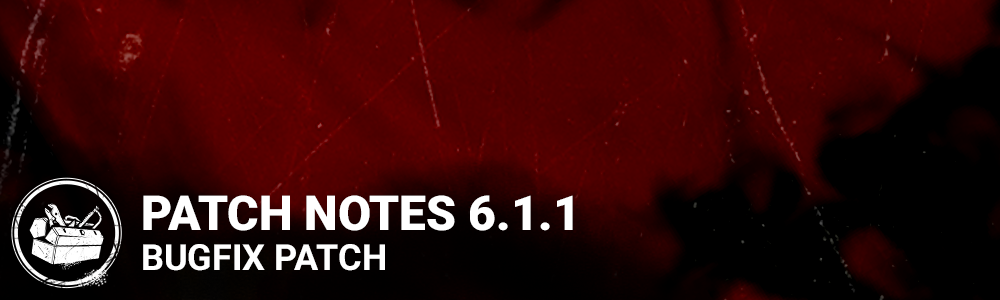

<!-- summary -->
## AI TL;DR

Added a new score event that logs when a perk or effect is disabled by a conspicuous action. The remainder of the update focuses on bug fixes: menu audio now works for new accounts, store back-button visuals, Prestige perk charm display, Hex: No One Escapes Death icon persistence, Calm Spirit perk interaction with Supply Case and Rummage, Endurance visual outline, Spine Chill timer direction, Demogorgon spectator model, Doctor's static-blast scream, Illusionary Doctor aura flicker, Shape and Ghost Face camera-stalk exploits, Green Glyph interaction on The Forsaken Boneyard, and a crash caused by Feng Min's Warrior Goddess outfit, which is now re-enabled.
<!-- /summary -->

<!-- nav -->
&larr; [6.1.0 | Mid-Chapter ](342-6-1-0-mid-chapter.md) · [Live](../../index.md#live) · [6.1.2/6.1.3 | Bugfix Patch](345-6-1-2-6-1-3-bugfix-patch.md) &rarr;
<!-- /nav -->

# 6.1.1 | Bugfix Patch

## Features

- Add a score event when a perk or effect is disabled by a conspicuous action.

## Bug Fixes

- Fixed an issue that prevented the main menu from playing when using a new account
- Fixed an issue that caused a visual glitch with the back button when backing out of the store
- Fixed an issue that caused all Prestige perk charms to display the Balanced Landing charm when inspected.
- Fixed an issue that caused the Exposed icon from Hex: No One Escapes Death to disappear after the hex is transferred to the Hex: Undying totem.
- Fixed an issue that caused the Supply Case and Rummage interactions to be affected by the Calm Spirit perk.
- Fixed an issue that caused the white outline to be missing when getting hit while under the Endurance effect from the Mettle of Man perk.
- Fixed an issue that caused the Spine Chill clock fill to fill in the wrong direction.
- Fixed an issue that caused the head of the Demogorgon to be visible for spectators after traversing to the Upside Down.
- Fixed an issue that caused the wrong scream to trigger after Madness increases from the Doctor's Static Blast.
- Fixed an issue that caused the aura of the Illusionary Doctor to flicker briefly in front of the killer's camera.
- Fixed an issue that caused the Shape and the Ghost Face to be able to stalk through the environment by rapidly moving the camera.
- Fixed an issue that caused a players not to be able to interact with a Green Glyph on The Forsaken Boneyard.
- Fixed a crash that occurred when Feng Min's Warrior Goddess outfit was used. This outfit has been re-enabled for use.

<!-- nav -->
&larr; [6.1.0 | Mid-Chapter ](342-6-1-0-mid-chapter.md) · [Live](../../index.md#live) · [6.1.2/6.1.3 | Bugfix Patch](345-6-1-2-6-1-3-bugfix-patch.md) &rarr;
<!-- /nav -->
