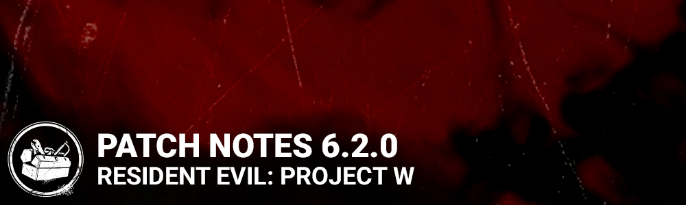

<!-- summary -->
## AI TL;DR

The 6.2.0 live update adds the Mastermind killer with three new perks—Superior Anatomy, Awakened Awareness and Terminus—plus two new survivors, Ada Wong and Rebecca Chambers, each bringing three unique perks. Streamer tools include anonymous mode and hidden matchmaking delay, while HUD connection indicators now display ping and packet loss details. The Raccoon City Police Station map receives East and West wing updates, unhooked survivor buffs are extended, and Bloodweb node costs drop a third.

The remainder of the patch is a sweep of bug fixes covering matchmaking, cosmetics, animation, perk interactions, and numerous map-specific issues, alongside PTB tweaks to the Mastermind’s abilities and survivor perk balances. Known issues include a wrong Hyperfocus tier description and placeholder store banner text.
<!-- /summary -->

<!-- nav -->
&larr; [6.1.2/6.1.3 | Bugfix Patch](345-6-1-2-6-1-3-bugfix-patch.md) · [Live](../../index.md#live) · [6.2.1 | Bugfix Patch](350-6-2-1-bugfix-patch.md) &rarr;
<!-- /nav -->

# 6.2.0 | Resident Evil: PROJECT W

## Features

- New Killer - The Mastermind
  - New Perk: Superior Anatomy
    - When a survivor performs a fast vault within 8 meters of you, this perk activates. The next time you vault a window, your vaulting speed is increased by 30%/35%/40%. This perk deactivates after vaulting a window. This perk has a 30 seconds cool-down.
  - New Perk: Awakened Awareness
    - When carrying a survivor, you can see the aura of other survivors within 16/18/20 meters of your position.
  - New Perk: Terminus
    - When exit gates are powered, this perk activates. While the perk is active, injured, downed and hooked survivors are inflicted with the broken status effect until exit gates are open. When exit gates are open, survivors will stay broken for an additional 20/25/30 seconds.
- New Survivor - Ada Wong
  - New Perk: Wiretap
    - After repairing Generators for a total of 33%, this perk activates. After repairing a Generator for at least 3 seconds, press the Ability button to install a spy trap, which stays active for 60/70/80 seconds. The aura of the trapped generator is revealed in yellow to all Survivors. When the Killer comes within 14 meters of the trapped generator, their aura is revealed to all Survivors. Damaging the generator destroys the Wiretap.
  - New Perk: Reactive Healing
    - When another survivor loses a health state in a 32 meters radius around you while you are injured, instantly increase your healing progression by 40%/45%/50% of the missing healing progression.
  - New Perk: Low Profile
    - When you become the last Survivor standing, this perk activates. Hide your scratch marks, pools of blood, and grunts of pain for 70/80/90 seconds.
- New Survivor - Rebecca Chambers
  - New Perk: Better Than New
    - Upon completing a healing action on another survivor, the targeted survivor gets a 12%/14%/16% speed boost to healing, opening chests, and cleansing and blessing Totems. Survivors keep the bonus until they lose a health state.
  - New Perk: Reassurance
    - When within a 6 meter radius around a hooked survivor, use the Active Ability Button 2 to pause their struggle progression for 20/25/30 seconds. If they are on the struggle phase, it also pauses the Struggle Skill Checks. Reassurance can only be triggered once per survivor per hook instance.
  - New Perk: Hyperfocus
    - After hitting a great Skill Check while repairing or healing, this perk gains 1 token, up to 6 tokens. Each token increases the chance of Skill Check trigger by 4%, the Skill Check cursor speed by 4% and the bonus progression for great Skill Checks by 10%/20%/30% of its base value. The perk loses all tokens in case of normal Skill Check success, Skill Check fail, or if you stop performing the action by any means.
- New Features: Streamer Options (PC Only)
  - These privacy options are available under the Privacy section of the General tab in the Options menu, and are intended to help reduce targeting and harassment of players who stream the game.
  - Anonymous Mode
    - Replaces your account name with your selected character's name for other players. Players in your group will still see your account name.
  - Hide Your Name
    - Replaces your own name with your selected character's name on your own screen. Elsewhere in the menus, your account name will appear as "You" and be hidden in your Friend List.
  - Hide Other Player Names
    - Replaces other player names with their selected character's name.
  - Hidden Matchmaking Delay
    - Adds a short, random delay when entering the matchmaking queue to prevent targeted in-game harassment.
- Improved Feature: HUD Connection Indicators
  - The in-game connection indicator has been improved to show more detailed information during connection issues stemming from ping and packet loss
  - Ping is represented by a vertical bar icon
    - Yellow = Ping over 100ms
    - Red = Ping over 200ms
  - Packet Loss is represented by a double-diamond icon
    - Yellow = 2%-5% packet loss
    - Red = More than 5% packet loss
  - Your own Ping / Packet Loss icons are displayed above the Survivor List
  - Players are notified when another player is experiencing severe connection issues (Red for Ping / Packet Loss)
    - For Killer issues: A unique red icon appears above the Survivor List for Survivors
    - For Survivor issues: A red bar appears next to their name on the Survivor List
- Matchmaking Incentives will be active.
- A photosensitivity warning has been added to the boot sequence of the game

### Perks

- Mettle of Man
  - Reverted to its previous behavior prior to 6.1.2
    - After you earn 3 Protection Hit scoring events, Mettle of Man activates. Once activated, the next occasion that would put you into the dying state from the injured state is ignored. The next time you heal back to full health, your aura will be revealed to the Killer when you are further than 12/14/16 meters from the Killer. Mettle of Man will deactivate the next time you are put into the dying state. Increases your chances to be the Killer’s Obsession.
  - Removed the Endurance icon from the status effect display, since the perk does not use Endurance
- Blast Mine
  - Changed the behaviour when a placed mine times out
    - If the mine times out without being triggered, the entire perk deactivates and the Survivor will need to repair a generator to re-earn the mine (previously, a timed out mine would be allow the Survivor to immediately place another one)

## Content

- Update on Racoon City Police Station map:
  - Raccoon City Police Station East Wing & Raccoon City Police Station West Wing
- Increased the duration of the Endurance & Haste effects after a Survivor is unhooked to 10 seconds (from 5 seconds).
- Increased the strength of the Haste effect after a Survivor is unhooked to 10% (from 7%).
- Reduced the cost of Bloodweb nodes by about 33%.

## Bug Fixes

- Tentatively fixed an issue that caused some players to have 'Unknown error' popups appear after matches.
- Tentatively fixed an issue that caused performance drops for users with large friends lists.
- Fixed an issue that caused survivors to drop too many Blood Orbs after performing some actions when playing against the Oni.
- Fixed an issue that occasionally caused the killer to appear in a survivor slot in a custom game lobby.
- Fixed an issue that caused the Spirit's and Oni's Attack on Titan outfits to appear as body-only cosmetics in the store featured page.
- Fixed an issue that prevented the game from being launched via accepting an invite. (Windows store only)
- Fixed an issue that caused some players to have incorrect perk levels after the prestige rework.
- Fixed an issue that caused equipped cosmetics to revert to default after previewing a different cosmetic piece.
- Fixed an issue that caused The Survivor to float in front of the Killer after being grabbed while performing various actions.
- Fixed an issue that caused Survivors to be misaligned with the Huntress when interrupted while vaulting towards the Killer.
- Fixed an issue that caused broken animation when repairing a generator.
- Fixed an issue that made it possible to intentionally delay loading into the trial, causing Corrupt Intervention to start late.
- Fixed an issue that caused the aura hiding effect of the Knock Out perk to apply to survivors not downed by a basic attack.
- Fixed an issue that may cause the killer to still be able to kill survivors after the Hex: Devour Hope totem is cleansed when used with Hex: Undying.
- Fixed an issue that caused the 'Disfigured Ear' add-on for the Hag to reduces audio for everyone, and not only the survivor that triggers the trap.
- Fixed an issue that caused the status effect icon to display a second time instead of the effect's source
- Fixed an issue that may cause the Lament Configuration to become invisible after being picked up by the Cenobite.
- Fixed an issue that may cause the Lament Configuration to appear on a bush and be inaccessible in the Garden of Joy map.
- Fixed an issue that may cause survivors to no longer be able to solve the Lament Configuration when picking it up at the same time as the Cenobite.
- Fixed an issue that made it possible to interact with glyphs while holding the Lament Configuration.
- Fixed an issue that caused all tokens not to be consumed when the Dredge returns to the Remnant when equipped with the Air Freshener add-on.
- Fixed an issue that made it possible for the Onryo to demanifest into a hooked survivor, preventing them from being rescued.
- Fixed an issue that may cause the Hillbilly’s Chainsaw SFX to continue playing when cancelling revving the chainsaw.
- Fixed an issue that caused the Shape to be unable to use the Tombstone Mori on survivors currently using the map, key or Clairvoyance perk.
- Fixed an issue that caused survivors to be unable to interact with the White Glyph after breaking the mirror.
- Fixed an issue that caused survivors not to receive a score event after burning the Spirit’s husk with a flashlight.
- Fixed an issue that caused survivors to receive a Burn score event after blinding the Wraith with the flashlight while uncloaked.
- Fixed an issue that caused survivors not to receive progress towards the Medic achievement when healing a survivor using the For the People perk.
- Fixed an issue that caused survivors to gain progress towards the Milk ’n’ Cookies achievement by opening the basement chest without picking up the item.
- Fixed an issue that caused survivors sacrificed at the Executioner’s Cage of Atonement not to grant progress towards the Reverent archive challenge.
- Fixed an issue that caused killers to remain shortly in the falling animation after landing after vaulting from a certain height.
- Fixed an issue that caused certain survivor charms to be misplaced when repairing a generator.
- Fixed an issue that caused a sound effect to be missing when selecting an outfit in the customization menu.
- Fixed an issue that caused tooltips to overlap other controls in the Lobby on consoles.
- Fixed an issue that caused the virtual cursor's to position itself to the center of the screen when entering a killer lobby with a controller.
- Fixed an issue that caused some of the main menu's controller button mapping not to work.
- Fixed an issue that caused various inconsistencies between tooltips' texts in the Lobby.
- Fixed an issue that caused the Archive Widget Open sound effects to play even if the widget wasn’t open.
- Fixed an issue that caused The Oni's Blood Fury background sound to continue to play when changing outfit.
- Fixed an issue that caused The Hillbilly's chainsaw revving sound to play infinitely when cancelling the revving.
- Fixed an issue that caused survivors to have a choppy animation after solving the Lament Configuration while injured.
- Fixed an issue that caused survivors to not have facial animation when chain interrupted by the Cenobite while solving the Lament Configuration.
- Fixed an issue that caused the weapon of the Trickster to break during the breaking a pallet animation.
- Fixed an issue that caused Female Survivor's right arms to clip through their right thighs when crouching while injured
- Fixed an issue that caused the Plague's "Frosty eyes" to appears in front of the camera when vomiting
- Fixed an issue that caused the Oni's hair to disappear when performing a Mori on a Survivor, while wearing specific head cosmetics
- Fixed an issue that caused the player to get stuck on a specific spot near the stairs in the main building in Eyrie of Crows map.
- Fixed an issue that caused a rock with bigger collision to block killer projectiles in Mount Ormond Resort map.
- Fixed an issue that caused an invisible collision when going up with the outside stair in the Main house of Mother's Dwelling map.
- Fixed an issue that enabled survivors to be able to climb onto inaccessible areas on the Racoon City Police Station map whilst cleansing or blessing a totem.

### Changes from PTB

- The Mastermind
  - Decreased the collision detection for Virulent Bound to 20cm (was 45cm)
  - Decreased the Survivor detection for Virulent Bound to 20cm (was 40cm)
  - Increased the movement speed between the first and second Virulent Bound to 2.76m/s (was 2.3m/s)
  - Virulent Bound throws ending at a ledge will now result in the Survivor falling instead of stopping at the ledge
  - Survivors standing too close to a vault point or dropped pallet will now be injured when The Mastermind vaults it
  - Survivors used as collision for Virulent Bound will now always get Deep Wound (previously only applied Deep Wound to injured survivors)
  - Add-on: Loose Crank
    - Decreased the movement modifier to 8% (was 20%)
    - *Dev Note: Even though the percentage has gone down, this is actually a net buff from 2.76m/s to 2.98m/s, due to the increase to the baseline move speed listed above.*
- Perks
  - Reassurance
    - Changed the restriction to once per survivor per hook instance (was a 40 second cooldown)
  - Awakened Awareness
    - Removed the 2 second aura linger
  - Low Profile
    - Added grunts of pain to the effects affected by the perk
  - Better Than New
    - Removed the generator repair boost
    - Added totem blessing to the list of effects
    - Increased speed boost to 12%/14%/16% (was 6%)
    - Removed effect duration: Survivors now keep the bonus until they lose a health state
  - Hyperfocus
    - Increased Skill check chance per token to 4% (was 2%)
  - Reactive Healing
    - Increased healing values to 40%/45%/50% (was 25%/30%/35%)

### Fixes from PTB

- Fixed an issue that caused subtitles to appear despite the voice lines not starting when switching fast between Resident Evil survivors in the lobby.
- Fixed an issue that caused Jonah Vasquez to trigger Leon S. Kennedy voice lines and reactions from other Resident Evil characters.
- Fixed an issue that caused Rebecca’s grunts of pain to be louder than the one from other survivors.
- Fixed an issue that caused a fence SFX impact to be played upon hitting an air conditioner unit on the Raccoon City Police Station map.
- Fixed an issue that caused a wooden box SFX impact to be played upon hitting a concrete wall on the Raccoon City Police Station map.
- Fixed an issue that caused matchmaking incentive bonuses to be applied on bonus bloodpoints.
- Fixed an issue that caused anonymous mode to hide player names from survivor group members.
- Fixed an issue that caused an artifact on The Mastermind's tentacle in the pre-lobby idle animation.
- Fixed an issue that caused the Uroboros to stay there during the sacrifice animation.
- Fixed an issue that caused too many pallets to spawn on the Raccoon City Police Station Map.
- Fixed an issue that caused the Mastermind to gain increased speed after being stunned during a Virulent Bound.
- Fixed an issue that may cause the Mastermind to float into the air after throwing a survivor with his Virulent Bound.
- Fixed an issue that may cause survivors to float into the air when thrown by the Mastermind’s Virulent Bound.
- Fixed an issue that caused the Virulent Bound to be unusable for the rest of the trial after being used on a survivor with the Mettle of Man or Dead Hard effect active.
- Fixed an issue that caused survivors to briefly disappear just before being thrown by the Mastermind.
- Fixed an issue that caused survivors to play an incorrect animation when hitting a collision after being thrown by the Mastermind.
- Fixed an issue that may cause the Mastermind’s Virulent Bound to stop working after being started close to a corner.
- Fixed an issue that caused the Mastermind’s Virulent Bound not to hit survivors who are vaulting or interacting with lockers.
- Fixed an issue that caused the Mastermind’s Virulent Bound to function incorrectly when passing over the Hatch.
- Fixed an issue that caused survivors to take damage when thrown over some ledges by the Mastermind.
- Fixed an issue that may cause survivors to be instantly dropped when grabbed near the end of the Virulent Bound’s range.
- Fixed an issue that caused the Deep Wound timer to be reset when a survivor infected with Uroboros Virus is slammed into a survivor already affected by Deep Wound.
- Fixed an issue that caused the Mastermind’s Bound Vault not to trigger on pallets currently being reset through the Any Means Necessary perk.
- Fixed an issue that caused survivors to gain bloodpoints for dodging the Mastermind’s Virulent Bound when on a hook.
- Fixed an issue that caused the Global Saturation score to be granted four times at the start of the trial when equipped with the Iridescent Uroboros Vial add-on.
- Fixed an issue that caused the Green Herb add-on not to increase infection the first time a survivor is hit by Virulent Bound.
- Fixed an issue that caused the exposed effect given by the Starstruck perk to last indefinitely when triggered by the Mastermind’s Virulent Bond.
- Fixed an issue that caused the Superior Anatomy perk to become active when a vaulting survivor is interrupted.
- Fixed an issue that caused the Superior Anatomy perk’s effect to be applied to the Mastermind’s Bound Vault and the Legion’s Frenzy pallet and window vaults.
- Fixed an issue that caused the Terminus perk icon to remain lit up after the perk’s effect is over.
- Fixed an issue that caused the Terminus perk icon not to be displayed when affected by the perk’s Broken effect.
- Fixed an issue that caused the Hyperfocus perk not to lose tokens when succeeding Merciless Storm skill checks.
- Fixed an issue that caused the Hyperfocus perk tokens not to reset when interrupting the Heal interaction.
- Fixed an issue that caused the Reactive Healing perk not to give healing progression when a survivor is damaged by the Plague’s Vile Purge.
- Fixed an issue that caused the Reactive Healing perk not to give healing progression when a survivor is put into the dying state.
- Fixed an issue that caused the killer aura revealed by the Wiretap perk to be visible when the survivor is affect by the Blindness effect.
- Fixed an issue that caused survivors to be unable to install traps from the Wiretap and Blast Mine perk when fully charged using the Brand New Part add-on.
- Fixed an issue that made it possible for several survivors to install Wiretap traps on the same generator.
- Fixed an issue that caused the Low Profile perk to have an incorrect duration.
- Fixed an issue that caused the Reassurance effect to continue when a survivor is unhooked and hooked for a second time.
- Fixed an issue that caused the Reassurance interaction not be available when already in range of the hook when a survivor is hooked.
- Fixed an issue that caused the Better Than New external perk icon not to be displayed when the survivor is not performing actions.
- Fixed an issue that may cause the dedicated server to crash when opening a chest when equipped with Ace in the Hole perk.
- Fixed an issue that caused traps on all generators to be destroyed when the killer damages any single generator.
- Fixed an issue that caused the Rite of the Mastermind not to gain progress.

## Known Issues

- The description for Tier 1 of the perk Hyperfocus displays the wrong value.
- The headline and subtitles for some Store banners is displayed as placeholder text.

<!-- nav -->
&larr; [6.1.2/6.1.3 | Bugfix Patch](345-6-1-2-6-1-3-bugfix-patch.md) · [Live](../../index.md#live) · [6.2.1 | Bugfix Patch](350-6-2-1-bugfix-patch.md) &rarr;
<!-- /nav -->
