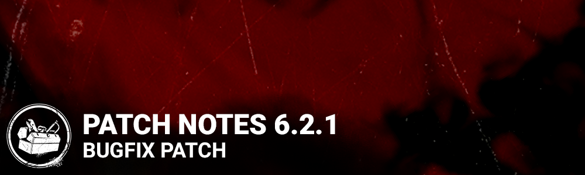

<!-- nav -->
&larr; [6.2.0 | Resident Evil: PROJECT W](349-6-2-0-resident-evil-project-w.md) · [Live](../../index.md#live) · [6.2.2 | Bugfix Patch](351-6-2-2-bugfix-patch.md) &rarr;
<!-- /nav -->

# 6.2.1 | Bugfix Patch

## Features

- The Mastermind
  - Increased the size of Survivor detection for triggering grabs with Virulent Bound
  - Damage done with Virulent Bound now counts towards the Chaser emblem

## Content

**Archives**

- Visual feedback has been updated for the "Glyph Massacre" orange glyph challenge.

## Bug Fixes

- Fixed an issue that caused a subtle camera offset in-game which lead to motion sickness in some players.
- Fixed an issue that caused the face of survivor Carlos's to be contorted after being Mori'd by some Killers
- Fixed an issue that caused the Mastermind to be able to grab survivors through thin walls when using Virulent Bound.
- Fixed an issue that may cause the Mastermind to be unable to grab survivors with his Virulent Bound near some stairs.
- Fixed an issue that may cause survivors to clip inside assets when slammed into them by the Mastermind’s Virulent Bound.
- Fixed an issue that caused fully infected survivors to play the dying scream SFX when another survivor is slammed into them by the Mastermind’s Virulent Bound.
- Fixed an issue that caused fully infected survivors to play the injured grunt SFX when hit by the Mastermind’s tentacle.
- Fixed an issue that may cause the Trigger Bound prompt to be visible in situations where Virulent Bound cannot be used.
- Fixed an issue that caused the pulse VFX to stay until the end of the trial after the Mastermind is stunned while using Virulent Bound.
- Fixed an issue that caused survivors not to be thrown down when the Virulent Bound ends close to the ledge.
- Fixed an issue that caused the Mastermind to be unable to grab survivors interacting with a chest when using Virulent Bound.
- Fixed an issue that caused the Mastermind to push back survivors exiting lockers into the locker when using Virulent Bound to rush at it.
- Fixed an issue that may cause the Mastermind to block unhooking by rushing at the hooked survivor with Virulent Bound.
- Fixed an issue that caused the Mastermind’s Virulent Bound not to trigger Decisive Strike.
- Fixed an issue that caused the Alert perk not to trigger when the Mastermind destroys a breakable wall with Virulent Bound.
- Fixed an issue that caused the icon to be missing when picking up a First Aid Spray from a supply crate.
- Fixed an issue that caused the Hyperfocus perk not to apply its effects on healing actions.
- Fixed an issue that caused the generator’s aura to remain shown for the rest of the trial if a survivor leaves the trial after installing a trap using the Wiretap perk.
- Fixed an issue that may cause survivors to be stuck after being interrupted by the Doctor’s Shock Therapy while unhooking.
- Fixed an issue that sometimes caused the HUD's Player Statuses to be constantly displayed in their brightened state.
- Fixed an issue that sometimes caused the Player's Name tags to be partially cut in the Lobby.
- Fixed an issue that caused the Pig's Ambush Dash attack prompt to erroneously display the Prove Thyself perk description in non-English languages.

<!-- nav -->
&larr; [6.2.0 | Resident Evil: PROJECT W](349-6-2-0-resident-evil-project-w.md) · [Live](../../index.md#live) · [6.2.2 | Bugfix Patch](351-6-2-2-bugfix-patch.md) &rarr;
<!-- /nav -->
