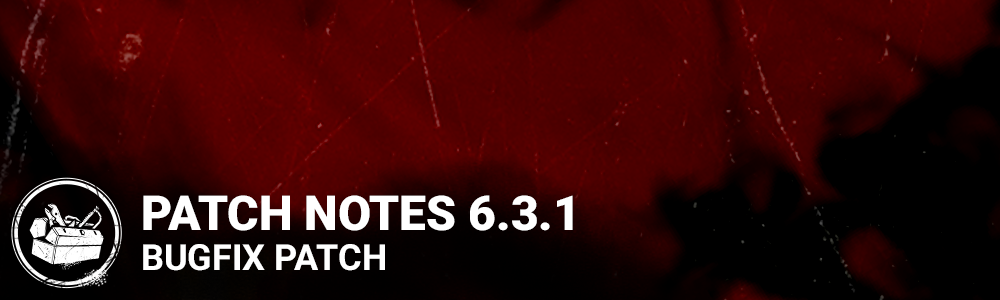

<!-- summary -->
## AI TL;DR

Fixes target the Xbox account-switch save bug, Windows Store store purchase glitch, tutorial reward display, post-match crashes and a custom-match kill-timer issue. Across the Archives UI number formatting, localization and compendium crashes are resolved, while map-specific problems such as body-blocking in Raccoon City Police Station’s basement stairs, flashlight aim drift and female survivor arm snapping are corrected. Audio bugs affecting several killers, the Blight’s hit SFX and memory-tome voicelines are fixed, and limits on flashbang carrying and Meg’s tutorial escape are restored. A texture update applies to the Dramatic Death charm and missing skeleton textures on Haunted by Daylight event shirts are added. Known issues remain with the event intro replay, a custom-game DLC toggle crash and non-consuming Bloodpoint Offerings.
<!-- /summary -->

<!-- nav -->
&larr; [6.3.0 | Mid-Chapter ](355-6-3-0-mid-chapter.md) · [Live](../../index.md#live) · [6.3.2 | Bugfix Patch](362-6-3-2-bugfix-patch.md) &rarr;
<!-- /nav -->

# 6.3.1 | Bugfix Patch

## Bug Fixes

- Fixed an issue that caused a save error when switching accounts in game on Xbox.
- Tentatively fixed an issue that sometimes caused outfits cannot be purchased error in the in-game store on WinGDK.
- Fixed an issue that caused the wrong tutorial reward display.
- Fixed an issue that caused a crash after finishing or leaving a match.
- Fixed an issue that caused the killer's custom match not to end when the last remaining survivor quits the match but stays on tally.
- Fixed some number formatting errors when more than thousands in the Archives.
- Fixed some text localization in the Archives.
- Fixed a potential crash when trying to access the compendium after mastering a tome.
- Fixed an issue in the Onboarding menu where the wrong character rewards are displayed.
- Fixed an issue that allowed the Killer to be able to body block Survivors in the Racoon City Police Station basement stairway.
- Fixed an issue that caused the flashlight aim to be inconsistent with previous releases.
- Fixed an issue that caused female Survivors arms to snap unnaturally when interacting with the Nightmare's alarm clocks.
- Fixed an issue that caused Meg to not escape during the survivor tutorial.
- Fixed an issue that allowed survivors to be able to carry more than one flashbang.
- Fixed an issue where a voiceline in the Memory 708 in Tome 13 in French would repeat itself.
- Fixed an issue where the voicelines in The Archives would not play for the Windows Store version of the game.
- Fixed an issue that caused the Blight to be missing SFX when hitting the environment with a basic attack.
- Fixed an issue where some Killers would have no sound in the menu.
- Changed texture on the Dramatic Death charm available in the Tome 13 Rift. *Note: The icon for this charm will be updated in the next patch.*(All platforms except Switch & Stadia - they will have the updated texture and icon in HF2)
- Added missing skeleton textures on the back of the Haunted by Daylight event reward shirts for David, Claudette, Yun-Jin and Jane.

## Known Issues

- Event intro movie might play again after every tally screen in custom game. To workaround the issue, restart the game.
- A crash occurs when unchecking the Allow DLC Killers option in Custom Games.
- Bloodpoint Offerings are not burnt when used and do not provide a Bloodpoint bonus.

<!-- nav -->
&larr; [6.3.0 | Mid-Chapter ](355-6-3-0-mid-chapter.md) · [Live](../../index.md#live) · [6.3.2 | Bugfix Patch](362-6-3-2-bugfix-patch.md) &rarr;
<!-- /nav -->
