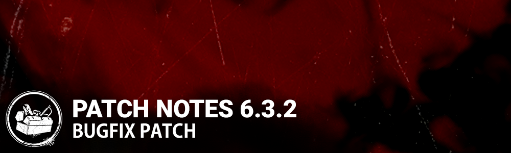

<!-- summary -->
## AI TL;DR

Key fixes in 6.3.2 target several killers, survivors and maps: the Oni’s ‘Bursting with Fury’ VFX and red hair now appear, the Wraith can interact with Unstable Rifts while cloaked, the Mastermind no longer traps survivors in Asylum, and hook placement works in Midwich Elementary. Survivor glitches—Carlos and Sheva’s screams, female arm snapping, Jeff’s eye pop, flashlight-vaulting quirks, and missing pumpkin-smash SFX for The Artist and Onryo—are resolved, along with generator muffling, Bloodpoint Offering bugs, matchmaking incentive icon loss and map interaction issues in Junkyard, Pale Rose ferry and Asylum. The patch also updates the Dramatic Death charm texture on Switch and Stadia, fixes its icon elsewhere, and removes crash-inducing Halloween cinematics; a known issue remains with Escape Artist challenge progression.
<!-- /summary -->

<!-- nav -->
&larr; [6.3.1 | Bugfix Patch](359-6-3-1-bugfix-patch.md) · [Live](../../index.md#live) · [6.4.0 | Forged in Fog](365-6-4-0-forged-in-fog.md) &rarr;
<!-- /nav -->

# 6.3.2 | Bugfix Patch

*Update will include 6.3.2a for all platforms excluding Stadia and Switch, crossplay is not affected*

- Fixed an issue that caused Bloodpoint modifier Offerings not to be working correctly.
- Fixed an issue that sometimes caused the Matchmaking Incentive icon to disappear.
- Fixed an issue where buying add-ons that were originally equipped do not auto-equip after replenishing.
- Fixed an issue where the hooks placement prevents hooking in Midwich Elementary School.
- Fixed an issue that caused Killers to be unable to move between a wall and barrel in Junkyard.
- Fixed an issue where the Mastermind can get survivors stuck between a wall and a pile of rubble in Asylum.
- Fixed an issue that prevented players from vaulting one of the windows on the ferry boat in the Pale Rose map.
- Fixed an issue where the sounds of generators would be muffled while working to fix them.
- Fixed an issue where Carlos and Sheva's screams were not heard by other survivors.
- Fixed an issue where the SFX for smashing a pumpkin with The Artist or The Onryo was missing.
- Fixed an issue that caused female Survivors arms to snap briefly when opening the exit gates.
- Fixed an issue that caused Jeff's eyeballs to pop out in the lobby.
- Fixed an issue that caused the VFX of the Oni's outfit "Bursting with Fury" to be missing and the hair to not turn red when he go into Demon Mode.
- Fixed an issue that caused survivors to vault a pallet or window sideways when clicking the flashlight before vaulting.
- Fixed an issue that caused survivors to keep using their flashlight during the escape animation if it is in use when they escape.
- Fixed an issue that caused the centrifuge to be spinning when working on an esoteric generator with an empty void energy tank.
- Fixed an issue that caused survivors to keep unbanked void energy when killed by the Shape’s standing mori.
- Fixed an issue that caused the Wraith to be unable to interact with Unstable Rifts when cloaked.
- Changed texture on the Dramatic Death charm available in the Tome 13 Rift. (Switch & Stadia only)
- Fixed an issue that caused the Dramatic Death charm icon to be the wrong one. (All platforms except Switch & Stadia)
- Removed the Halloween Cinematics that caused crashes on all platforms and game access issues for XB1/XSX users. (All platforms except Stadia & Switch)

### KNOWN ISSUES

- Occasionally the Escape Artist Challenge from the Haunted by Daylight Event does not progress for some users

<!-- nav -->
&larr; [6.3.1 | Bugfix Patch](359-6-3-1-bugfix-patch.md) · [Live](../../index.md#live) · [6.4.0 | Forged in Fog](365-6-4-0-forged-in-fog.md) &rarr;
<!-- /nav -->
