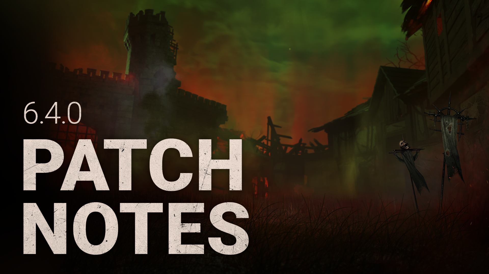

<!-- summary -->
## AI TL;DR

The Knight joins the roster with three new perks—Nowhere to Hide, Hex: Face the Darkness, and Hubris—while Vittorio Toscano debuts as a survivor, bringing Potential Energy, Fogwise, and Quick Gambit. The Shattered Square arrives as the latest map, and the existing Basement receives wider stairs and visual tweaks to pallets and doors. Flashlight mechanics are adjusted so late-stage blinds now stun the killer, and PS5 gains haptic feedback. Hosts can now add survivor bots to custom matches.

The update also refines guard behavior, rebalances several add-ons and perk timers, and addresses numerous bugs—including animation stalls, aura visibility, map clipping, tutorial steps, and flashlight blind timing—across all platforms.
<!-- /summary -->

<!-- nav -->
&larr; [6.3.2 | Bugfix Patch](362-6-3-2-bugfix-patch.md) · [Live](../../index.md#live) · [6.4.1 | Bugfix Patch](366-6-4-1-bugfix-patch.md) &rarr;
<!-- /nav -->

# 6.4.0 | Forged in Fog

## Features

- New Killer - The Knight
  - New Perk - Nowhere to Hide
    - Whenever you damage a generator, reveal the aura of all survivors standing within 24 meters of your position for 3/4/5 seconds.
  - New Perk - Hex: Face the Darkness
    - Injuring a Survivor by any means lights a Dull Totem, activating the Hex. While the Hex is active, all other Survivors outside of your Terror Radius will scream every 35/30/25 seconds, revealing their positions and auras for 2 seconds. When the Survivor enters the dying state or becomes healthy, the Hex totem becomes dull again and this perk deactivates. If the Hex totem is cleansed, this perk is permanently disabled.
  - New Perk - Hubris
    - Whenever you are stunned by a Survivor, that Survivor suffers from the Exposed status effect for 10/15/20 seconds. Hubris has a cooldown of 20 seconds.
- New Survivor - Vittorio Toscano
  - New Perk - Potential Energy
    - After working on a generator for 12/10/8 uninterrupted seconds, press the Active Ability Button 2 to activate this perk. When this perk is active, repairing the generator will charge this perk instead of making the generator progress. For each 1.5% of generator repair, the perk will gain one token, up to 20 tokens. While this perk has at least one token and you are working on a generator, you can press the Active Ability Button 2 to consume all the tokens and instantly make the generator progress by 1% for each token. This perk then deactivates. If you lose a health state while this perk has at least 1 tokens, the perk will lose all tokens and deactivate. Missing a skill check will also result in some charges lost.
  - New Perk - Fogwise
    - Hitting a great Skill Check while repairing a generator reveals the aura of the Killer to you for 4/5/6 seconds.
  - New Perk - Quick Gambit
    - When you are chased within 24 meters of any generator, any other Survivor working on that generator receives a 6/7/8% speed boost to the repair action.
- Flashlight update
  - Flashlight blinds that occur within the last 0.4 seconds of the Survivor pickup animation will now stun the Killer once the animation has completed.
    - ***Dev note**: We've increased the duration of the buffer from its PTB value of 0.25 to account for latency.*
  - Killers are now immune to blindness while grabbing a Survivor out of a locker.
- Bots in Custom Matches
  - The host of a Custom Match can add Survivor bots to the game.
- (PS5 Only!) Added Haptic Feedback & a pop-up informing players.
- Rancor Perk - updated the conditions on which the obsession becomes exposed to include closing the hatch

## Content

- New map - The Shattered Square
- Updated Basement
  - Wider stairs to address body-blocking issues
- Updated visuals for Pallets and Breakable doors

## Changes From PTB

- Decreased the spawn time of the guards to 1.5s from 2.0s.
- Guard Detection Radius interpolation speed now 1.0 instead of 1.5 sec.
- Guard traveling to detection location decreased to 2.5 sec instead of 3.0 sec.
- Flag activation on Carnifex is now 10.0 sec. instead of 8.0 sec.
- Flag activation on Assassin is now 5.0 sec. instead of 2.0 sec.
- Flag activation on Jailer is now 5.0 sec. instead of 2.0 sec.
- The Killer is now able to cancel/destroy a patrolling Guard by hitting them with their base attack.
- Addon Map of the Realm: is now +4M instead of +6M.
- Addon Flint and Steel: now only works on dropped/unbroken pallets.
- Addon Healing Poultice: Effect has been inverted to within 24M instead of over 36M.
- Addon Knight’s Contract: Extended the effect to 12M instead of 8M. Addon text now specifies the Guard spawn trigger.
- Perk Hex: Face the Darkness has updated functionality and timing.
- Flashlight blind buffer increased from 0.25 seconds to 0.4 seconds.
- *Dev note: we've increased the duration of the buffer from its PTB value of 0.25 to account for latency.*
- The fog on the Shattered Square has been modified to reduce the amount of red and added a grey fog effect as a replacement.
- The pallet textures and hooks on The Shattered Square have been modified to improve visibility.
- When a survivor picks up a flag, there is now a VFX for the duration of the bonus effect.

## Bug Fixes

- Fixed an issue that caused error 109 after a trial.
- Fixed an issue that caused the wrong prestige level to be displayed on the tally screen
- Fixed an issue that sometimes left survivors in the dying state, unable to be able to be healed whilst on a stairway or slope
- Fixed an issue that caused letter casing in chat on WinGDK.
- Fixed an issue that allowed the Killer to bodyblock a hook on Racoon City Police Station map
- Fixed an issue that enabled a Survivor to pass through a visible gap but not the Killer in Dead Dawg Saloon map.
- Fixed an issue that caused a placeholder in Pale Rose.
- Fixed an issue that caused the Survivor getting stuck between a hook and a rack in Racoon City Police Station map.
- Fixed an issue in the Archives where the progression was duplicated between some tomes
- Fixed a possible crash when closing the Game
- Fixed invitations not received when visiting the Archives or Onboarding menus
- Fixed an issue that caused the survivor to be stuck in the animation loop after failing a skillcheck.
- Fixed an issue that caused Jeff Johansen face to be distorted When performing action..
- Fixed an issue that caused The Knight snuffing animation to emits a metallic SFX.
- Fixed an issue that caused The Knight to plays 2 kicks sounds when breaking doors despite only kicking the door once.
- Fixed an issue on Switch that caused the Onryo project power's SFX to be corrupted.
- Fixed an issue that caused the Survivor's escape animation to be incorrect when escaping while using a flashlight.
- Fixed an issue with the Object of Obsession perk icon appears in red when the Survivor is not the obsession.
- Fixed an issue that caused Survivors to be able to avoid dying with a Reverse Beartrap by using a Flashlight at the Exit Gate
- Fixed an issue that caused Survivors to be able to avoid getting caught in a Beartrap by using a flashlight
- Fixed an issue that caused For The People to not trigger We're Gonna Live Forever when used too quickly
- Fixed an issue that caused Killers to be able to bypass the Decisive Strike stun if the survivor is dropped before the skill check
- Fixed an issue that caused kills and sacrifices not being properly tracked in emblems, challenges and achievements.
- Fixed an issue that caused female Survivors to not grunt when falling from heights.

## Bug Fixes From PTB

- Fixed an issue which caused flashlight blinds from any point of the Survivor pickup animation to blind the Killer once the animation was completed.
- Fixed some issues in the Lobby where the PlayerTag option menus could overlap with other PlayerTags
- Fixed an issue where the character is unable to move after visiting the Compendium section in the Archives
- Fixed an issue that caused the Blight's VFX to be missing during his mori
- Fixed an issue that caused the active flag VFX to be visible when a survivor is hit by a guard, before it get activated.
- Fixed an issue that caused the flags for the Knight to dissolve inconsistently when a Guard despawns.
- Fixed an issue that caused the loud noise notification to be misaligned with the Exit Gate Switch Panel.
- Fixed an issue that caused the VFX for the Potential Energy perk to be misaligned depending of the orientation of the survivor when triggered.
- Fixed an issue that caused the flag to remain for the hunted survivor even if the guard disappeared.
- Fixed an issue that caused some Tier 1 perks from The Knight and Vittorio Toscano to be brown instead of yellow
- Fixed an issue that caused The Knight's **Flint and Steel** addon to not remove a token from the perk Distortion when triggered
- Fixed an issue that caused The Knight's **Knight Contract** addon to affect a smaller than intended radius
- Fixed an issue that caused The Knight's **Chain Mail Fragment** addon to not apply the Hemorrhage Status effect to survivors when hit by the guards
- Fixed an issue that caused The Knight's **Broken Hilt** addon to not apply the Mangled Status effect to survivors when hit by the guards
- Fixed an issue that caused The Knight's perk Nowhere To Hide to reveal the Aura of Survivors when cancelling the damage action on Generators
- Fixed an issue that caused The Knight's Guards to place a flag in mid-air if the hunted survivor is detected while falling
- Fixed an issue that caused survivors to be unable to pallet stun The Knight creating a Patrol Path
- Fixed an issue that caused the Decimated Borgo map icon to appear in the wrong place in the Custom Games match management selection menu
- Fixed an issue that caused The Knight's aura not to be visible to survivors when performing Guardia Compagnia
- Fixed an issue that caused The Knight's power hud icon to incorrectly display a button prompt during the guard patrol
- Fixed an issue that caused survivors in a locker hit by a Guard to keep the Blindness status effect indefinitely
- Fixed an issue that caused The Knight's cohorts not to hunt Survivors who are downed, unhooked or get themselves up after a cohort is spawned
- Fixed an issue that caused The Knight's guards to sometimes be unable to reach a survivor hiding in a locker during a hunt
- Fixed an issue that caused The Knight's Guards to not grant Chaser Emblem points when damaging a survivor
- Fixed an issue that caused The Knight's Guards to not detect survivors making loud noises within their hunt detection radius
- Fixed an issue that caused The Knight's Healing Poultice Addon to reveal Survivors in a larger area than intended
- Fixed an issue that caused The Knight's Guard order VFX to not be visible on breakable objects until The Knight uses his power once
- Fixed an issue that caused Survivors hit by a Guard in a locker to play an extra reaction animation
- Fixed an issue that caused the Killer Basement lighting to be used throughout the map after The Knight performs a Guardia Compagnia in the Killer Basement
- Fixed an issue that caused players not to receive receive brutality score events for hitting Survivors or breaking objects with The Knight's Guards
- Fixed an issue that caused Survivors to be able to blind The Knight's Path of Creation Wisp
- Fixed an issue that caused The Knight's Guards to get stuck when making sharp turns around thin walls
- Fixed an issue that caused the the VFX for Potential Energy and Refined Serum to be visible to The Knight while Path Creating Mode and and Spirit while Phase walking.
- Fixed an issue that caused the The Knight's Guardia Compagnia to be unable to Summon a guard to break certain pallets
- Fixed an issue that caused a green line at the bottom of the screen during the Knight's Trailer on certain platforms
- Fixed an issue that caused The Knight's Carnifex guard to be unable to move after hitting a hunted survivor in a locker
- Fixed an issue that caused Survivors to become able to get stuck in or on top of a locker if The Knight hits the Survivor during the guard locker attack animation
- Fixed an issue that caused The Knight's Guards to sometimes walk around vault locations or pallets instead of walking through them during a hunt
- Fixed an issue that caused The Knight to be able to Order his Guards to kick Generator through walls
- Fixed an issue that caused The Knight's Guard to incorrectly change elevation during a hunt
- Fixed an issue that caused the Oni's model to be distorted during a Mori when in Blood Fury.
- Fixed an issue that caused the wiggle UI to remain on screen after escaping the Killer's grasp.
- Fixed an issue that caused the camera and animation to be incorrect when a survivor escapes through an exit gate.
- Fixed an issue that caused a repaired generator not to count towards the escape requirement when a perk causes an explosion/regression at the same time as the repair completion
- Fixed an issue that allowed Flashbangs and Firecrackers to blind the killer at any point during the pick up animation
- Fixed an issue that caused escaping by the Hatch to prevent progress through the Survivor Tutorial
- Fixed an issue that caused the Survivor Tutorial objective "Vault the Pallet" to be impossible to complete, preventing players from progressing further in the tutorial.
- Fixed an issue that caused bots to be able to automatically wiggle out of a Virulent Bound grab
- Fixed an issue that caused the Object of Obsession perk to remain active when the Survivor is in the dying state or being carried by the killer.
- Fixed an issue that caused Freddy's dream pallets to have incorrect textures in The Shattered Square map.
- Fixed an issue that caused bots to sometimes fail to escape the trial when passing through the Exit Gates at the same time.
- Fixed an issue that caused Killers to be able to vault on elevated vault locations.
- Fixed an issue that caused The Mastermind to not receive brutality Score Events for damaging Survivors with Virulent Bound.
- Fixed an issue that caused The Artist to not receive brutality score events for damaging Survivors with Crows
- Fixed an issue that caused the survivors' animation transition from holding to solving the Lament Configuration to not be triggered.
- Fixed an issue that caused the Deep Wound status bar to remain visible on other players' HUDs after the Survivor had escaped the trial.
- Fixed an issue that caused survivors to get stuck inside a locker if The Dredge teleports away during the animation where the survivor gets pulled inside the locker.
- Fixed an issue that caused spamming any gesture while screaming to cause the screaming animation to repeat constantly.

## Known Issues

- (Stadia Only) The Shattered Square is not available to be selected in Custom Games on Stadia.
- In French, in several descriptions The Knights Power is incorrectly written as Compagnia d'Arme rather than the proper name Guardia Compagnia.
- Some Playstation players are unable to invite or join friends in the lobby.
- Hex: Face the Darkness has an incorrect description.

<!-- nav -->
&larr; [6.3.2 | Bugfix Patch](362-6-3-2-bugfix-patch.md) · [Live](../../index.md#live) · [6.4.1 | Bugfix Patch](366-6-4-1-bugfix-patch.md) &rarr;
<!-- /nav -->
