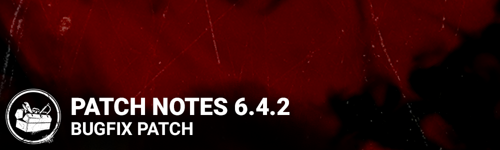

<!-- nav -->
&larr; [6.4.1 | Bugfix Patch](366-6-4-1-bugfix-patch.md) · [Live](../../index.md#live) · [6.4.3 | Bugfix Patch](368-6-4-3-bugfix-patch.md) &rarr;
<!-- /nav -->

# 6.4.2 | Bugfix Patch

## Content

**BONE CHILL**

- The Bone Chill Event returns on December 8th, bringing holiday atmosphere, dark and fantastical Cosmetics, a few familiar visitors, and much more.

**THE KNIGHT**

- **BUFF:** When Guards damage Generators, they now apply the Killer’s default **2.5%** regression loss. This regression is not affected by Perks.

## BUG FIXES

**PLAYSTATION**

- Players will no longer be stuck with an analog cursor in-game.

**THE KNIGHT**

- The Knight’s Enchanted Plates Outfit now plays the correct sound in the menu.
- The Knight no longer crosses small obstacles after using Guardia Compagnia.
- Fixed an animation issue when The Knight’s guards hit a Survivor during a locker search.
- The Knight’s Guards no longer get stuck when creating a Patrol Path in select corners.
- Fixed an issue where The Knight could not order Guards to destroy select Breakable Walls.
- The Knight’s Patrol Path Orb no longer triggers Make Your Choice or Hex: Devour Hope.

**THE ONI**

- The Oni’s weapon no longer disappears during the Match Results screen.

**SURVIVOR PERKS**

- The Knight’s Guardia Compagnia no longer makes the Terror Radius indicator disappear from the Spine Chill icon.
- Spine Chill no longer grants a repair bonus when a Survivor is in the line of sight of The Knight’s Path Drawing Orb.

**MAPS**

- Beef Tallow Mixture (Map Offering for **The Decimated Borgo Realm**) has been re-enabled.
- A hook-free dead zone in one corner of the **Temple of Purgation**Map has been fixed.
- A Totem no longer accidentally spawns inside a Locker in **The Game** Map.
- Removed impassable spaces on the**Ironworks of Misery.**
- An invisible collision spot in the **Autohaven Wrecker's** Realm has been fixed.
- Fixed an irregular Pallet spawn issue in the **Autohaven Wrecker's**Realm.
- Removed spaces where Killers could not pass between objects (trees, rocks) on the **Crotus Prenn Asylum Map**.
- A maze tile on the **Garden of Joy**Map no longer accidentally spawns without windows.
- Reduced the number of Pallets in **TheShattered Square** Map.
- Fixed an issue where two Pallets spawned at the same time in **TheShattered Square**Map.
- Edge objects now spawn as intended in **TheShattered Square**Map.

**MISC**

- Survivors no longer suffer from distorted lips during select actions.
- The Killer’s loadout no longer displays while spectating a Survivor during a custom game.

## KNOWN ISSUES

- The Knight’s feet have no animation when looking down during an Attack.
- The Killer’s Aura does not properly appear while Kindred is active if the Hooked Survivor did not equip the Perk.

<!-- nav -->
&larr; [6.4.1 | Bugfix Patch](366-6-4-1-bugfix-patch.md) · [Live](../../index.md#live) · [6.4.3 | Bugfix Patch](368-6-4-3-bugfix-patch.md) &rarr;
<!-- /nav -->
