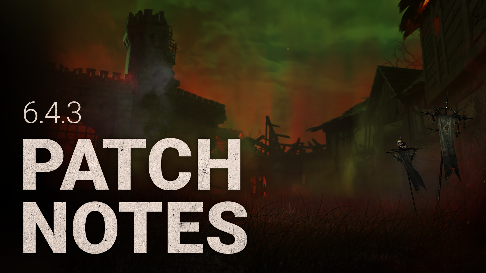

<!-- summary -->
## AI TL;DR

The Knight’s chase entry no longer fails when a Guard is active, and Bone Chill’s invisibility glitch after exiting a Snowman has been fixed along with collision-sticking issues. Survivor perk bugs were addressed: Kindred’s Killer Aura now displays correctly and Inner Healing heals one health state after cleansing a Totem and staying in a Locker. The Game map no longer contains an invisible collision zone, and undetectable killers no longer unintentionally reveal their aura. The patch is primarily a collection of stability fixes, with remaining known issues on Nowhere To Hide’s aura detection and a missing foot animation for the Knight.
<!-- /summary -->

<!-- nav -->
&larr; [6.4.2 | Bugfix Patch](367-6-4-2-bugfix-patch.md) · [Live](../../index.md#live) · [6.5.0 | Mid-Chapter](371-6-5-0-mid-chapter.md) &rarr;
<!-- /nav -->

# 6.4.3 | Bugfix Patch

## Bug Fixes

**THE KNIGHT**

- The Knight no longer encounters issues entering a chase while a Guard is active.

**BONE CHILL**

- Killers no longer occasionally turn invisible upon leaving a Snowman.
- Killers entering a snowman should no longer get stuck in collision terrain.

**SURVIVOR PERKS**

- The Killer’s Aura no longer fails to display while using Kindred.
- Inner Healing now operates as intended, where cleansing a Totem and entering a Locker for a duration heals 1 Health State.

**MAPS**

- **The Game** is no longer haunted by an invisible collision zone.

**MISC**

- Undetectable Killers no longer experience unintended Aura reveals.

## Known Issues

- **Nowhere To Hide’s** Aura reveal zone currently remains centred on the Generator instead of the Killer.
- **Nowhere To Hide** does not reveal the Aura of Survivors who were out of range when the Perk was triggered, but enter the detection zone while it’s still activated.
- The Knight’s feet have no animation when looking down during an Attack.

<!-- nav -->
&larr; [6.4.2 | Bugfix Patch](367-6-4-2-bugfix-patch.md) · [Live](../../index.md#live) · [6.5.0 | Mid-Chapter](371-6-5-0-mid-chapter.md) &rarr;
<!-- /nav -->
