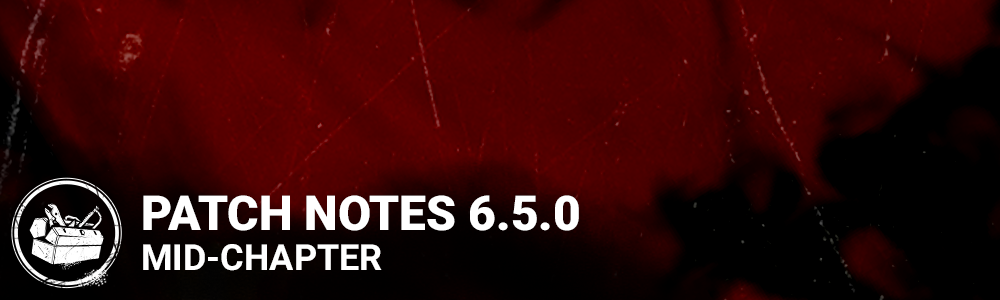

# 6.5.0 | Mid-Chapter

## Content

**Event - Moonlight Burrow**

- The**"Moonlight Burrow"** Lunar New Year event starts January 24, 1pm ET.

**Archives**

- **Tome 14 - BETRAYAL** Level 1 opens January 25, 11am ET.

**Archive Challenges:**

- "Dark Triumph" Killer Challenge: As The Executioner, Survivors who die inside a Cage of Atonement now award progress.
- "Terrified" Killer Challenge: As The Trickster, Survivors hit by Showstopper blades no longer award progress.
- "Near Miss" Survivor Challenge: Dodging Basic Attacks from The Oni and The Ghost Face (while crouched) now awards progress.
- "The Engineer's Guild" Survivor Challenge: Progress is now cumulative and no longer resets when the co-op action is interrupted.

## Features

### Quality Of Life

**Survivor Activity HUD**

- The Survivor HUD now features an indicator that appears whenever they or their teammates engage in an activity. **Activities include** Repairing a Generator, being chased by the Killer, Healing, recovering from the Dying State, Cleansing or Blessing a Totem, opening an Exit Gate, or interacting with a Killer’s Power.

**Merciless Killer**

- Moving forward, getting 4 Kills will earn the Killer a **Merciless Killer**rating, rather than the previous requirement of a double pip.

**The Queuing Experience**

- Players are now able to browse the Store, The Archives and Daily Rituals, while queueing for a match. If they are mid-purchase when the lobby is ready, the game will wait for the conclusion of the transaction – though it will kick the player if the delay is too long.
- While queued, Killers can browse their other Killers and change their loadouts and customizations. This will not affect their currently queued character, who remains shown beside the "Looking for Match" message.

**Dev Note:*Due to a potential disconnection during cinematics, we had to disable the viewing of cinematics when in a party or queueing for a match.*

**Wiggling**

Following a period in BETA, the updated Wiggle system is now standard for all players. Rather than mashing the left and right inputs to Wiggle, it now follows a ping-pong Skill Check system.

Based on the feedback we’ve received from players – thank you very much – we have made a few adjustments to the system.

- Controller input handling has been improved, which should allow Killers to respond to Wiggling more efficiently while carrying Survivors.
- Survivors no longer shorten carry time by hitting Great Skill Checks. Instead, Great Skill Checks will increase resistance for the Killer.
- The size of the Great Skill Check zone has been slightly increased. We’ve also updated the Wiggling sound effects for improved feedback.

## Balance Changes

### The Knight

Now that the Forged In Fog Chapter has been released for several weeks, we have updated several aspects of The Knight’s Base Kit:

- While using his Power, The Knight is now forced out of Guard Summon Mode after 10 seconds.
- While tracing a Patrol Path, The Knight’s Orb shrinks with distance travelled and disappears completely after **10m.**
- When The Knight creates a Patrol Path longer than 10m, he will gain the Haste Status Effect. The Effect’s duration depends on the length of the Path, beginning at 2 seconds and increasing to 10 seconds at the maximum distance of 32m. The 10-second duration was 6 seconds on the PTB.
- **When a Guard detects a Survivor:**If your Patrol Path is over 10m, the time it takes that Guard to reach the Survivor has been decreased. This reduction depends on the length of your Path, ranging from the default 10% to a maximum of 25% if your Path reaches 32m. *Basically, the longer your Patrol Path, the faster your Guard will move once he detects a Survivor.*
- Using a Guard to damage a Generator now grants an instant 5% loss of progress (previously 2.5%).

**Add-On Updates:**

- **Healing Poultice:**When Survivors are within 24m of The Assassin when he spawns, their locations will be revealed for 5 seconds (up from 3).

### The Nurse

The Nurse holds an interesting place in the Killer Roster. Though her Power can be challenging to master, she can be extremely deadly in practiced hands, especially with certain Perks that accentuate her mobility. While we don’t want to completely overhaul her, we have made some updates to The Nurse, including a pass on her Add-Ons.

In addition, The Nurse is officially the latest Killer to receive her own theme in the menu, as well as a new Terror Radius and Chase Music.

**Base Kit:**

- Any Attack made after Blinking is now a **Blink Attack,**not a Basic Attack. This will impact how The Nurse synergizes with certain Perks, including those that trigger the Exposed Status Effect.

**Add-On Updates:**

- **Catatonic Boy’s Treasure:**Reduces extra fatigue from Chain Blinks by 65% (was 100).
- **Dark Cincture:** Increases movement speed after a Blink but before the following fatigue by **30%**.
- **Heavy Panting:**Extends the duration of a Lunge by 30% after more than one Blink.
- **Ataxic Respiration:** Reduces base Blink fatigue duration by **7%**(was **12%**).
- **Fragile Wheeze:** Blink Attacks inflict the **Mangled** status effect.
- **Campbell's Last Breath:**After reappearing from a fully charged Blink, **The Nurse** immediately Blinks again at full charge in the direction she is currently facing. This only works if **The Nurse** has a remaining Blink charge (was originally a half-charged Blink).
- **"Bad Man's" Last Breath:**Hitting a Survivor with a successful Blink Attack grants the **Undetectable** status effect for **25 seconds**(up from 16). This effect may be only triggered once every **45 seconds** (down from 60).
- **Kavanaugh's Last Breath:**When succumbing to fatigue, any Survivors within **8 meters** of **The Nurse** are afflicted with the **Blindness** status effect for **60 seconds**.
- **Jenner's Last Breath:** Once **The Nurse** has exhausted all her Blinks, **The Nurse** can immediately Blink back to her original position by pressing the *Active Ability Button*. Must be triggered before **The Nurse** succumbs to fatigue. After returning to her original position, one Blink charge is restored (added restoration of 1 Blink charge; this is a change from the PTB where all charges were restored).
- **Torn Bookmark:** Adds **1** Blink charge. Increases Blink recharge time by **30%**(was **50%**).
- **Matchbox:** Sets maximum number of Blink charges to **1**. Increases **The Nurse's** base movement speed to **4.4 m/s** (was **4.2 m/s**, no longer allows other addons to increase Blink charges).

We’ve also adjusted the following:

- Improved feedback for the Spasmodic Breath Add-On.
- Updated Blink recharge audio to give a better indication of when Blink charges are full.

### Eyrie of Crows Map

Eyrie of Crows has received an additional balance pass to make the Map more fun to play for both Survivor and Killer.

- The Map's length has been shortened.
- Generators are more evenly distributed.
- The main building has been moved toward the Map's edge.
- The strength of certain main building loops has been decreased.
- New tiles have been added.
- Dead Zones have been reduced around the border.
- The Exit Gate no longer inadvertently spawns behind the main building.
- Certain rocks will no longer spawn close to Hooks, causing collision issues.
- An alternate Generator has been added to the main building.

## Bug Fixes

**PlayStation**

- The PlayStation Store banner no longer remains visible outside of the store.
- PlayStation players should no longer have trouble inviting or joining their friends in a match.

**Windows Store**

- Players should no longer be unable to successfully purchase Auric Cells on the Windows Store.

**Audio**

- The proper SFX will now play when a match is found.
- The blood SFX will no longer play when a Hooked Survivor enters the Struggle Phase.
- The Locker exit SFX is no longer unaffected by the Quick & Quiet Perk.
- The Music no longer continues playing while a Survivor is being Sacrificed.
- Raised the volume of the Legion’s blood wiping SFX.

**The Knight**

- The Knight’s Guards no longer get stuck in various places on the Mount Ormond Map.
- The Knight’s guards are no longer incapable of traversing certain passages on the Mount Ormond Map.
- The Knight’s feet are officially animated in the first-person perspective when attacking or looking down.
- Fixed an issue that caused the Knight and The Spirit to see the Potential Energy VFX and Refined Serum VFX while in Path creation mode and Phase Walking respectively.
- The Knight's Power no longer becomes unusable when using the order system immediately after entering Patrol mode.
- The Knight will no longer be able to perform actions from unintended distances immediately after using Guardia Compagnia.
- The Knight will no longer receive a permanent 5% Haste Status Effect upon creating a Guard Path under than 10m.
- Fixed an issue that caused The Knight entering Path Creation Mode to trigger Make Your Choice while standing beside a Hook.

**The Spirit**

- The Spirit’s weapon retracting animation no longer speeds up.
- The Spirit’s hair is no longer missing from a Spectator’s point of view during a Custom Match.

**The Twins**

- Switching between Charlotte and Victor will no longer lead to an unexpected black screen.
- Fixed an issue where Charlotte would be unable to move after switching control from Victor.
- The Undetectable Visual Effect is no longer missing while using the Silencing Cloth Add-On.

**The Plague:**

- Unstable Rifts can no longer become infected by a Survivor infected by The Plague’s Power.

**Survivor Perks & Gameplay**

- Flashbangs no longer spin while in a Survivor’s hand.
- When the **Circle of Healing**Boon is snuffed, Survivors in its radius no longer fail their ongoing Skill Checks.
- Survivors can no longer drop a Flashbang Grenade while getting Healed.
- Firecrackers and Flashbangs now trigger as intended when thrown against a wall.
- Object of Obsession now properly increases the chances of players becoming the Obsession at the start of a match.
- Potential Energy should no longer remain on the Survivor after certain Killers use their Power.

**Killer Perks**

- Fixed an issue where Hex: No One Escapes Death’s Aura remains active if first blessed by a survivor, then snuffed by a killer.
- Resolved Hex: Huntress inconsistencies between SFX and UI.

**Maps**

- Fixed an impassable passage between cedar walls on the**Badham Preschool IV Map.**
- Survivors can no longer use momentum to vault onto a ledge of the **Pale Rose’s** Ferry.
- A specific Generator on the **Garden of Joy**Map is no longer inaccessible from one side.
- Placeholder textures have been removed from the **Disturbed Ward** Map.

**Misc:**

- Special Cosmetics such as the Vial Charms will now appear in-game consistently.
- The Killer player can no longer join a lobby with an unintended character.
- Players can no longer use an exploit to play with more than 4 Perks.
- Bots no longer get stuck on thin air.
- Force-quitting the game no longer causes a crash.
- The splash screen no longer causes a crash.
- Customizations equipped in the store are now immediately visible to all party members.
- Survivor Bots no longer attempt to blind The Knight’s guards.
- Applied a tentative fix to an issue causing lag spikes for players with both a mouse and controller connected.
- Resolved an issue in the Shrine of Secrets where a Perk would display as “available” even after purchasing it.
- The menu is no longer accessible while interacting with the EULA or Privacy Policy popup.
- The Alert Reward popup no longer blocks inputs on the Menu.
- Players should now gain proper progress on the achievement “Milk ‘n’ Cookies.”
- Wiggle Skill Check responsiveness has been improved.
- Survivor hair is no longer wonky during the Hook death animation.
- The Entity Spikes at the Exit Gates should now appear as intended.
- Fixed an issue causing the Dissolve VFX not to not appear when a Breakable Wall is destroyed.

## Bug Fixes from PTB

- The Cannibal’s Perk Names have been corrected.
- The Artist’s legs now move correctly while rotating in place.
- Grabbing a Vaulting female Survivor as The Spirit no longer causes clipping issues.
- As The Legion, Julie and Susie’s Tally Screen animation has been corrected.
- A visual progression issue affecting select Tomes on Archive Compendium menu has been corrected.
- Pop-ups should no longer overlap incorrectly when opened.
- Improved accuracy of the Survivor Activity Indicator while in Spectate Mode.
- The intensity of the Nurse's Spasmodic Breath vignette has been reduced.
- The Knight’s Undetectable vignette will now appear as intended.

**Maps**

- Bots no longer get stuck on a pallet in **Wreckers' Yard**.
- A placeholder Hill tile no longer spawns in the **Crotus Prenn Asylum**.
- The **Eyrie of Crows**Killer shack Pallet no longer traps Killers or causes unintended interactions.
- The Legion no longer vaults incorrectly during Feral Frenzy in the **Eyrie Of Crows.**
- Crawling underneath the**Raccoon City Police Department**main hall desk no longer prevents Killers from picking you up.
- The **Raccoon City Police Department** basement light no longer clips through the stairs.
- Players will no longer land on top of a desk when falling through the hole in the **Raccoon City Police Department’s**second floor.
- The Knight's guards no longer get stuck in the doorway of the **Raccoon City Police Department's** main hall.
- The **Pale Rose** no longer has a spot where Survivors can avoid being picked up.
- Killers can no longer accidentally land on top of a Pallet in the **Midwich Elementary School.**

**The Pig**

- Survivors can no longer re-interact with the Jigsaw Box after attempting to remove a Reverse Bear Trap.

**The Knight**

- A Knight’s Guard that previously attacked a Survivor will no longer play an Attack animation after breaking a Wall or Pallet.
- Improved The Knight's Guard's pathing around select Mount Ormond Resort ski racks.
- The Knight's Guards’ feet no longer clip into the floor.

**The Twins**

- Charlotte no longer has a higher-than-intended movement speed boost when switching from Victor after having previously woken up as Charlotte.
- Charlotte can no longer perform any actions during her wake-up animation.
- The Twins may lose all functionality if stunned while unbinding.

**The Nurse**

- The Heavy Panting Add-On now extends The Nurse's Lunge duration after the second Blink as intended.

**The Nightmare**

- When playing as The Nightmare, red arrows no longer appear above Generators during the intro screen.
- The Nightmare is no longer unable to use Dream Snares.

**The Legion**

- The Julie’s Mixtape Add-On no longer allows the The Legion to attack twice in quick succession after recovering from a stun.

**The Trapper**

- The Trapper grabbing Dwight from a Locker no longer triggers a Skill Check.

**The Executioner**

- Injuring a Survivor from up close using Punishment of the Damned no longer now gives the Punishment score event.

**Killer Perks & Gameplay**

- **Terminus**now displays a cooldown for Survivors after opening the Exit Gate.
- Special Attack Lunges no longer inadvertently trigger **Coup De Grace.**
- **Whispers**now works as intended.
- Killers no longer bypass the **Decisive Strike** Stun if the Survivor is dropped before the Skill Check.
- **Nowhere To Hide**now reveals the Aura of Survivors that were out of the range upon activation.
- **Nowhere to Hide’s**effect is now properly centered on the Killer instead of the kicked Generator.
- The Hag’s Daily Ritual Rite **Of Flesh and Mud** can now be completed

**Survivor Perks & Gameplay**

- **Wiretap** now reveals the auras of The Killer while they are blinded by **Residual Manifest**.
- **Situational Awareness** no longer reveals the player's Aura against **Lethal Pursuer.**
- **Adrenaline**no longer triggers every time a Survivor is unhooked after all Generators have been repaired.
- **Renewal**no longer keeps charging when Survivors change states.
- The Deep Wound vignette no longer remains visible at the Tally Screen when a Survivor escapes while in the Deep Wound state.
- Survivors now gain Haste when grabbing The Knight's banner as intended.
- Survivors are now longer immune to The Deathslinger's projectile during a fast window Vault.
- Fixed an issue that caused The Survivor perk 'Smash Hit' may apply delayed movement speed bonus for the Survivor when The Nurse is stunned while charging its power
- The **Item of Obsession** Achievement can now be unlocked without issue.
- The**Agonizing Escape** Achievement can now be unlocked without issue.

**Misc.**

- Players can no longer use an exploit to play with two copies of the same Add-On.
- Entering the Archives during an Event while tracking a previous Event’s Archive Challenge will no longer cause soft locking.
- In the "Survive with Bots" Tutorial, the Killer will no longer be unable to pick up a downed Survivor.
- The Wiggle UI will no longer appear incorrectly during the Survivor Tutorial.
- Added an outline to the Chat text to improve contrast.

## Known Issues

- Generator progress is not shown on Survivor HUD activity icons.
